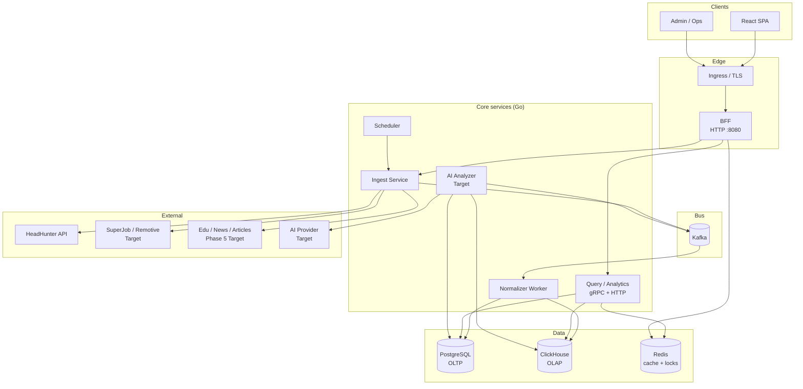
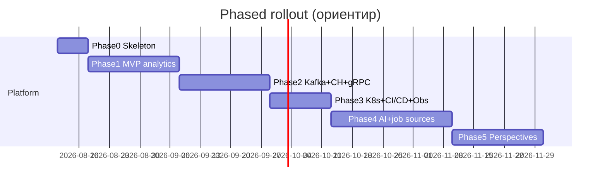

# 00. Overview

## Vision

Платформа аналитики IT-рынка труда: регулярно собирает вакансии из внешних API (сначала HeadHunter), нормализует к единой модели, считает зарплаты/спрос по ролям и регионам, показывает тренды в дашборде. В перспективе — асинхронный AI-анализ кластеров вакансий и рядов трендов; позже — секция **«Тенденции» (Perspectives)**: составной эвристический сигнал перспективности IT-направлений по спросу на рынке труда, интересу к обучению и медиа-вниманию (не прогноз «истины»).

Архитектура production-like: чёткое разделение OLTP/OLAP, event-driven ingest, внутренний gRPC, деплой в Kubernetes.

## Goals

| Цель | Метрика успеха (ориентир) |
|------|---------------------------|
| Регулярный сбор HH | Ежедневный (или чаще) ingest без ручного вмешательства |
| Dedup и нормализация | Устойчивый `source + external_id`; роли/скиллы/регионы в справочниках |
| Аналитика зарплат и спроса | Дашборд: summary, roles, regions, salary trends, top skills |
| Масштабируемый ingest | В MVP — идемпотентные страницы и checkpoint; Kafka развязывает API-лимиты и запись в хранилища с Phase 2 |
| Расширяемость источников | Новый source = adapter, без переписывания core (jobs → edu/news signals в Phase 5) |
| Observability | Метрики ingest/lag, трейсы read-path, structured logs |
| AI (Target) | Async jobs с версионированием промптов и human-review флагом |
| Perspectives / «Тенденции» (Target) | Multi-source composite score + UI; после multi-source job boards (Phase 4→5) |

## Non-goals

- Не маркетплейс откликов и не ATS для кандидатов
- Не real-time стриминг каждого изменения вакансии на HH (достаточно batch/poll)
- Не полная юридическая копия всех полей вакансии «навсегда» сверх нужд аналитики
- Не multi-tenant SaaS с биллингом в MVP
- Не собственная ML-обучение модели с нуля (Target: inference через provider abstraction)
- Не замена ClickHouse/Postgres друг другом — у каждого своя роль
- Не «оракул будущего»: «Тенденции» — эвристика по открытым сигналам, не инвестиционный/карьерный совет
- Не scraping площадок без разрешённого API/ToS (в т.ч. LinkedIn, Avito, закрытые каталоги курсов)

## High-level architecture

## Component responsibilities

| Компонент | Ответственность | Фаза |
|-----------|-----------------|------|
| **React SPA** | Дашборд, фильтры роль/регион/период, графики salary/demand; позже экран «Тенденции» | MVP (+ Perspectives Phase 5) |
| **BFF** | Публичный REST (OpenAPI) `:8080`, агрегация DTO под UI, вызовы Query/Ingest; edge MVP | MVP |
| **API Gateway** | Optional edge перед BFF (auth/WAF/canary) | Target (Phase 3+) |
| **Query / Analytics** | Чтение агрегатов из CH/PG, cache-aside Redis; позже Perspectives API | MVP (+ Phase 5) |
| **Ingest** | Вызов source adapters (HH), публикация raw events в Kafka, backoff 429; позже signal adapters | MVP (+ Phase 5) |
| **Normalizer Worker** | Валидация, dedup, mapping в каноническую модель, write PG + CH snapshots | MVP |
| **Scheduler** | Cron-триггеры daily/incremental ingest | MVP |
| **PostgreSQL** | Справочники, вакансии (текущее состояние), jobs, AI insights metadata; позже trend_signals | MVP (+ Phase 5) |
| **ClickHouse** | Факты/снимки для трендов и тяжёлой аналитики; опц. daily composite scores | Phase 2 (+ Phase 5) |
| **Kafka** | Буфер и fan-out между ingest и workers; опц. `signals.*` | Phase 2 / Target early |
| **Redis** | Cache dashboard, HH dictionaries, distributed locks | MVP (cache), Phase 2 (locks) |
| **AI Analyzer** | Async анализ кластеров/трендов, запись insights; опц. summary «почему растёт направление» | Target (Phase 4+) |
| **Signals aggregator** | Nightly/incremental composite score по направлениям | Phase 5 Target |
| **K8s + CI/CD** | Deploy, миграции, environments | Phase 3 |

## Phased delivery

Чтобы не поднимать весь стек в day-1:

### Phase 0 — Skeleton (неделя 1)

- Монорепо / структура сервисов (Go modules + React app)
- Docker Compose: PostgreSQL, Redis
- BFF hello/health (`:8080`); React shell
- Миграции PG (`golang-migrate`, см. ADR 002)
- **Без** Kafka/ClickHouse/gRPC полного контура

### Phase 1 — MVP analytics path

- HH adapter + ingest (sync или in-process queue допустим как временный)
- Normalizer → PostgreSQL (vacancies, roles, regions, skills)
- Идемпотентная обработка **страницы**: fetch → adapter draft → shared normalize + сохранение всех записей страницы; `cursor`/номер страницы сохраняется в `ingest_checkpoints` только после успешного завершения этой последовательности. При сбое checkpoint не меняется, страница безопасно повторяется благодаря unique `(source, external_id)` и `content_hash`.
- Query REST: dashboard summary, roles, regions, salary trends (из PG агрегатов или materialized views)
- Отдельный analytics worker: daily snapshot только после полного all-IT cycle,
  weekly rollup из семи daily snapshots; история active demand хранится в PG
- Redis cache-aside для summary
- Scheduler (cron в Compose или k8s CronJob позже)
- Vacancy-based demand/salary на экране `/market` — **это не** полный продукт «Тенденции» (Perspectives)
- **Label:** MVP

### Phase 2 — Event-driven + OLAP

- Kafka: `vacancies.raw`, `vacancies.normalized`, DLQ
- Вынести Normalizer в отдельный consumer
- ClickHouse: daily snapshots / facts; Query читает тренды из CH
- gRPC между BFF ↔ Query / Ingest
- Distributed lock ingest в Redis
- Перед включением Kafka обязателен отдельный ADR: transactional outbox **или** явно задокументированный replay checkpoint, который гарантирует отсутствие пропуска между записью в PG и публикацией события.
- **Опциональный foundation для Perspectives:** topic `signals.raw` / envelope schema (без обязательных edu/news collectors)
- **Label:** Target core

### Phase 3 — Platform

- Kubernetes manifests, Ingress, HPA для BFF/Query
- CI/CD (lint/test/build/push/deploy), migration Job
- Observability: OpenTelemetry, Prometheus metrics, structured JSON logs
- Auth stub → JWT/API keys roadmap
- Schema/ops готовность к signal tables — только если не ломает MVP (миграции — в Phase 5)

### Phase 4 — AI + multi-source (job boards)

- Source adapters: SuperJob, Remotive, Adzuna (вакансии)
- AI Analyzer worker + provider abstraction
- Prompt versioning, human_review, privacy policy (no PII)
- Export/webhook (опционально)
- **Не** полный продукт «Тенденции»: vacancy demand уже есть в Phase 1 `/trends/*`; multi-source **jobs** усиливает demand-ногу composite score

### Phase 5 — Perspectives («Тенденции») multi-source

После (или в хвосте) Phase 4: job multi-source готов; AI для narrative — опционально.

**Deliverables:**

| Deliverable | Описание |
|-------------|----------|
| Signal collectors / adapters | Edu platforms, news/RSS, articles (+ reuse vacancy demand) → нейтральный signal event |
| Storage | `trend_signals`, `trend_scores_daily` (PG и/или CH) — см. [05](./05-data-model.md) |
| Aggregator job | Composite heuristic score по direction/skill/role family |
| Query API | `GET /api/v1/trends/perspectives` (+ detail) — `x-lifecycle: target` |
| UI | Экран «Тенденции» `/perspectives` — disclaimer эвристики |
| Ethics | Attribution, ToS, official API/RSS only, rate limits |

См. [ADR 007](./adr/007-multi-source-trend-signals.md), [08](./08-integrations-and-extensibility.md).

## Quality attributes

### Scalability

- Ingest ограничен rate-limit внешних API → горизонтальное масштабирование workers за Kafka, не «долбим HH»
- Query/BFF — stateless; HPA по CPU/RPS
- ClickHouse для тяжёлых scan/aggregate; PG не должен стать OLAP
- Partition key Kafka = `source` или `source+region` для упорядочивания per-source

### Observability

- **Logs:** JSON, `trace_id`, `ingest_run_id`, `source`, `external_id`
- **Metrics:** ingest success/429, Kafka lag, normalize errors, cache hit ratio, query latency p95
- **Traces:** BFF → Query → Redis/CH/PG; Ingest → HH → Kafka (Target: + gateway hop)
- Health/readiness на каждом сервисе

### Security

- Secrets только через env/Secret (не в git)
- Публичный perimeter MVP — BFF HTTP; Query/Ingest — internal; gRPC внутри cluster network
- HH: корректный User-Agent, соблюдение ToS/rate limits
- Auth: stub в MVP; JWT/API keys / optional gateway — позже
- AI: не отправлять PII (телефоны, ФИО контактов) в provider

### Reliability

- At-least-once + idempotent normalize (unique `(source, external_id)`)
- DLQ для poison messages
- Retry с exponential backoff на 429/5xx HH
- Soft-delete / `is_active` для исчезнувших вакансий

### Maintainability

- Adapter pattern для sources
- Версионирование REST (`/api/v1`) и proto packages
- Явные миграции схемы PG/CH

## Test-first / тесты до фичи (Phase 0–1)

Для критичной логики MVP **сначала** фиксируем поведение тестами (или table-driven скелетом + golden), **потом** пишем реализацию.

| До кода фичи | Вместе с фичей |
|--------------|----------------|
| Кейсы normalize (mid / gross / FX / outliers / role) по [15](./15-normalization-rules.md) | Integration PG/Redis на `production` |
| Фикстуры HH + ожидаемые draft ([`testdata/hh/`](../../testdata/hh/)) | Contract BFF↔Query / OpenAPI |
| Pure checkpoint: cursor только после успешной страницы | Vitest на formatters / critical widgets |
| OpenAPI lint на затронутые пути | Playwright journeys — nightly, не каждый PR |

Definition of Done и матрица CI: [13-testing.md](./13-testing.md). Backend детали — [13a](./13a-testing-backend.md); UI/E2E — [13b](./13b-testing-frontend-e2e.md).

## Decision summary (коротко)

| Решение | Выбор | Почему |
|---------|-------|--------|
| Публичный edge | BFF REST `:8080` | Один hop для MVP; gateway — Target (ADR 010) |
| Внутренний RPC | gRPC | Типизация, скорость между сервисами |
| Events | Kafka | Buffer, retry, fan-out normalize/AI |
| OLTP | PostgreSQL | Справочники, текущее состояние, jobs |
| OLAP | ClickHouse | Тренды, агрегаты по большим срезам |
| Cache | Redis | Dashboard + dicts + locks |
| AI | Async worker | Не блокировать ingest/UI; cost control |
| Perspectives | Separate signal plane (Phase 5) | Не смешивать с vacancy-only `/trends`; ADR 007 |

Детали решений: [adr/](./adr/). Контракты: `api/openapi.yaml`, `libs/proto/lma/`.

## SLO / cost (lite, ориентир)

Не enterprise-SLA — ориентиры для MVP, чтобы было что алертить.

| Показатель | Цель (MVP→Target) |
|------------|-------------------|
| Ingest HH daily | ≥ 1 успешный run / сутки (`success` или приемлемый `partial`) |
| Dashboard summary p95 | < 500 ms (cache hit); < 2 s (miss, Phase 1 PG) |
| Availability BFF (dev/stage) | best-effort; Target 99% monthly |
| Kafka lag normalize | < 30 min age (Phase 2) |
| Стоимость AI | budget cap / день; jobs async only (Phase 4) |
| Локальный Compose RAM | mvp profile ≲ 2–3 GB; full выше |

Cost levers: реже full ingest, Redis cache, CH только с Phase 2, AI не в sync path. Подробнее метрики/алерты: [11-observability-security.md](./11-observability-security.md).
