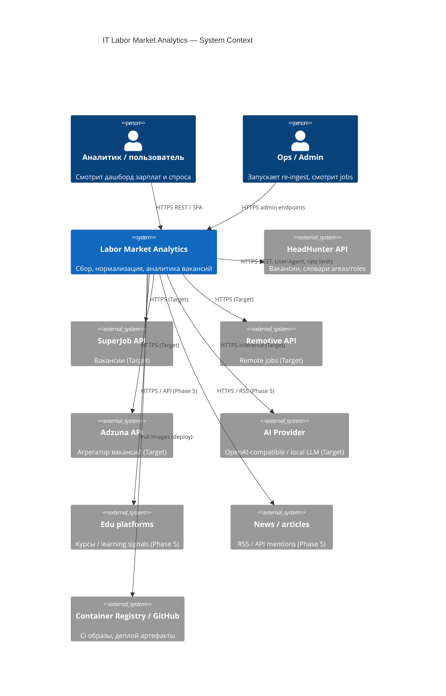
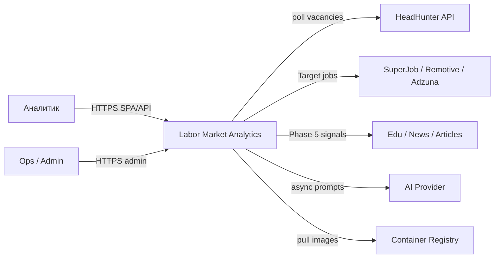
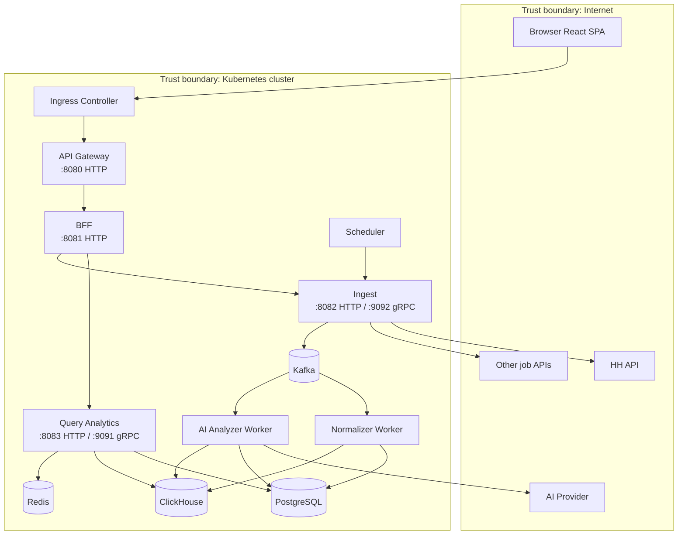
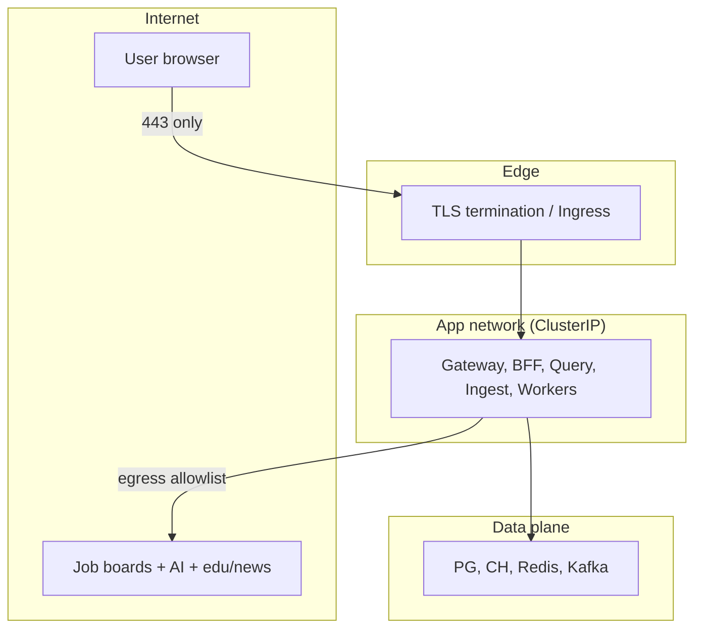

# 01. System Context (C4)

## Context diagram

Если рендер C4 в viewer недоступен, эквивалент:

## Container diagram

## External systems

| Система | Назначение | Протокол | Фаза | Заметки |
|---------|------------|----------|------|---------|
| **HeadHunter** | Основной источник вакансий и словарей | HTTPS REST | MVP | Обязательный `User-Agent` с контактами; 429 backoff |
| **SuperJob** | Доп. источник RU | HTTPS REST | Target | Отдельный adapter + credentials |
| **Remotive** | Remote/global IT jobs | HTTPS REST | Target | Часто более простая схема полей |
| **Adzuna** | Агрегатор, multi-country | HTTPS REST | Target | Полезно для бенчмарков стран |
| **Survey benchmarks** | Ручные/файловые бенчмарки зарплат | CSV/API | Target | Не вакансии; отдельный import path |
| **AI Provider** | Insights по кластерам/трендам | HTTPS (OpenAI-compatible) | Target (Phase 4) | Абстракция клиента; cost/rate limits |
| **Edu platforms** | Learning-interest signals («Тенденции») | HTTPS API | Phase 5 Target | Кандидаты: Stepik/Coursera/Skillbox — API TBD; см. [21](./21-external-services.md) |
| **News / articles** | Media-attention signals | HTTPS / RSS | Phase 5 Target | Официальные feeds/API only; Habr и др. — кандидат |
| **Container Registry** | Docker images для k8s | HTTPS | Phase 3 | GHCR / Docker Hub |

## Trust boundaries

| Граница | Правило |
|---------|---------|
| Internet → Cluster | Только Ingress (SPA static + `/api/*` → gateway). gRPC **не** публиковать наружу |
| Gateway → BFF → internal | mTLS опционально (Target); в MVP — private network |
| Egress | Allowlist: HH, будущие job APIs, edu/news (Phase 5), AI provider, registry, DNS |
| Secrets | API tokens HH/AI только в K8s Secrets / local `.env` (gitignored) |
| PII | Не кэшировать и не слать в LLM контактные данные кандидатов/работодателей сверх необходимости аналитики |
| Admin | Trigger ingest — отдельный путь + будущий authz role `admin` |

## Data sensitivity (кратко)

| Данные | Чувствительность | Где |
|--------|------------------|-----|
| Текст вакансии, зарплата, навыки | Бизнес-публичные (уже на job board) | PG, CH |
| Employer name | Низкая/средняя | PG, CH |
| Контакты из описания | PII — **не** для AI, по возможности не хранить отдельно | strip before AI |
| HH/AI API keys | Secret | Secret store |
| Aggregated trends | Низкая | CH, Redis cache |

## Actors & use cases

| Actor | Use cases |
|-------|-----------|
| Аналитик | Открыть dashboard, фильтры роль/регион/период, salary trends, top skills; Phase 5 — экран «Тенденции» |
| Ops | Ручной re-ingest, просмотр статуса job, DLQ replay (Target) |
| Scheduler | Периодический trigger ingest |
| AI worker (system) | Забрать job → вызвать LLM → сохранить insight |
