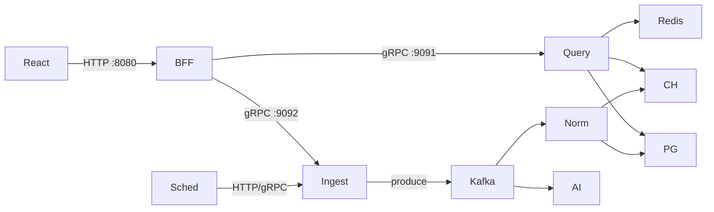

# 02. Services

## Service map

| Service | Язык | Публично | Внутри | Фаза |
|---------|------|----------|--------|------|
| `web` (React) | TS/React | static via Ingress/CDN | — | MVP |
| `bff` | Go | HTTP `:8080` | вызывает gRPC/HTTP internal | MVP |
| `gateway` | Go | HTTP `:8080` (вместо прямого BFF) | reverse proxy → bff | Target (Phase 3+) |
| `query` | Go | HTTP `:8083` (debug) | gRPC `:9091` | MVP |
| `ingest` | Go | HTTP admin `:8082` | gRPC `:9092` | MVP |
| `normalizer` | Go | — | Kafka consumer | Phase 2 (Phase 1: in-process) |
| `scheduler` | Go / CronJob | — | HTTP/gRPC → ingest | MVP |
| `ai-analyzer` | Go | — | Kafka consumer + gRPC optional | Target (Phase 4) |
| `signals-ingest` (или расширение `ingest`) | Go | HTTP admin optional | Kafka `signals.raw` / in-process | Target (Phase 5) |
| `signals-aggregator` (job/worker) | Go | — | cron → PG/CH scores | Target (Phase 5) |

## Responsibilities

### BFF (`bff`) — public product API (MVP edge)

- **Публичная HTTP поверхность** для React (`/api/v1/...`) на `:8080`
- OpenAPI business routes (контракт `api/openapi.yaml`)
- Агрегация/адаптация DTO под UI
- Вызовы Query / Ingest (gRPC с Phase 2; Phase 1 — HTTP/internal)
- Edge MVP: CORS/корреляция/`request_id` по мере появления кода
- Не пишет бизнес-данные напрямую в PG/CH (кроме опционально session/cache keys)
- Local: `GET /api/v1/health` (опц. PG/`DATABASE_URL` и Redis/`REDIS_URL` ping; degraded ok)

### API Gateway (`gateway`) — Target Phase 3+

- Optional edge перед BFF: reverse proxy `/api/*`, TLS/auth stub, rate-limit, canary
- **Не** содержит business logic и OpenAPI handlers ([ADR 010](./adr/010-api-gateway.md))
- В MVP **нет** кода `apps/gateway` — публичный вход = BFF

### Query / Analytics (`query`)

- Чтение агрегатов и справочников
- Cache-aside через Redis
- Владеет **read-моделями** (не ingest)
- gRPC: `QueryService`
- HTTP debug/metrics на отдельном порту (`:8083`)

### Ingest (`ingest`)

- Source adapters (HH first)
- Управление `ingest_runs`
- Публикация raw vacancy events в Kafka (Phase 2+)
- В Phase 1 передаёт versioned source-neutral drafts в in-process normalizer; сам не выполняет shared normalization
- Сохраняет checkpoint страницы только после успешной нормализации и сохранения **всех** её drafts
- Уважает rate limits, backoff, pagination HH
- Admin: trigger run, статус (снаружи — только через BFF admin paths + auth)

### Normalizer / Worker (`normalizer`)

- Consume `vacancies.raw.*`
- Dedup, mapping roles/skills/regions, salary normalize (валюта/gross-net)
- Upsert PostgreSQL
- Insert ClickHouse snapshots/facts
- Idempotent обработка
- Ошибки → retry / DLQ

### Scheduler (`scheduler`)

- Phase 1: dedicated `apps/ingest/cmd/scheduler` периодически запускает bounded,
  resumable all-IT batch in-process; one-shot CLI остаётся отдельным.
- No-overlap в процессе + PostgreSQL session advisory lock на отдельном
  соединении между процессами; lock key `549004801`, без новой таблицы.
- В k8s (Phase 3) выбор между long-running process и `CronJob` →
  `POST /internal/v1/ingest/runs` фиксируется при production deployment.
- Не содержит бизнес-логики парсинга

### AI Analyzer (`ai-analyzer`) — Target

- Consume `ai.jobs` или poll PG `ai_jobs`
- Собирает вход (кластер вакансий / time series)
- Вызов LLM provider
- Пишет `ai_insights` в PG (+ опционально агрегаты в CH)
- Prompt version, cost tokens, `needs_human_review`
- Phase 5 (opt.): job type `perspective_narrative` по composite scores — не блокирует Perspectives API

### Signals ingest (`signals-ingest` или extend `ingest`) — Phase 5 Target

- Адаптеры `source_kind`: `edu`, `news`, `article` (+ переиспользование vacancy aggregates для `jobs`)
- Тот же ethics/rate-limit контур, что job ingest: User-Agent, backoff, ToS
- Publish `NeutralTrendSignalV1` в Kafka `signals.raw` (Phase 2+ foundation) или sync upsert `trend_signals`
- **Не** считает composite score

### Signals aggregator (`signals-aggregator`) — Phase 5 Target

- Читает `trend_signals` (и/или vacancy demand views)
- Нормализация ног + weighted composite → `trend_scores_daily`
- Версия формулы в `score_version`; идемпотентный daily run
- Триггер: Scheduler / CronJob

### Query — расширение Phase 5

- Endpoints Perspectives: список направлений и ряды scores (через BFF)
- Cache-aside по аналогии с dashboard (отдельный key prefix)

## Ports & protocols

| Service | Port | Protocol | Exposure |
|---------|------|----------|----------|
| bff | 8080 | HTTP/JSON | Ingress (public) |
| gateway | 8080 | HTTP/JSON | Target: Ingress (public); тогда BFF — ClusterIP |
| query | 9091 | gRPC | ClusterIP |
| query | 8083 | HTTP health/metrics | ClusterIP |
| ingest | 9092 | gRPC | ClusterIP |
| ingest | 8082 | HTTP admin/health | ClusterIP (Ingress только admin path + auth via bff) |
| normalizer | — | Kafka | — |
| ai-analyzer | 8085 | HTTP health | ClusterIP |
| postgres | 5432 | SQL | ClusterIP / managed |
| clickhouse | 8123/9000 | HTTP/native | ClusterIP / managed |
| redis | 6379 | Redis | ClusterIP / managed |
| kafka | 9092 | Kafka | ClusterIP / managed |



## Data store ownership

| Store | Owner (writer) | Readers | Содержимое |
|-------|----------------|---------|------------|
| PostgreSQL `core` | normalizer (vacancies, dicts), ingest (runs, checkpoints), ai-analyzer (insights/jobs), signals-ingest (`trend_signals`), signals-aggregator (`trend_scores_daily`) | query, bff (через query) | OLTP |
| ClickHouse | normalizer (facts/snapshots), ai-analyzer (optional aggregates), signals-aggregator (opt. scores) | query | OLAP |
| Redis | query (cache), ingest (locks), ingest (HH dict cache) | bff/query | ephemeral |
| Kafka | ingest, scheduler-triggered flow; ai enqueue; signals-ingest (Phase 5) | normalizer, ai-analyzer, signals-aggregator (opt.) | events |

**Правило:** один writer-домен на таблицу. Query **не** обновляет vacancies.

## Failure modes & retries

| Компонент | Failure | Поведение |
|-----------|---------|-----------|
| HH 429 | Rate limited | Exponential backoff + `Retry-After`; метрика `hh_429_total` |
| HH 5xx / timeout | Transient | Retry 3–5 раз; затем fail page/run partial |
| Kafka unavailable | Produce fail | Phase 2: не подтверждать replay checkpoint; выбрать transactional outbox или documented replay checkpoint отдельным ADR до включения Kafka |
| Normalize poison msg | Invalid schema | После N retry → DLQ `vacancies.raw.dlq` |
| PG unique violation | Duplicate | Treat as success (idempotent upsert) |
| CH insert fail | Transient | Retry batch; не откатывать PG если уже committed — компенсирующий retry snapshot (at-least-once CH ok) |
| Redis down | Cache miss path | Query идёт в CH/PG; degrade latency, не 5xx обязательно |
| Ingest overlap | Два scheduler process | Phase 1: PostgreSQL advisory try-lock, second tick skipped; Redis lock — Phase 2 |
| AI provider 429 | Cost/rate | Backoff job; status `retrying` |
| BFF → gRPC down | Dependency | 502/503 + problem+json |

### Retry policy (рекомендация)

| Операция | Max attempts | Backoff | Jitter |
|----------|--------------|---------|--------|
| HH API | 5 | exp 1s..60s | yes |
| Kafka produce | 5 | exp | yes |
| Normalize handler | 3 (Kafka) | consumer retry / nack | — |
| CH insert | 5 | exp | yes |
| AI inference | 3 | exp + respect provider | yes |

### Circuit breaker (Target)

- На HH client и AI client: open after consecutive failures → fail-fast run с алертом.

## Health checks

| Endpoint | Liveness | Readiness |
|----------|----------|-----------|
| `bff` `GET /api/v1/health` | process up | PG ping (если `DATABASE_URL`); Redis ping (если `REDIS_URL`); иначе без check |
| `/healthz` / `/readyz` (прочие сервисы) | process up | PG/Kafka/Redis connectivity as needed |

- `normalizer` ready: Kafka + PG (+ CH)
- `query` ready: PG + CH (Redis optional)
- `ingest` ready: Kafka (Phase 2) + Redis lock store

## Suggested repo layout (не код, ориентир)

```
/apps
  /web
  /bff
  /query
  /ingest
  /normalizer
  /scheduler
  /ai-analyzer
  /signals-ingest      # Phase 5; или пакет внутри ingest
  /signals-aggregator  # Phase 5 job
  # /gateway           # Target Phase 3+ only (не в MVP)
/libs
  /proto/lma          # канон: common|ingest|query|ai /v1/*.proto
  /go-common
/api
  openapi.yaml        # REST BFF (публичный MVP)
/testdata
  /hh
  /seeds              # synthetic SQL/JSON for integration + E2E
/tests
  /integration        # optional multi-package Go suites
  /e2e                # Playwright
/deploy
  /compose
  /k8s
/docs/architecture
/docs/runbooks
```

**Контракты:** protobuf — только [`libs/proto/lma/`](../../libs/proto/lma/); OpenAPI — [`api/openapi.yaml`](../../api/openapi.yaml). Локальный DX: [12-local-dev.md](./12-local-dev.md).
