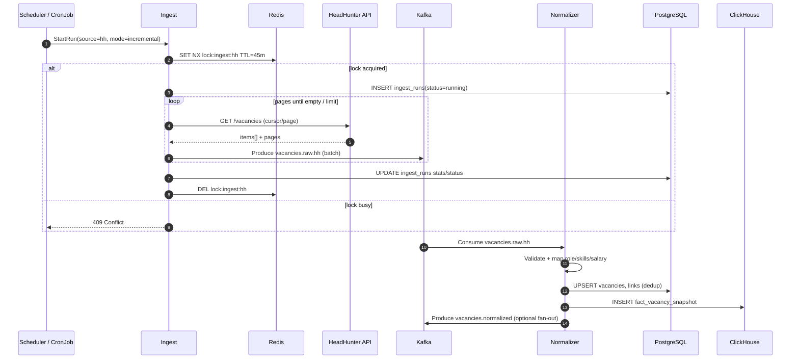
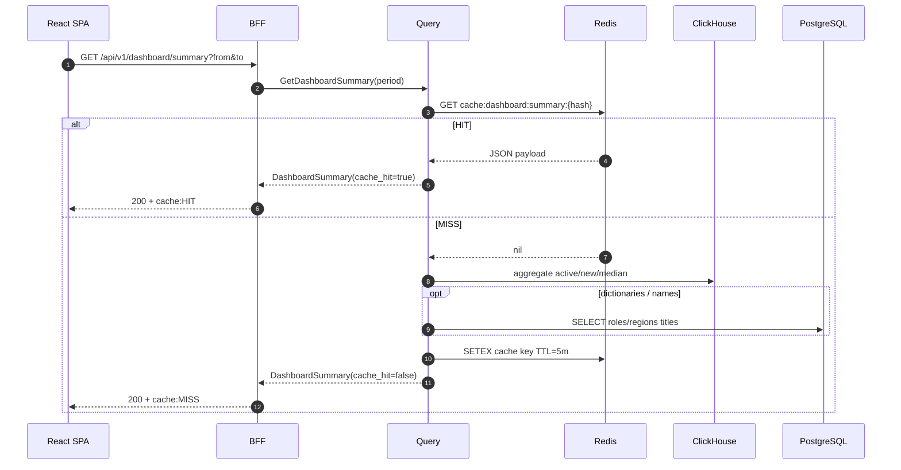
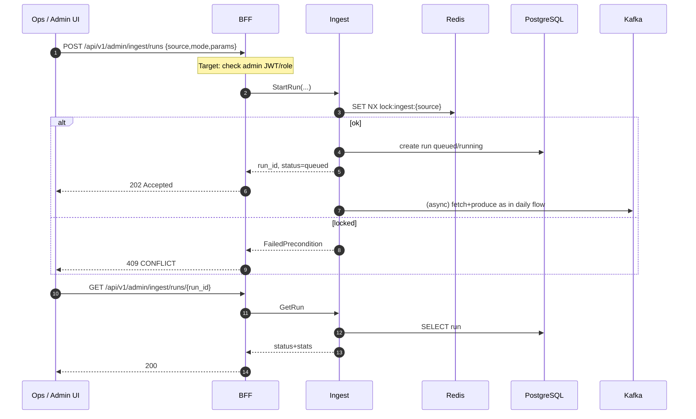
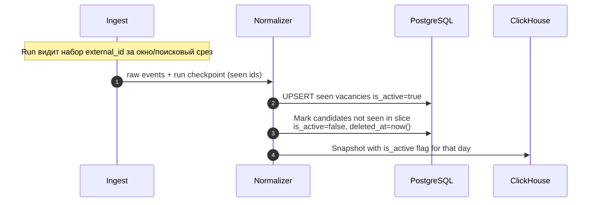
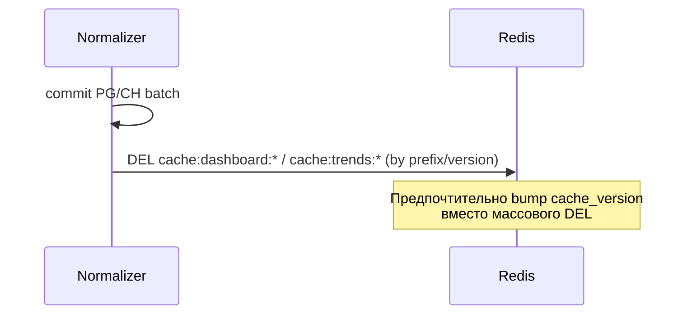

# 04. Sequence Diagrams

## 1. Daily ingest: HH → Kafka → normalize → PG → ClickHouse

**Фаза:** Target core (Phase 2). В MVP Kafka может быть заменена in-process вызовом.

> Для Phase 2 выбор between transactional outbox и documented replay checkpoint — отдельный ADR. Диаграмма ниже показывает pipeline, но не утверждает атомарность PG + Kafka.



### Phase 1: commit checkpoint страницы

```mermaid
sequenceDiagram
  autonumber
  participant Ing as Ingest
  participant HH as HeadHunter API
  participant Adapter as HH adapter
  participant Norm as In-process normalizer
  participant PG as PostgreSQL

  Ing->>PG: Read ingest_checkpoint(source, scope)
  Ing->>HH: GET /vacancies(cursor)
  HH-->>Ing: page items + next_cursor
  Ing->>Adapter: ToDraftV1 for every item
  Adapter-->>Ing: SourceNeutralDraftV1[]
  Ing->>Norm: NormalizeAndStorePage(drafts)
  Norm->>PG: UPSERT all vacancy/dictionary changes
  alt all drafts stored
    Norm-->>Ing: success
    Ing->>PG: UPDATE ingest_checkpoint(next_cursor)
  else any draft/store fails
    Norm-->>Ing: error
    Note over Ing,PG: Do not update checkpoint; retry whole page
  end
```

## 2. Dashboard read path — Redis cache hit / miss



## 3. Manual re-ingest (admin)



## 4. Future AI analysis flow (async job)

```mermaid
sequenceDiagram
  autonumber
  participant UI as React / Admin
  participant BFF as BFF
  participant AIApi as AI Service gRPC
  participant PG as PostgreSQL
  participant Kafka as Kafka
  participant Worker as AI Analyzer
  participant CH as ClickHouse
  participant LLM as AI Provider

  UI->>BFF: POST /api/v1/admin/ai/analyses
  BFF->>AIApi: StartAnalysis(...)
  AIApi->>PG: INSERT ai_jobs(status=queued)
  AIApi->>Kafka: Produce ai.jobs
  AIApi-->>BFF: job_id queued
  BFF-->>UI: 202

  Kafka->>Worker: Consume ai.jobs
  Worker->>PG: UPDATE status=running
  Worker->>CH: Load trend series / vacancy sample
  Worker->>PG: Load role metadata (no PII)
  Worker->>Worker: Build prompt (prompt_version)
  Worker->>LLM: ChatCompletion
  alt success
    LLM-->>Worker: insight JSON
    Worker->>PG: INSERT ai_insights; job=completed
  else provider error / 429
    LLM-->>Worker: error
    Worker->>PG: job=retrying/failed
    Worker->>Kafka: retry or DLQ ai.jobs.dlq
  end

  UI->>BFF: GET /api/v1/ai/insights/{id}
  BFF->>AIApi: GetInsight
  AIApi->>PG: SELECT
  AIApi-->>BFF: insight
  BFF-->>UI: 200
```

## 5. HH rate-limit / 429 backoff

```mermaid
sequenceDiagram
  autonumber
  participant Ing as Ingest HH client
  participant HH as HeadHunter API
  participant Metrics as Metrics

  loop fetch page
    Ing->>HH: GET /vacancies?...
    alt 200 OK
      HH-->>Ing: items
      Ing->>Ing: reset consecutive_429
    else 429 Too Many Requests
      HH-->>Ing: 429 + Retry-After
      Ing->>Metrics: hh_429_total++
      Ing->>Ing: sleep max(Retry-After, exp_backoff+jitter)
      Note over Ing: attempt++ ; if attempt>max → fail run partial
      Ing->>HH: retry same page
    else 5xx / timeout
      HH-->>Ing: error
      Ing->>Ing: exp backoff retry
    end
  end
```

## 6. Soft-delete / deactivate missing vacancies (incremental)



> Политика «не увидели = inactive» осторожная: только для scoped search (например area+role), не глобально по всей HH за один проход. Полный reconcile — отдельный weekly job (Target).

## 7. Cache invalidation after successful normalize batch (optional)


