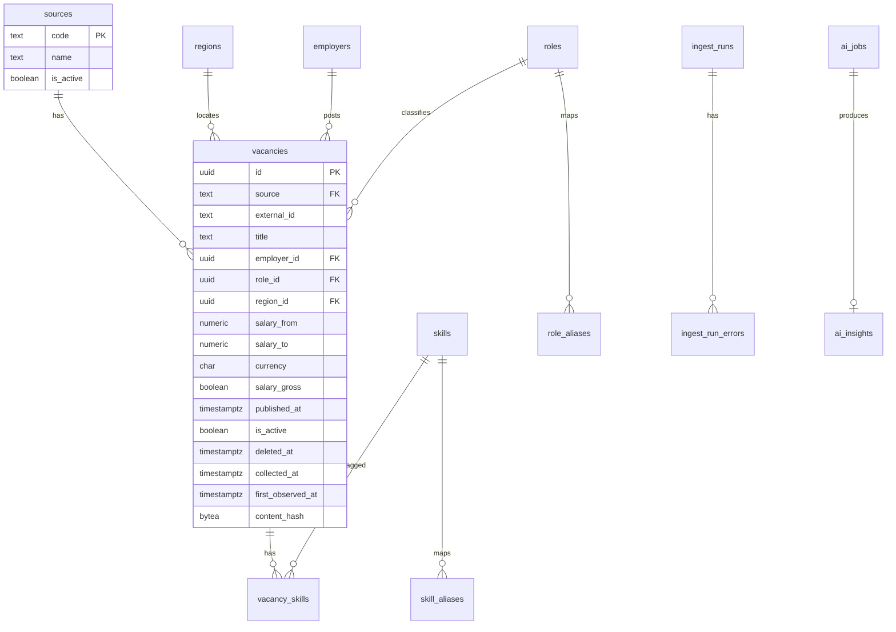

# 05. Data Model

## OLTP vs OLAP — что куда и почему

| Вопрос | PostgreSQL (OLTP) | ClickHouse (OLAP) |
|--------|-------------------|-------------------|
| Текущее состояние вакансии | Да | Нет (только снимки/факты) |
| Справочники ролей/скиллов | Да (source of truth) | Денормализованные названия в фактах |
| Dedup / unique constraints | Да | Нет (идемпотентность на уровне insert+ReplacingMergeTree опционально) |
| Точечный GET vacancy by id | Да | Нет |
| Медианы зарплат за год по разрезам | Можно на малых объёмах (MVP) | Да (Target / Phase 2) |
| Ingest runs, AI jobs | Да | Нет |
| Daily snapshots для трендов | Да, Phase 1 market demand | Да — основной store с Phase 2 |

**Правило:** если запрос сканирует миллионы строк по времени — ClickHouse. Если нужна транзакционная целостность и связи — PostgreSQL.

---

## PostgreSQL ER (логический)



---

## PostgreSQL tables

### `sources`

| Column | Type | Notes |
|--------|------|-------|
| `code` | `TEXT` PK | `hh`, `superjob`, ... |
| `name` | `TEXT` NOT NULL | |
| `is_active` | `BOOLEAN` NOT NULL DEFAULT true | |
| `created_at` | `TIMESTAMPTZ` NOT NULL DEFAULT now() | |

**Target (Phase 5):** либо additive колонка `kind` (`jobs|edu|news|article`), либо отдельная таблица `signal_sources` с тем же смыслом — см. секцию [Perspectives / trend signals](#perspectives--trend-signals-target-phase-5). До Phase 5 достаточно job-источников без `kind`.

### `regions`

| Column | Type | Notes |
|--------|------|-------|
| `id` | `UUID` PK | |
| `code` | `TEXT` NOT NULL | канонический код, напр. `ru-msk` |
| `name` | `TEXT` NOT NULL | |
| `country_code` | `CHAR(2)` NOT NULL DEFAULT `RU` | |
| `parent_id` | `UUID` NULL FK → regions | дерево |
| `is_active` | `BOOLEAN` NOT NULL DEFAULT true | |
| `created_at` / `updated_at` | `TIMESTAMPTZ` | |

**Unique:** `(country_code, code)`  
**Index:** `(parent_id)`, `(is_active) WHERE is_active`

### `region_external_ids`

Маппинг внешних area id.

| Column | Type |
|--------|------|
| `source` | `TEXT` FK sources |
| `external_id` | `TEXT` |
| `region_id` | `UUID` FK regions |
| PK | `(source, external_id)` |

### `roles`

| Column | Type | Notes |
|--------|------|-------|
| `id` | `UUID` PK | |
| `slug` | `TEXT` NOT NULL UNIQUE | `go-developer` |
| `title` | `TEXT` NOT NULL | |
| `family` | `TEXT` NULL | backend, data, ... |
| `is_active` | `BOOLEAN` NOT NULL DEFAULT true | |

Для HH Phase 1 `family` также служит продуктовым scope:
`software_development`, `analytics`, `quality_assurance`. Только эти семейства
попадают в публичный vacancy list; официальный внешний ID остаётся в
`role_aliases`. Это не title-классификация.

С migration v7 scope больше не выводится неявно только из `family`:
`role_scopes(role_id, scope)` и
`vacancy_role_scopes(vacancy_id, role_id, scope)` поддерживают
`vacancy_listing` и `management_analytics`. Одна официальная роль может
принадлежать обоим scopes. `/vacancies` проверяет только persisted
`vacancy_listing`; management-only rows остаются доступны аналитике, но не
listing. Решение: [ADR 012](./adr/012-dashboard-ranking-scopes.md).

### `role_aliases`

| Column | Type | Notes |
|--------|------|-------|
| `id` | `BIGSERIAL` PK | |
| `role_id` | `UUID` FK roles | |
| `pattern` | `TEXT` NOT NULL | нормализованный title pattern / HH professional_role id |
| `source` | `TEXT` NULL | если alias специфичен источнику |
| **Unique** | `(source, pattern)` | |

### `skills`

| Column | Type | Notes |
|--------|------|-------|
| `id` | `UUID` PK | |
| `slug` | `TEXT` NOT NULL UNIQUE | |
| `name` | `TEXT` NOT NULL | |
| `is_active` | `BOOLEAN` NOT NULL DEFAULT true | |
| `skill_kind` | `TEXT` NOT NULL | `programming_language`, `query_language`, `markup`, `shell`, `platform_language`, `framework`, `database`, `tool`, `other` |

### `skill_aliases`

Аналогично `role_aliases` для нормализации «k8s» → Kubernetes.
Для языков alias (`Go`/`Golang`, JS/JavaScript, TS/TypeScript, C Sharp/C#)
указывает на один canonical skill; PK `vacancy_skills` исключает двойной счёт.
Строгий language ranking берёт только `programming_language`. SQL, HTML/CSS,
Bash и 1C имеют явные отдельные категории и в него не входят.

### `employers`

| Column | Type | Notes |
|--------|------|-------|
| `id` | `UUID` PK | |
| `source` | `TEXT` NOT NULL | |
| `external_id` | `TEXT` NOT NULL | |
| `name` | `TEXT` NOT NULL | |
| `is_active` | `BOOLEAN` NOT NULL DEFAULT true | |
| **Unique** | `(source, external_id)` | |

### `vacancies`

| Column | Type | Notes |
|--------|------|-------|
| `id` | `UUID` PK | |
| `source` | `TEXT` NOT NULL FK | |
| `external_id` | `TEXT` NOT NULL | |
| `title` | `TEXT` NOT NULL | |
| `employer_id` | `UUID` NULL FK | |
| `role_id` | `UUID` NULL FK | nullable пока не сматчили |
| `region_id` | `UUID` NULL FK | |
| `salary_from` | `NUMERIC(12,2)` NULL | |
| `salary_to` | `NUMERIC(12,2)` NULL | |
| `salary_currency` | `CHAR(3)` NULL | |
| `salary_gross` | `BOOLEAN` NULL | |
| `salary_mid` | `NUMERIC(12,2)` NULL | computed: mid/from/to |
| `description_text` | `TEXT` NULL | усечённый текст; без отдельного хранения PII-контактов |
| `published_at` | `TIMESTAMPTZ` NULL | |
| `collected_at` | `TIMESTAMPTZ` NOT NULL | |
| `first_observed_at` | `TIMESTAMPTZ` NOT NULL | UTC-время первого наблюдения; не изменяется при повторном ingest |
| `is_active` | `BOOLEAN` NOT NULL DEFAULT true | soft availability |
| `deleted_at` | `TIMESTAMPTZ` NULL | soft-delete |
| `content_hash` | `BYTEA`/`CHAR(64)` | для skip unchanged |
| `raw_payload` | `JSONB` NULL | MVP optional; Target — object storage / TTL cleanup |
| `created_at` / `updated_at` | `TIMESTAMPTZ` | |

**Constraints / indexes:**

- **UNIQUE** `(source, external_id)` — главный dedup key
- **INDEX** `(role_id, is_active) WHERE deleted_at IS NULL`
- **INDEX** `(region_id, is_active) WHERE deleted_at IS NULL`
- **INDEX** `(published_at DESC)`
- **INDEX** `(is_active) WHERE is_active = true`
- **INDEX** `(salary_mid) WHERE salary_mid IS NOT NULL AND is_active`
- **COMPOSITE** `(role_id, region_id, published_at DESC) WHERE is_active`

### `vacancy_skills`

| Column | Type |
|--------|------|
| `vacancy_id` | `UUID` FK ON DELETE CASCADE |
| `skill_id` | `UUID` FK |
| PK | `(vacancy_id, skill_id)` |

**Index:** `(skill_id, vacancy_id)`

### `ingest_runs`

| Column | Type | Notes |
|--------|------|-------|
| `id` | `TEXT`/`UUID` PK | ULID предпочтительно |
| `source` | `TEXT` NOT NULL | |
| `mode` | `TEXT` NOT NULL | `full`/`incremental` |
| `status` | `TEXT` NOT NULL | queued/running/success/partial/failed |
| `params` | `JSONB` NOT NULL DEFAULT `{}` | |
| `requested_by` | `TEXT` | scheduler/admin |
| `started_at` / `finished_at` | `TIMESTAMPTZ` | |
| `stats` | `JSONB` | fetched/published/errors |
| `error_message` | `TEXT` | |
| `created_at` | `TIMESTAMPTZ` | |

**Index:** `(source, created_at DESC)`, `(status) WHERE status IN ('queued','running')`

### `ingest_checkpoints` (Phase 1)

Состояние продвижения pagination/cursor для конкретного логического среза source и параметров ingest.

| Column | Type | Notes |
|--------|------|-------|
| `source` | `TEXT` FK sources | |
| `scope_hash` | `CHAR(64)` | стабильный hash нормализованных params (area/text/mode) |
| `cursor` | `TEXT` NULL | cursor источника или сериализованный номер следующей страницы |
| `updated_at` | `TIMESTAMPTZ` | |
| **PK** | `(source, scope_hash)` | |

**Commit policy:** Ingest читает checkpoint перед fetch. Новый `cursor` сохраняется в одной транзакции с успешным завершением обработки **всей** fetched page: adapter создаёт versioned source-neutral drafts, normalizer выполняет shared normalization и idempotent UPSERT всех drafts. При ошибке cursor не обновляется; page безопасно будет повторена.

В Phase 2 эта таблица сама по себе не решает разрыв между PG и Kafka. До перехода к Kafka требуется ADR о transactional outbox или о documented replay checkpoint (см. [07-messaging.md](./07-messaging.md)).

### `ingest_run_errors`

| Column | Type |
|--------|------|
| `id` | `BIGSERIAL` PK |
| `run_id` | FK ingest_runs |
| `external_id` | `TEXT` NULL |
| `stage` | `TEXT` | fetch/produce |
| `message` | `TEXT` |
| `created_at` | `TIMESTAMPTZ` |

### `ingest_cycles` и market snapshots (Phase 1)

`ingest_cycles` — долговечное доказательство полного coverage. Для
`daily_discovery` статус `complete` допустим только после commit всех
role/date search pages. Detail hydration использует отдельный checkpoint и не
влияет на дневной marker.

| Таблица | Natural key | Назначение |
|---------|-------------|------------|
| `analytics_runs` | `(run_type, target_period_start, source, method_version)` | Идемпотентный daily/weekly run, status, counts, sanitized error |
| `vacancy_demand_daily` | date + source + role group + aggregation level + region + method | Сохранённые active/published/salary metrics полного cycle |
| `vacancy_demand_weekly` | ISO Monday + те же dimensions + method | Воспроизводимый rollup из daily rows |
| `ingest_cycle_partitions` | cycle + stable partition key | Page-level resume/progress discovery |
| `ingest_cycle_observations` | `(cycle_id, source, external_id)` | Дедуплицированные минимальные search facts без descriptions/PII |

Регион задаётся явно: `aggregation_level=all_regions` требует `region_id IS
NULL`, `aggregation_level=region` — `region_id IS NOT NULL`; unique constraint
использует `NULLS NOT DISTINCT`, поэтому all-Russia row не дублируется.

Методика `vacancy_demand_v2`:

- группы: development/leads (`96`, `104`), analytics (`148`, `150`, `156`,
  `164`), QA (`124`);
- `active_count` — дедуплицированные in-scope search observations полного
  дневного discovery cycle;
- `published_count` — их `published_at` в UTC-дне snapshot;
- role/region берутся из per-vacancy search item, не из partition defaults;
- salary sample — search offered salary, обработанная shared normalizer в
  RUB/net, `10 000..2 000 000`; сохраняются method и coverage;
- weekly `active_count` — последний daily snapshot недели;
  `published_count` — сумма дней; weekly salary — медиана daily medians;
- `source_daily_count < 7` означает `complete=false`, такой ряд BFF не показывает
  как сопоставимую полную неделю.

Skill snapshots отложены: текущий Market UI не показывает skill trend. Это
отдельная методика, а не повод расширять v1 без потребности.

Observations хранятся минимум 35 дней и удаляются только после успешного
snapshot. Решения: [ADR 011](./adr/011-phase1-market-snapshots.md),
[ADR 013](./adr/013-daily-discovery-snapshots.md).

### `ai_jobs` (Target)

| Column | Type |
|--------|------|
| `id` | PK ULID |
| `type` | `TEXT` |
| `status` | `TEXT` |
| `payload` | `JSONB` |
| `prompt_version` | `TEXT` |
| `attempts` | `INT` |
| `error_message` | `TEXT` |
| `created_at` / `finished_at` | `TIMESTAMPTZ` |

### `ai_insights` (Target)

| Column | Type |
|--------|------|
| `id` | PK |
| `job_id` | FK UNIQUE |
| `type` | `TEXT` |
| `role_id` / `region_id` | UUID NULL |
| `summary` | `TEXT` |
| `bullets` | `JSONB` |
| `model` | `TEXT` |
| `prompt_version` | `TEXT` |
| `needs_human_review` | `BOOLEAN` DEFAULT false |
| `tokens_input` / `tokens_output` | `INT` |
| `created_at` | `TIMESTAMPTZ` |

---

## Perspectives / trend signals (Target, Phase 5)

**Не писать миграции до Phase 5.** Логическая модель для multi-source «Тенденции» (см. [ADR 007](./adr/007-multi-source-trend-signals.md), [08](./08-integrations-and-extensibility.md)).

Vacancy demand Phase 1 живёт в `vacancy_demand_daily|weekly` (PG; CH с Phase 2)
и API `/trends/demand` — это **не** замена таблицам ниже.

### Вариант реестра источников

**A.** Расширить `sources`:

| Column | Type | Notes |
|--------|------|-------|
| `kind` | `TEXT` NOT NULL DEFAULT `jobs` | `jobs` \| `edu` \| `news` \| `article` |

**B.** Отдельная `signal_sources(code, name, kind, is_active, …)` — если не хотите смешивать job-board codes с RSS/edu.

Выбор A/B — при реализации Phase 5 (один writer-домен на реестр).

### `trend_signals` (PG, Target)

Сырые/нормализованные наблюдения сигналов (одна строка = метрика источника на дату × direction).

| Column | Type | Notes |
|--------|------|-------|
| `id` | `UUID` / `BIGSERIAL` PK | |
| `signal_date` | `DATE` NOT NULL | день наблюдения / агрегата |
| `direction_key` | `TEXT` NOT NULL | skill slug / role family / канонический direction id |
| `role_id` | `UUID` NULL FK roles | если смаплено |
| `skill_id` | `UUID` NULL FK skills | если смаплено |
| `source` | `TEXT` NOT NULL | FK `sources` / `signal_sources` |
| `source_kind` | `TEXT` NOT NULL | `jobs` \| `edu` \| `news` \| `article` |
| `metric_name` | `TEXT` NOT NULL | напр. `vacancy_active_count`, `course_catalog_count`, `mention_count` |
| `value` | `NUMERIC` NOT NULL | |
| `unit` | `TEXT` NULL | `count`, `share`, … |
| `meta` | `JSONB` NULL | provenance, query, locale |
| `content_hash` | `BYTEA`/`CHAR(64)` | идемпотентность |
| `collected_at` | `TIMESTAMPTZ` NOT NULL | |
| **Unique (ориентир)** | `(signal_date, direction_key, source, metric_name)` | |

**Index:** `(direction_key, signal_date DESC)`, `(source_kind, signal_date DESC)`.

### `trend_scores_daily` (PG и/или CH, Target)

Результат aggregator job — composite heuristic score.

| Column | Type | Notes |
|--------|------|-------|
| `score_date` | `DATE` NOT NULL | |
| `direction_key` | `TEXT` NOT NULL | |
| `role_family` | `TEXT` NULL | фильтр UI |
| `composite_score` | `NUMERIC` NOT NULL | нормированный score |
| `demand_component` | `NUMERIC` NULL | |
| `learning_component` | `NUMERIC` NULL | |
| `media_component` | `NUMERIC` NULL | |
| `coverage` | `JSONB` / flags | какие ноги участвовали |
| `score_version` | `TEXT` NOT NULL | веса/формула |
| `sample_refs` | `JSONB` NULL | опц. ссылки на signal ids |
| **PK / Unique** | `(score_date, direction_key, score_version)` | |

- **PG:** удобно для точечного API и debug.  
- **CH (опц.):** длинные ряды / тяжёлые scan — `ReplacingMergeTree` по `(score_date, direction_key)`.

Миграции (когда дойдём): например `0006_trend_signals.sql` в `/migrations/postgres` — **не создавать сейчас**.

---

## Soft-delete / is_active

| Флаг | Смысл |
|------|-------|
| `is_active = false` | Вакансия больше не наблюдается в источнике (снята) |
| `deleted_at IS NOT NULL` | Логическое удаление/скрытие из продукта (редко) |
| Справочники `is_active` | Отключение роли/скилла без удаления истории |

Аналитические запросы по «текущему рынку» фильтруют `vacancies.is_active = true AND deleted_at IS NULL`.
Reconciliation не активирует устаревшие строки автоматически. Новый bounded
официальный ingest может подтвердить актуальность management-only vacancy и
оставить её `is_active=true`, при этом отсутствие `vacancy_listing` scope
гарантирует исключение из публичного списка.

---

## Dedup keys

| Сущность | Natural key |
|----------|-------------|
| Vacancy | `(source, external_id)` |
| Employer | `(source, external_id)` |
| Region external | `(source, external_id)` |
| Skill slug | `skills.slug` |
| Role slug | `roles.slug` |

Normalize: при конфликте unique → `UPSERT` обновляет поля если `content_hash` изменился.

---

## ClickHouse

### `fact_vacancy_snapshot`

Ежедневный (или per-collect) снимок для трендов. Денормализация названий — чтобы не JOIN'ить PG.

| Column | Type | Notes |
|--------|------|-------|
| `snapshot_date` | `Date` | partition key component |
| `vacancy_id` | `UUID` | PG id |
| `source` | `LowCardinality(String)` | |
| `external_id` | `String` | |
| `role_id` | `UUID` | |
| `role_slug` | `LowCardinality(String)` | denorm |
| `region_id` | `UUID` | |
| `region_code` | `LowCardinality(String)` | denorm |
| `country_code` | `FixedString(2)` | |
| `employer_id` | `UUID` | |
| `title` | `String` | |
| `salary_mid` | `Nullable(Float64)` | в базовой валюте отчёта или raw + currency |
| `salary_currency` | `LowCardinality(String)` | |
| `salary_mid_rub` | `Nullable(Float64)` | нормализовано |
| `is_active` | `UInt8` | |
| `published_at` | `DateTime` | |
| `collected_at` | `DateTime` | |
| `skills` | `Array(String)` | slugs denorm |

**Engine (рекомендация):** `ReplacingMergeTree(collected_at)`  
**PARTITION BY:** `toYYYYMM(snapshot_date)`  
**ORDER BY:** `(snapshot_date, role_slug, region_code, source, vacancy_id)`

### `fact_vacancy_skill` (опционально)

Развёртка скиллов для top-skills без array join каждый раз.

| Column | Type |
|--------|------|
| `snapshot_date` | `Date` |
| `vacancy_id` | `UUID` |
| `skill_slug` | `LowCardinality(String)` |
| `role_slug` | `LowCardinality(String)` |
| `region_code` | `LowCardinality(String)` |
| `salary_mid_rub` | `Nullable(Float64)` |

**PARTITION BY** `toYYYYMM(snapshot_date)`  
**ORDER BY** `(snapshot_date, skill_slug, role_slug, region_code, vacancy_id)`

### `agg_salary_daily` (Target materialized)

Можно наполнять MV или nightly job:

- `day`, `role_slug`, `region_code`, `median`, `p25`, `p75`, `sample_size`, `active_count`

---

## MVP vs Target storage

| Возможность | MVP | Target |
|-------------|-----|--------|
| Vacancies + dicts | PG | PG |
| Dashboard aggregates | SQL на PG (+ Redis) | CH + Redis |
| Trends > 90 дней (salary/demand) | PG snapshots, ограничено | CH |
| Perspectives signals / composite scores | — | PG (+ опц. CH), Phase 5 |
| Raw JSON payload | PG JSONB краткосрочно | S3/MinIO + hash в PG |
| AI tables | — | PG |

---

## Migrations

**Выбор (зафиксирован):** [`golang-migrate`](./adr/002-migrate-tool.md) для PostgreSQL. В CI — тот же инструмент. ClickHouse — отдельный SQL runner / файлы в `migrations/clickhouse`.

### PostgreSQL

```
/migrations/postgres
  0001_init_sources.sql
  0002_dicts.sql
  0003_vacancies.sql
  0004_ingest_runs.sql
  0005_ai.sql          # Target
```

- Только forward+backward где возможно; destructive — expand/contract
- Миграции запускает Job в pipeline / init container (см. 10-cicd)

### ClickHouse

```
/migrations/clickhouse
  0001_fact_vacancy_snapshot.sql
  0002_fact_vacancy_skill.sql
```

Отдельный migrate runner (HTTP clickhouse client) в CI Job.

### Правила

1. Не править применённые файлы — только новые версии  
2. Длинные locks на PG — избегать `REWRITE` больших таблиц без плана  
3. CH: additive columns предпочтительнее rebuild  
4. Версия схемы в таблице `schema_migrations`

## FX и source URL (migration v9)

- `fx_rates(provider, rate_date, base_currency, quote_currency)` хранит
  официальный дневной `rub_per_unit`, исходные `Nominal`/`Value`, `fetched_at`
  и provenance. Индекс `(quote_currency, provider, rate_date DESC)` обслуживает
  latest и bounded historical lookup.
- `fx_sync_runs` хранит только операционные счётчики без vacancy content.
- `vacancies.source_url` — nullable source-neutral HTTP(S) URL.
- `salary_*_rub_net`, `salary_rate_date/provider` отделяют canonical RUB/net от
  исходного диапазона и валюты. Аналогичная provenance добавлена минимально в
  daily discovery observations.
- Контракт и fallback: [ADR 014](./adr/014-official-fx-and-source-links.md).
