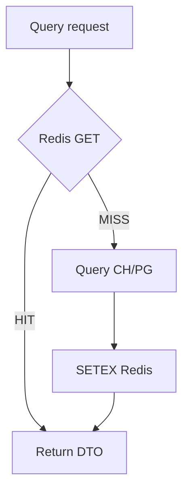

# 06. Caching (Redis)

## Роли Redis

| Роль | Фаза | Описание |
|------|------|----------|
| Cache-aside для dashboard/trends | MVP | Снижение нагрузки на PG/CH |
| Кэш словарей HH | MVP | areas, professional_roles |
| Distributed locks ingest | Phase 2 | Один active run на source |
| Rate-limit counters (edge) | Target | Опционально вместо in-memory |
| Idempotency keys admin POST | Target | |

## Key design

Convention: `{namespace}:{entity}:{key}` + optional `:v{cache_version}`.

Глобальный `cache_version` (integer в Redis `meta:cache_version`) — дешёвая инвалидация: bump версии вместо SCAN/DEL по маске.

### Ключи

| Key pattern | Тип | TTL | Писатель | Назначение |
|-------------|-----|-----|----------|------------|
| `cache:v{n}:dashboard:summary:{hash}` | string JSON | 5 min | query | Summary DTO |
| `cache:v{n}:trends:salary:{hash}` | string JSON | 10 min | query | Salary series |
| `cache:v{n}:trends:demand:{hash}` | string JSON | 10 min | query | Demand series |
| `cache:v{n}:skills:top:{hash}` | string JSON | 15 min | query | Top skills |
| `cache:v{n}:roles:list:{hash}` | string JSON | 10 min | query | Roles page |
| `cache:v{n}:regions:list:{hash}` | string JSON | 10 min | query | Regions page |
| `dict:hh:areas` | string/hash JSON | 24h | ingest | HH areas tree |
| `dict:hh:professional_roles` | string JSON | 24h | ingest | HH roles dict |
| `dict:fx:rub:{date}` | hash | 24h | ingest/query | Курсы для normalize (если нужны) |
| `lock:ingest:{source}` | string (run_id) | 45–60 min | ingest | Mutex run |
| `lock:ai:{job_id}` | string | 15 min | ai-analyzer | Avoid double process |
| `meta:cache_version` | string int | none | normalizer/ops | Bust caches |
| `idempotency:admin:{key}` | string | 24h | bff | Target |

`{hash}` = stable hash от нормализованных query params (`from`, `to`, `role_id`, `region_id`, `grain`, `currency`, page...).

## TTL guidelines

| Данные | TTL | Почему |
|--------|-----|--------|
| Dashboard summary | 3–5 min | Баланс свежести после daily ingest |
| Trends | 10–15 min | Тяжёлые агрегаты |
| HH dictionaries | 12–24h | Меняются редко |
| Locks | = max expected run + buffer | Safety expire |
| Vacancy detail | **не кэшировать долго** / 60s max | Точечные чтения из PG дешёвые |

ADR: [006-cache-strategy.md](./adr/006-cache-strategy.md). Ops: [cache-and-locks.md](../runbooks/cache-and-locks.md).

## Cache-aside pattern



Псевдокод:

```
key = buildKey(version, params)
if val = redis.Get(key): return val
dto = repo.Load(params)
redis.SetEX(key, ttl, dto)
return dto
```

При ошибке Redis — **fail-open**: идти в CH/PG, логировать `redis_error`, не ронять запрос.

## Invalidation strategy

| Событие | Действие |
|---------|----------|
| Успешный normalize batch (ежедневный) | `INCR meta:cache_version` |
| Ручной ops «bust cache» | тот же INCR |
| Изменение словарей ролей | INCR или точечный DEL dict keys |
| AI insight создан | не инвалидирует salary caches (отдельный ресурс) |

**Не использовать** массовый `KEYS cache:*` в prod. Если нужен prefix delete — Redis secondary index / version bump.

### Stale-while-revalidate (Target)

Для summary: отдать stale на короткий grace (например TTL 5m + soft 1m) и обновить в фоне — улучшает p95.

## Distributed locks (ingest)

```
SET lock:ingest:hh <run_id> NX EX 2700
```

- Владелец продлевает TTL heartbeat'ом каждые N минут (если run долгий)
- Release: `DEL` только если value == run_id (Lua compare-and-del)
- Если lock истёк mid-run — следующий run может стартовать; старый run должен детектить loss и останавливаться (Target)

## Caching HH dictionaries

1. Ingest перед sync: `GET dict:hh:areas`  
2. Miss → HTTP HH `/areas` → `SETEX` 24h  
3. Normalizer читает тот же ключ (или локальный snapshot в PG `region_external_ids`)

Словари в Redis — ускорение; **source of truth маппинга** после normalize — PostgreSQL.

## Что НЕ кэшировать

| Не кэшировать | Почему |
|---------------|--------|
| Сырые PII / контакты из описаний | Безопасность; лучше вообще не хранить |
| Admin ingest run status < 5s polling | Лучше напрямую PG; или TTL 2s max |
| Полные raw HH payloads | Большой объём; ephemeral в Kafka |
| Пользовательские секреты / tokens | Никогда в cache values |
| Неограниченные query комбинации без TTL cap | Риск memory blow-up — лимитировать размер value и cardinality (нормализовать params) |
| Результаты AI без привязки к id | Кэшировать только по `insight_id` кратко, основное в PG |

## Memory & sizing (rough)

| Среда | Maxmemory policy | Ориентир |
|-------|------------------|----------|
| Local compose | `allkeys-lru`, 256mb | ok |
| Dev/stage | `allkeys-lru`, 512mb–1gb | |
| Prod | `allkeys-lru`, 1–2gb | Зависит от cardinality hash keys |

Метрики: `cache_hit_ratio`, `redis_evicted_keys`, `lock_acquire_fail_total`.

## Security notes

- Redis без публичного Ingress
- AUTH password / ACL в prod
- Не класть secrets в values
- TLS redis (`rediss://`, managed / cloud — см. [12-local-dev.md](./12-local-dev.md#облачный-redis))
