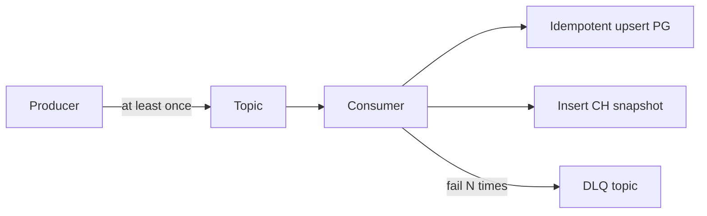

# 07. Messaging (Kafka)

## Зачем Kafka

- Развязать скорость HH API и скорость записи PG/CH
- Retry / DLQ без потери прогресса ingest
- Fan-out: normalize сейчас, AI / export позже
- Горизонтальное масштабирование workers

**MVP (Phase 1):** допускается in-process queue или прямая передача ingest→normalize.  
**Target (Phase 2+):** Kafka обязателен для production-like контура.

## Граница Phase 1 → Phase 2: checkpoint и публикация

В Phase 1 `cursor`/номер страницы сохраняется только после того, как normalizer успешно обработал и сохранил **всю** страницу versioned source-neutral drafts. Повтор страницы допустим: PG UPSERT по `(source, external_id)` и `content_hash` идемпотентен.

В Phase 2 нельзя переносить эту политику на Kafka неявно: запись checkpoint в PG и produce Kafka не образуют общую транзакцию. **До включения Kafka нужен отдельный ADR**, выбирающий один из вариантов:

1. transactional outbox в PG с надёжным publisher; или
2. documented replay checkpoint: cursor продвигается только после подтверждённой публикации всей страницы, а replay-процедура и допустимые дубликаты явно описаны в runbook.

До решения ADR не заявляем exactly-once и не считаем checkpoint гарантией отсутствия пропусков для Phase 2.

## Topics

| Topic | Producers | Consumers | Назначение |
|-------|-----------|-----------|------------|
| `vacancies.raw.hh` | ingest | normalizer | Сырые HH vacancies (+ meta) |
| `vacancies.raw.superjob` | ingest | normalizer | Target source |
| `vacancies.raw.remotive` | ingest | normalizer | Target |
| `vacancies.normalized` | normalizer | ai-analyzer, export (opt) | Каноническое событие после upsert |
| `vacancies.raw.dlq` | normalizer | ops replay | Poison raw messages |
| `ai.jobs` | ai service / bff path | ai-analyzer | Async analysis jobs |
| `ai.jobs.dlq` | ai-analyzer | ops | Failed AI jobs |
| `signals.raw` | signals-ingest / ingest | signals-aggregator (или sync writer) | Neutral trend signals (edu/news/…) — **опц. foundation Phase 2+, collectors Phase 5** |
| `signals.raw.dlq` | aggregator / consumer | ops | Poison signal messages |

Альтернатива одному topic `vacancies.raw` с полем `source` + header — тоже ок; отдельные topics проще для ACL и retention per source.

Perspectives (`signals.*`) не блокируют Phase 1–2: topic можно завести пустым; edu/news adapters — только Phase 5 ([ADR 007](./adr/007-multi-source-trend-signals.md)).

## Partition key strategy

| Topic | Key | Почему |
|-------|-----|--------|
| `vacancies.raw.*` | `{source}:{external_id}` | Упорядочивание обновлений одной вакансии в partition |
| `vacancies.normalized` | `{vacancy_id}` или тот же natural key | Стабильный порядок per vacancy |
| `ai.jobs` | `{job_id}` | Уникальность, равномерность |
| `signals.raw` | `{source}:{direction_key}:{metric_name}` | Упорядочивание обновлений одного сигнала |

Partitions (ориентир): 3–6 для raw на старте; увеличивать по lag.

**Не ключить** только `source` — все сообщения попадут в одну partition.

## Message schema decision: JSON vs Avro

| Критерий | JSON (выбран для учебного проекта) | Avro + Schema Registry |
|----------|------------------------------------|------------------------|
| Простота локального DX | Высокая | Ниже |
| Эволюция схемы | `schema_version` + tolerant readers | Сильные compatibility rules |
| Размер / CPU | Хуже | Лучше |
| Ops нагрузка | Ниже | Нужен registry |

**Решение:** **JSON** с envelope + `schema_version` для MVP→Target early.  
Миграция на Avro — опциональный Target, когда появится много consumers.  
ADR: [001-json-vs-avro.md](./adr/001-json-vs-avro.md). Local broker: Redpanda — [003-redpanda-local.md](./adr/003-redpanda-local.md).

### Envelope

```json
{
  "schema_version": 1,
  "message_id": "01JMSG...",
  "produced_at": "2026-08-11T10:00:00Z",
  "source": "hh",
  "ingest_run_id": "01JRUN...",
  "payload": { }
}
```

Headers (Kafka): `schema_version`, `source`, `content_hash`, `trace_id`.

### `vacancies.raw` payload (v1)

```json
{
  "external_id": "123456",
  "collected_at": "2026-08-11T10:00:00Z",
  "raw": { },
  "content_hash": "sha256..."
}
```

`raw` — усечённый/полный JSON ответа источника. Normalizer не ходит обратно в HH за телом (кроме редких enrich — Target).

### `vacancies.normalized` payload (v1)

```json
{
  "vacancy_id": "uuid",
  "source": "hh",
  "external_id": "123456",
  "role_id": "uuid",
  "region_id": "uuid",
  "salary_mid_rub": 250000,
  "is_active": true,
  "skills": ["go", "kafka"],
  "published_at": "2026-08-10T10:00:00Z",
  "changed": true
}
```

### `ai.jobs` payload (v1)

```json
{
  "job_id": "01JAI...",
  "type": "role_trend",
  "role_id": "uuid",
  "region_id": "uuid",
  "from": "2026-05-01",
  "to": "2026-08-01",
  "prompt_version": "trend_v1"
}
```

## Consumer groups

| Group ID | Service | Topics | Notes |
|----------|---------|--------|-------|
| `normalizer-v1` | normalizer | `vacancies.raw.*` | Основной pipeline |
| `ai-analyzer-v1` | ai-analyzer | `ai.jobs`, optionally `vacancies.normalized` | Target |
| `ops-replay` | tooling | DLQ | Ручной |

Не шарить group ID между разными сервисами.

## Delivery semantics

- **Produce/consume:** at-least-once
- **Normalizer:** идемпотентный upsert по `(source, external_id)`
- **CH inserts:** допускают дубликаты → `ReplacingMergeTree` / дедуп по ORDER BY ключу на чтении (`FINAL` осторожно) или идемпотентный snapshot_date+vacancy_id



## Idempotency

| Механизм | Где |
|----------|-----|
| Unique `(source, external_id)` | PG vacancies |
| `content_hash` skip | Normalizer: если hash тот же — no-op (кроме touch `collected_at` по политике) |
| `message_id` dedup table (Target) | `processed_messages(message_id PK, processed_at)` TTL 7d |
| AI `job_id` unique | PG ai_jobs / insights |

## Retry & DLQ

1. Transient errors (PG/CH unavailable): nack / retry с backoff (consumer framework)
2. После `max_retries` (напр. 5): produce в DLQ + commit offset (не блокировать partition forever)
3. Poison (schema invalid): сразу DLQ + metric `normalize_poison_total`
4. Ops: replay DLQ → raw topic после фикса

DLQ message добавляет:

```json
{
  "original_topic": "vacancies.raw.hh",
  "error_class": "validation",
  "error_message": "...",
  "failed_at": "...",
  "attempts": 5,
  "original": { }
}
```

## Retention & compaction

| Topic | Retention | Compaction |
|-------|-----------|------------|
| `vacancies.raw.*` | 3–7 days | нет |
| `vacancies.normalized` | 7 days | опционально compact by key (Target) |
| DLQ | 14–30 days | нет |
| `ai.jobs` | 7 days | нет |

## Lag & alerting

- Alert: consumer lag > N messages или > 15–30 min age
- Dashboard: produce rate, consume rate, DLQ rate
- Ingest не должен outpace normalize бесконечно — backpressure через ограничение prefetch / пауза fetch HH при большом lag (Target)

## Local vs prod

| | Local Compose | Prod |
|--|---------------|------|
| Kafka | Bitnami/Redpanda single node | Managed MSK/Aiven или Strimzi operator |
| Auto-create topics | можно | выключить; topics as code |
| Replication | 1 | 3 |

**Redpanda** допустим как Kafka API-compatible для упрощения local/dev.
