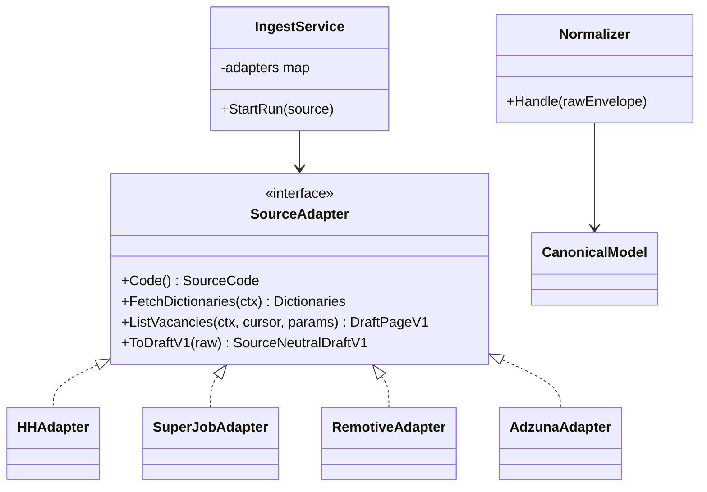
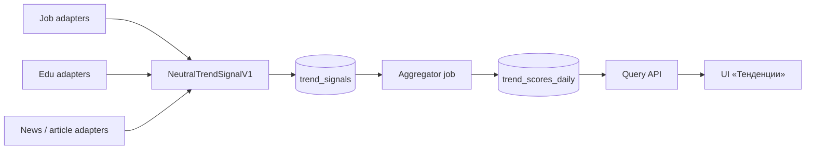
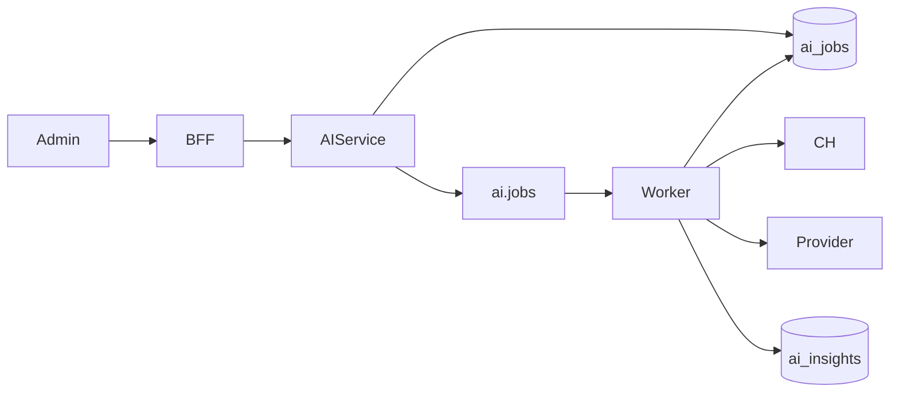

# 08. Integrations & Extensibility

## Цель

Добавление нового источника вакансий (SuperJob, Remotive, Adzuna, …) **без переписывания** normalize/query core: только adapter + маппинг external ids + конфиг.

## Plugin / Adapter pattern



### Обязанности слоёв

| Слой | Делает | Не делает |
|------|--------|-----------|
| **Adapter** | HTTP к источнику, пагинация, backoff, преобразование source payload в versioned source-neutral draft | Shared normalization, role/skill aliases, FX, gross/net, outlier policy, запись PG/CH |
| **Ingest** | Оркестрация run, lock, передача page drafts normalizer'у (Phase 1) или publish Kafka (Phase 2) | Сложная нормализация ролей и зарплат |
| **Normalizer** | Shared normalization, dedup, role/skill/region mapping, PG/CH | Знание HTTP/пагинации конкретного source |
| **Query** | Агрегаты по канонической модели | Вызовы job boards |

### Пагинация HH (Phase 1)

- `page` начинается с `0`, `per_page` — максимум `100`.
- `pages` задаёт число доступных страниц, `found` — полное число совпадений.
- Официальная глубина одной поисковой выдачи — максимум **2000 результатов**:
  `found` может быть больше, но получить их одним запросом нельзя.
- `INGEST_SCOPE=query` сохраняет целевой dev-режим `area` + `text`.
- Явный `INGEST_SCOPE=it` получает официальный `/professional_roles`, проверяет
  имена ролей категории `11` и ищет только продуктовый allowlist по России
  (`area=113`): `96` «Программист, разработчик», `104` «Руководитель группы
  разработки», `148` «Системный аналитик», `150` «Бизнес-аналитик», `156`
  «BI-аналитик, аналитик данных», `164` «Продуктовый аналитик», `124`
  «Тестировщик». Машиночитаемый канон — `apps/ingest/internal/hh/role_policy.go`.
- Fullstack, software/solution/system architects и technical/team leads без
  отдельной подходящей HH-роли входят через `96` или `104`. Строительная роль
  `14` «Архитектор» не используется.
- Общий `10` «Аналитик» не используется: этот ID также назначается вакансиям
  продаж/маркетинга. Исключены project/product managers, продажи, content,
  design, HR, support, sysadmin, DevOps и остальные роли категории `11`, не
  соответствующие однозначно утверждённому продуктовому scope.
- Если роль превышает 2000 результатов, планировщик рекурсивно делит закрытый
  UTC-интервал публикации на непересекающиеся интервалы с шагом границы в одну
  секунду. Между соседними leaf нет разрыва; UPSERT `(source, external_id)`
  дополнительно защищает от дублей при изменении данных во время crawl.
- `INGEST_IT_MAX_PARTITIONS`, `INGEST_IT_MAX_REQUESTS`, max depth и timeout —
  жёсткие ceilings: превышение завершает run ошибкой, а не тихой обрезкой.
- Dedicated Phase 1 scheduler сохраняет immutable plan cycle (role/date leaf +
  `cycle_end`) и следующую partition в `ingest_checkpoints`. Каждый tick
  выполняет только batch в пределах request budget; ошибка оставляет cursor
  для безопасного retry.
- Полный успешный cycle отмечается отдельно. Следующий обычный tick начинает
  свежий cycle; deactivation невстреченных вакансий по partial batch запрещена,
  complete-cycle reconciliation пока отложен.
- Публичный поиск отдаёт текущее активное предложение. Историю снятых/удалённых
  вакансий один crawl не восстанавливает; её формируют регулярные снимки.

### Versioned source-neutral draft (граница adapter → normalizer)

`SourceNeutralDraftV1` — контракт на границе: `schema_version`, `source`, `external_id`, `title`, `employer_external_id`, `region_external_id`, `salary_from`, `salary_to`, `salary_currency_raw`, `salary_gross`, `published_at`, `skills_raw[]`, `content_hash`, `is_active_hint` и ограниченный `raw_payload` для диагностики.

Draft сохраняет source facts и не пытается сделать их аналитически одинаковыми. **Только normalizer** применяет правила из [15-normalization-rules.md](./15-normalization-rules.md): `RUR → RUB`, gross/net, FX, outliers, aliases и role matching. Новая версия draft добавляется как `SourceNeutralDraftV2`; V1 не меняется breaking-правками.

## Как добавить источник (чеклист)

1. Зарегистрировать `sources.code` миграцией/seed  
2. Реализовать `SourceAdapter`  
3. Topic `vacancies.raw.{source}` (+ ACL)  
4. Таблицы/строки `*_external_ids` mapping  
5. Конфиг: base URL, tokens, rate limit, User-Agent  
6. Scheduler cron entry  
7. Контрактные тесты: fixture JSON → `SourceNeutralDraftV1`, затем golden shared-normalization expectations  
8. Документировать ToS/лимиты источника  

**Не трогать:** схемы dashboard API, CH ORDER BY (только новые LowCardinality values), React (источник — фильтр `source`).

## Future sources

| Source | Гео | Сложность | Заметки |
|--------|-----|-----------|---------|
| SuperJob | RU | Средняя | OAuth/token, своя пагинация |
| Remotive | Global remote | Низкая | Проще схема; меньше salary |
| Adzuna | Multi-country | Средняя | Хорош для country benchmarks |
| Habresh / другие | RU | Высокая | Часто нет стабильного API |
| Survey benchmarks | — | Отдельный import | CSV → `benchmark_salaries` (не vacancies) |

### Survey benchmarks (Target)

Отдельный bounded context: таблица `salary_benchmarks(role_id, region_id, period, median, source_survey)` — не смешивать с vacancy facts без явной пометки на графике.

---

## Perspectives / «Тенденции» — multi-source signals (Phase 5 Target)

Продуктовая цель: секция UI **«Тенденции»** (англ. Perspectives) — показать, какие IT-направления выглядят относительно более перспективными по **составному эвристическому** сигналу. Это **не** пророчество и не карьерный совет; методика и веса версионируются.

### Составной сигнал (heuristic)

| Нога | Смысл | Источники (примеры) | Фаза готовности данных |
|------|-------|---------------------|------------------------|
| **Job demand** | Объём / рост вакансий по direction/skill/role | HH (+ SuperJob/Remotive/… после Phase 4) | Phase 1 pipeline уже даёт vacancy demand |
| **Learning interest** | Интерес к обучению (каталоги курсов, proxies enrollments/popularity если API отдаёт) | Stepik, Coursera, Skillbox и др. — **TBD / кандидат** | Phase 5 |
| **Media attention** | Упоминания технологий/ролей в новостях и статьях | RSS / официальные API, Habr (если ToS/API позволяют) | Phase 5 |

Каждая нога нормализуется (например z-score / min-max по окну), затем `composite_score = w_d·demand + w_l·learning + w_m·media` с явными весами в конфиге (`score_version`). Отсутствие ноги → score с пометкой `coverage` / partial, не «тихий ноль» без дисклеймера.

### Паттерн: adapter → neutral signal → aggregator



| Слой | Делает | Не делает |
|------|--------|-----------|
| **Signal adapter** | Fetch (API/RSS), backoff, map → `NeutralTrendSignalV1` | Composite scoring, UI copy |
| **Ingest / signals-ingest** | Оркестрация run per source kind | Выдумывать метрики без сырья |
| **Aggregator** | Dedup window, normalize, weighted score, write daily series | HTTP к внешним API |
| **Query** | Читать scores/signals для Perspectives | Парсинг RSS |

`NeutralTrendSignalV1` (концепт): `schema_version`, `source`, `source_kind` (`jobs|edu|news|article`), `observed_at`/`signal_date`, `direction_key` (skill/role family slug), `metric_name`, `value`, `unit`, `content_hash`, опц. `raw_ref`.

Расширение `sources`: поле `kind` или отдельный реестр `signal_sources` — см. [05](./05-data-model.md). Job vacancy adapters **не** переписываются: demand-нога может материализовываться из уже существующих vacancy aggregates.

### Этика и ToS

- Только официальные API, документированные RSS/feeds или явно разрешённый экспорт; **запрещён** scraping там, где ToS запрещает.
- Attribution источников в UI и README; rate limits + идентифицирующий User-Agent где требуется.
- Токены провайдеров — только server-side ([17](./17-secrets-management.md)).
- Кандидаты провайдеров без зарегистрированных аккаунтов: статус **кандидат/later** в [21](./21-external-services.md).

### Фазирование (кратко)

| Фаза | Scope |
|------|--------|
| 1 | Только vacancy demand/salary на `/trends` — **не** Perspectives |
| 2–3 | Опц. Kafka `signals.raw`, контракт envelope |
| 4 | Multi-source **job boards** (+ AI optional) — усиливает demand |
| **5** | Collectors edu/news, storage, scoring, API, UI «Тенденции» |

Решение «отдельный signal plane vs только vacancy metrics»: [ADR 007](./adr/007-multi-source-trend-signals.md).

## Webhook / export (Target)

| Механизм | Назначение |
|----------|------------|
| `POST` outbound webhook | Уведомление «daily ingest done» / anomaly |
| Export API | CSV/Parquet выгрузка агрегатов |
| `vacancies.normalized` consumer | Внешние пайплайны |

Webhook signing: HMAC secret, retry with backoff, disable on repeated 4xx.

## Multi-country

- `regions.country_code`, фильтр API `country=RU|*`
- Валюта: хранить raw + `salary_mid_rub` (или `salary_mid_base`)
- FX rates daily job → Redis/PG
- Адаптеры параметризуют country/area

---

## AI integration (Target)

### Где живёт модель

Async worker `ai-analyzer`, **не** в sync request path дашборда.



### Inputs

| Тип job | Вход |
|---------|------|
| `role_trend` | Ряд median/demand из CH + top skills delta |
| `vacancy_cluster` | Выборка N описаний/title (без PII) по роли |
| `skills_shift` | Top skills now vs previous period |
| `perspective_narrative` (Phase 5 opt.) | Composite score + component series → краткое «почему растёт» (не замена score) |

Санитизация: вырезать телефоны, emails, telegram handle regex'ами перед промптом.

### Outputs

- `ai_insights` в PostgreSQL (summary, bullets, model, prompt_version, needs_human_review)
- Опционально: CH таблица `fact_ai_insight_meta` для аналитики usage/cost
- UI читает через REST; не блокирует dashboard

### Provider abstraction

```go
// концепт, не реализация
type CompletionClient interface {
  Complete(ctx context.Context, req CompletionRequest) (CompletionResponse, error)
}
```

Реализации:

- OpenAI-compatible HTTP (`OPENAI_BASE_URL` + key) — облако или local (Ollama/vLLM)
- Fake/mock для тестов

### Cost & rate limits

| Контроль | Механизм |
|----------|----------|
| Max tokens / job | конфиг per type |
| Daily budget | счётчик Redis `ai:budget:{date}` |
| Concurrency | worker pool size 1–N |
| Provider 429 | backoff, job `retrying` |
| Caching identical prompts | hash(prompt_version+input) → reuse insight (optional) |

### Prompt versioning

- Промпты в репо: `/prompts/trend_v1.md` (или embed)
- В job/insight обязательно `prompt_version`
- A/B: два version → human_review сравнивает
- Изменение промпта = новый version, не silent edit

### Human review

- `needs_human_review=true` если: low confidence, policy keywords, первый запуск новой prompt_version, cost outlier
- Admin UI (Target): approve/reject; rejected не показываются в публичном dashboard

### Privacy

| Правило | Деталь |
|---------|--------|
| No PII to LLM | Strip contacts; не слать employer HR phones |
| Minimize | Агрегаты предпочтительнее сырых текстов; sample size cap |
| Retention | Insights хранить; сырой prompt log — TTL / opt-in |
| Secrets | Provider key только Secret |
| User data | MVP без персональных аккаунтов кандидатов |

### Failure modes AI

| Failure | Handling |
|---------|----------|
| Timeout | retry ≤3 |
| Invalid JSON from model | parse repair once → fail → DLQ |
| Budget exceeded | reject new jobs 429/409 |
| CH empty sample | fail validation early |

## Extensibility principles (summary)

1. **Hexagonal ports:** source & AI за интерфейсами  
2. **Canonical model** в центре  
3. **Events** для новых side-effects  
4. **Version everything:** API, proto, message schema, prompts  
5. **Feature flags** на источники и AI в конфиге (`SOURCES_ENABLED=hh,remotive`)
