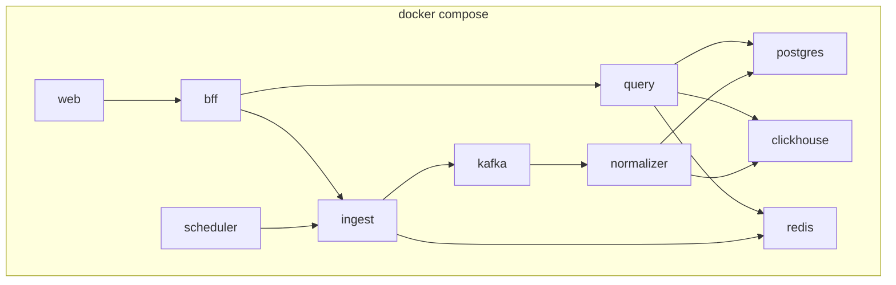
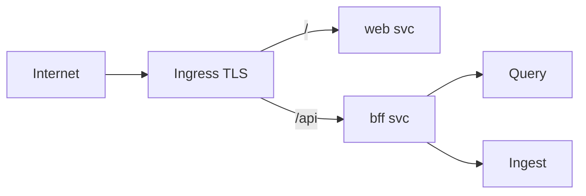

# 09. Deployment

## Environments

| Env | Назначение | Инфра | CI trigger (см. [10-cicd.md](./10-cicd.md)) |
|-----|------------|-------|---------------------------------------------|
| local | Разработка | Docker Compose | — |
| dev | Интеграция | k8s namespace `lma-dev` | push `developer` после job `test` |
| stage | Pre-prod | `lma-stage` | tags / manual (later) |
| prod | Production-like | `lma-prod` / managed data | push `production` после `test` + Environment approval |

## Local: Docker Compose layout

```text
deploy/compose/
  docker-compose.yml
  docker-compose.override.yml   # hot-reload optional
.env.example                    # канон в корне репо (см. 12-local-dev.md)
```

### Сервисы Compose (Target layout; Phase 1 можно урезать)

| Service | Image / build | Ports |
|---------|---------------|-------|
| `web` | React (nginx) | 3000→80 |
| `bff` | Go | 8080 |
| `query` | Go | 8081, 9091 |
| `ingest` | Go | 8082, 9092 |
| `normalizer` | Go | — |
| `scheduler` | Go или profile off + ручной curl | — |
| `postgres` | postgres:16 | 5432 |
| `redis` | redis:7 | 6379 |
| `kafka` / `redpanda` | redpanda/kafka | 9092 |
| `clickhouse` | clickhouse:24 | 8123, 9000 |
| `migrate` | oneshot profile | — |



**Сейчас в `deploy/compose`:** profile `local-redis` — опциональный Redis; profile `local-pg` — опциональный Postgres; profile `mvp` — зарезервирован под приложения. Рекомендуемый cloud path: managed Postgres (`DATABASE_URL`) + managed Redis (`REDIS_URL`, часто `rediss://`) — Compose infra может быть пустой (см. [12-local-dev.md](./12-local-dev.md)).  
**Цель Phase 1 local:** + bff + query + ingest(+normalize in-process) + web.  
Kafka/CH — Phase 2 (`olap` / `bus`) без смены публичного API.

## Production-like: Kubernetes

### Workloads

| Component | Kind | Replicas (start) | Notes |
|-----------|------|------------------|-------|
| `web` | Deployment | 2 | nginx + static |
| `bff` | Deployment | 2 | HPA |
| `query` | Deployment | 2 | HPA |
| `ingest` | Deployment | 1–2 | не масштабировать агрессивно из-за HH limits |
| `normalizer` | Deployment | 2+ | scale by Kafka lag |
| `scheduler` | CronJob | — | `0 3 * * *` daily |
| `ai-analyzer` | Deployment | 0–2 | Target |
| `migrate-pg` | Job | 1 | on deploy |
| `migrate-ch` | Job | 1 | on deploy |

### Services

- `ClusterIP` для всех app-сервисов
- `Ingress` → `web` (`/`) + `bff` (`/api`)
- gRPC **не** через public Ingress



### Data plane: Stateful vs managed

| Store | Вариант A (учебный cluster) | Вариант B (предпочтительно stage/prod) |
|-------|-----------------------------|----------------------------------------|
| PostgreSQL | StatefulSet + PVC / Zalando operator | Managed (RDS, Cloud SQL, Neon) |
| ClickHouse | Operator / StatefulSet | Managed CH Cloud / Altinity |
| Kafka | Strimzi / Redpanda operator | Managed MSK/Aiven |
| Redis | StatefulSet / Bitnami | Managed ElastiCache / Memorystore |

**Рекомендация для пет-проекта:** managed Postgres (`DATABASE_URL`) + managed Redis (`REDIS_URL`); локальные контейнеры (`local-pg`, `local-redis`) — опционально. В «prod-like» k8s — managed endpoints через Secret URL (или operators).

Не класть PG/CH/Kafka data на emptyDir.

## Config: 12-factor

| Источник | Примеры |
|----------|---------|
| Env | `DATABASE_URL`, `REDIS_URL`, `KAFKA_BROKERS`, `HH_USER_AGENT`, `LOG_LEVEL` |
| ConfigMap | non-secret: feature flags, TTLs, cron params, topic names |
| Secret | `HH_TOKEN` (если нужен), `AI_API_KEY`, `POSTGRES_PASSWORD`, `REDIS_PASSWORD`, `ADMIN_TOKEN` |

Правила:

- Один процесс = один контейнер
- Stateless apps; state только в backing services
- `PORT` / явные bind addresses
- Конфиг не в образе (кроме defaults)

Пример ключей:

```yaml
# ConfigMap lma-config
CACHE_SUMMARY_TTL_SEC: "300"
INGEST_LOCK_TTL_SEC: "2700"
SOURCES_ENABLED: "hh"
CLICKHOUSE_DATABASE: "lma"
```

```yaml
# Secret lma-secrets
DATABASE_URL: postgres://...
REDIS_URL: rediss://...
HH_USER_AGENT: "LMAStudyProject/0.1 (email@example.com)"
ADMIN_TOKEN: "..."
```

## Resource requests/limits (rough guesses)

| Deployment | CPU req/lim | Mem req/lim |
|------------|-------------|-------------|
| web | 50m / 200m | 64Mi / 128Mi |
| bff | 100m / 500m | 128Mi / 256Mi |
| query | 200m / 1000m | 256Mi / 512Mi |
| ingest | 100m / 500m | 128Mi / 512Mi |
| normalizer | 200m / 1000m | 256Mi / 1Gi |
| ai-analyzer | 100m / 500m | 256Mi / 512Mi |
| postgres (self) | 500m / 2 | 1Gi / 4Gi |
| clickhouse (self) | 500m / 4 | 2Gi / 8Gi |
| redis | 100m / 500m | 256Mi / 1Gi |
| kafka (self single) | 500m / 2 | 1Gi / 4Gi |

Тюнить по метрикам; для учебного стенда можно ниже.

## Ingress

- TLS: cert-manager + Let's Encrypt (stage/prod)
- Paths:
  - `/` → web
  - `/api` → bff
- Optional basic auth / IP allowlist на `/api/v1/admin/*` до появления JWT
- Security headers на web (CSP базовый)

## Autoscaling

| Component | HPA | Триггер |
|-----------|-----|---------|
| bff | yes | CPU 70% или RPS (keda Target) |
| query | yes | CPU / latency |
| normalizer | yes / KEDA | Kafka lag |
| ingest | no / max 2 | ограничен HH; масштабируется schedule'ом |
| scheduler | CronJob | не HPA |
| ai-analyzer | optional | queue depth |

PodDisruptionBudget: minAvailable 1 для bff/query.

## Probes

```yaml
livenessProbe:
  httpGet: { path: /healthz, port: http }
readinessProbe:
  httpGet: { path: /readyz, port: http }
```

## Namespaces & network policy (Target)

- Namespace per env
- NetworkPolicy: apps → data stores; only bff receive from ingress controller; egress allowlist to HH/AI

## Rollout strategy

- Deployment `RollingUpdate` maxUnavailable=0 для bff/query
- Migrations Job **до** или init с lock (см. CI/CD): expand/contract совместимость
- Feature flags для CH read path vs PG fallback
