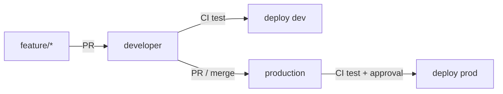
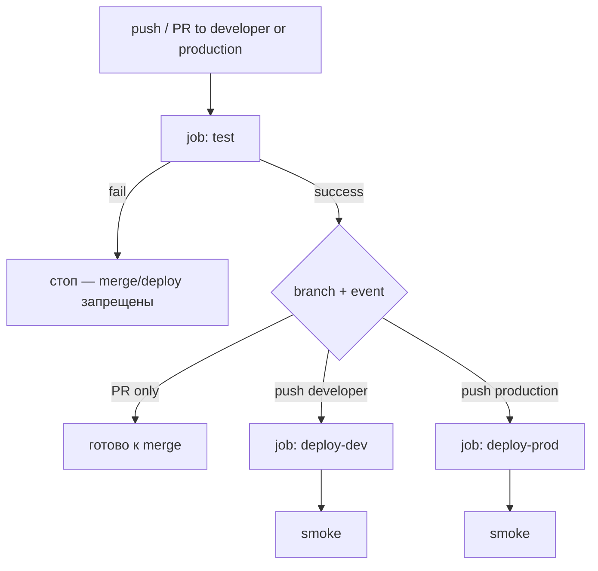
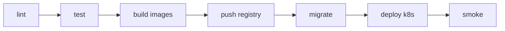
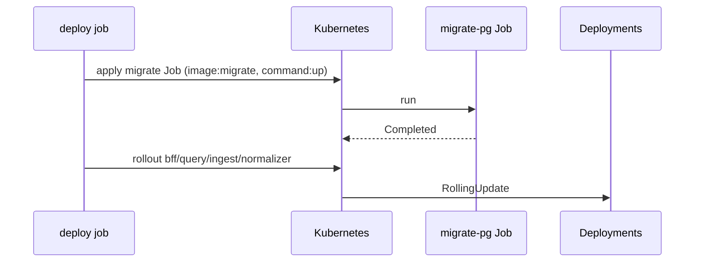

# 10. CI/CD

## Выбор

**GitHub Actions** как default (легко для учебного GitHub-репо).  
GitLab CI — эквивалентные стадии, если репозиторий на GitLab.

**Канон gate:** сначала тесты, потом деплой. Deploy-job всегда `needs: [test]` и не стартует при красных тестах.  
Реализация: [`.github/workflows/ci-cd.yml`](../../.github/workflows/ci-cd.yml) — один workflow, jobs `test` → `deploy-dev` / `deploy-prod`.

Полная матрица suites: [13-testing.md](./13-testing.md). Backend — [13a](./13a-testing-backend.md), UI/E2E — [13b](./13b-testing-frontend-e2e.md).  
Секреты CI / Environments: [17-secrets-management.md](./17-secrets-management.md) §6.

---

## Branch model

Схема **`developer` → dev, `production` → prod** (удобно для «пушим → тесты → выкатываем»):

| Branch | Назначение | Env после зелёного CI |
|--------|------------|------------------------|
| `feature/*`, `fix/*` | работа → PR в `developer` | нет деплоя |
| `developer` | интеграция (default branch) | **dev** (auto) |
| `production` | production-ready | **prod** (auto после test + Environment protection) |
| tags `vX.Y.Z` / `release/*` | опц. stage / ручной promote | **stage** (позже) |



Правила:

- В `production` — только через PR (branch protection). В `developer` — required status check `test`; PR тоже рекомендуется.
- Merge в `developer` / `production` возможен только если required check **`test`** зелёный.
- Hotfix: PR в `production` (и при необходимости cherry-pick / merge обратно в `developer`).
- Default branch репозитория: **`developer`** (дневная работа и PR). Стабильная линия — `production`.
- Старый `main` (если остался) — не использовать; удалить после переключения default.

---

## Gate: сначала тесты, потом деплой



| Принцип | Как |
|---------|-----|
| Тесты всегда первыми | job `test` без `needs`; deploy с `needs: [test]` |
| Нет деплоя при fail | GitHub не запускает downstream при failure `test` |
| PR не деплоит | `deploy-*` только при `github.event_name == 'push'` |
| Fork без secrets | deploy не на `pull_request` из fork; Environment secrets недоступны fork PR; см. § Forks |
| Prod строже | suite на `production` шире; Environment `production` + required reviewers |

### Что гоняем на developer vs production (согласовано с [13](./13-testing.md))

| Suite | PR → `developer`/`production` | push `developer` (→ deploy dev) | push `production` (→ deploy prod) | Nightly |
|-------|-------------------------------|----------------------------------|-----------------------------------|---------|
| lint + unit Go/TS + HH fixtures | ✅ required | ✅ | ✅ | ✅ |
| contract lite (OpenAPI, buf, BFF↔Query) | ✅ required | ✅ | ✅ | ✅ |
| migrate dry / SQL present | ✅ | ✅ | ✅ | ✅ |
| integration (PG/Redis, testcontainers) | ❌ / label | опц. warn | ✅ **required** (когда код есть) | ✅ |
| migrate up/down/up against PG | ❌ | опц. | ✅ before deploy | ✅ |
| build/push images + k8s deploy | ❌ | ✅ после test | ✅ после test | — |
| curl smoke post-deploy | — | ✅ | ✅ | — |
| Playwright E2E | ❌ | ❌ | опц. 1 smoke | ✅ required job |
| live HH | ❌ | ❌ | ❌ | manual + secrets |

Итого: **developer** = PR-набор + deploy в dev; **production** = PR-набор + integration + более строгий prod deploy.

**Сейчас (до появления Go/TS модулей):** job `test` обязанно падает, если нет `api/openapi.yaml` / `.env.example`, или если в репо закоммичен `.env`. `go test` запускается только при наличии `go.mod`/`go.work`, иначе skip с логом. Когда модули появятся — раскомментировать lint/Vitest/buf/integration в workflow.

---

## Pipeline stages (полный путь)



| Stage | Что | Когда |
|-------|-----|-------|
| lint | `golangci-lint`, `eslint`/`tsc`, proto lint (`buf lint`), OpenAPI lint | каждый PR / push |
| test (PR / developer) | Go unit + HH fixtures (без сети); Vitest; contract BFF↔Query; `buf breaking`; migrate dry | **required** check `test` |
| test (production) | то же + integration (testcontainers PG/Redis); migrate up/down/up | push `production` перед deploy |
| test (nightly) | Playwright E2E + опц. Schemathesis / load smoke | schedule, не PR-gate |
| build | Docker multi-stage per service | после зелёного `test` на push |
| push | GHCR / registry | push `developer` / `production`, tags |
| migrate | Job `migrate-pg` / `migrate-ch` (golang-migrate) | deploy job before app rollout |
| deploy | `kubectl`/`helm`/`kustomize` | `developer` → dev auto; `production` → prod + approval |
| smoke | curl health + summary; опц. 1 Playwright | после deploy |

---

## Workflow layout (канон)

**Рекомендуемый паттерн — один файл** (сложно сломать gate `needs: test`):

```text
.github/workflows/
  ci-cd.yml          # jobs: test → deploy-dev | deploy-prod
  docs-pages.yml     # OpenAPI HTML → GitHub Pages (не зависит от test/deploy)
  nightly.yml        # позже: Playwright E2E (schedule)
```

### `docs-pages.yml` — публикация OpenAPI

Отдельный workflow (не в gate `test` → deploy): статический сайт Redoc + Swagger UI из [`docs/api-site/`](../api-site/).

| | |
|--|--|
| Trigger | push `production` (paths: `api/openapi.yaml`, `docs/api-site/**`, сам workflow) + `workflow_dispatch` |
| Шаги | checkout → `cp api/openapi.yaml docs/api-site/openapi.yaml` → `upload-pages-artifact` → `deploy-pages` |
| Permissions | `pages: write`, `id-token: write`, `contents: read` |
| Source of truth | только `api/openapi.yaml`; копия в site — артефакт build, не коммитить |
| Включить Pages | Settings → Pages → Source = **GitHub Actions** |
| Environment `github-pages` | Settings → Environments → **github-pages** → Deployment branches: разрешить **`production`** (раньше мог быть только `main`) |
| URL | https://chuchoss.github.io/it-labor-pulse/ (Redoc), https://chuchoss.github.io/it-labor-pulse/swagger.html (Swagger UI) |

Решение: [ADR 008](./adr/008-github-pages-openapi.md). Стиль/контракт: [22-documentation-style.md](./22-documentation-style.md).

Альтернатива (два/три файла): отдельный `ci.yml` + `deploy-*.yml` с `workflow_run` после success — больше точек рассинхрона; для LMA не нужен, пока нет жёсткого требования split permissions.

### `ci-cd.yml` — логика jobs

| Job | Trigger | Условие | Secrets |
|-----|---------|---------|---------|
| `test` | `pull_request` + `push` на `developer`/`production` | всегда | нет (только fixtures / public) |
| `deploy-dev` | push | `needs: [test]`, ref = `developer`, не fork | Environment **`development`** |
| `deploy-prod` | push | `needs: [test]`, ref = `production`, не fork | Environment **`production`** (+ reviewers) |

Шаги `test` (критичные проверки уже реальные; остальное — TODO до модулей):

1. Checkout  
2. **Fail**, если `.env` в дереве / tracked  
3. OpenAPI present + минимальная структура (`openapi:`, paths)  
4. `.env.example` present  
5. `go test ./...` если есть `go.mod`/`go.work`, иначе skip  
6. TODO: Setup Go → `golangci-lint`  
7. TODO: Setup Node → `npm ci && npm test` (Vitest)  
8. TODO: `buf lint` + `buf breaking --against production`  
9. На `production` (push): TODO `go test -tags=integration ./...`  
10. Не запускать на PR: Playwright full, live HH, deploy secrets  

Шаги `deploy-*` (stubs, Phase 3+):

1. TODO: build & push images `{sha}` / `{env}`  
2. TODO: kube context (OIDC / Environment secret)  
3. TODO: migrate Job → wait → rollout → curl smoke  

**Не класть** `HH_APP_TOKEN` / kubeconfig в job `test`. Fixture/httptest only. См. [17](./17-secrets-management.md).

---

## Branch protection (включить на GitHub)

Settings → Branches → Branch protection rules для **`developer`** и **`production`**:

| Настройка | `developer` | `production` |
|-----------|-------------|--------------|
| Require a pull request before merging | рекомендуется ✅ | ✅ обязательно |
| Require status checks to pass before merging | ✅ | ✅ |
| Status checks that are required | **`test`** | **`test`** |
| Require branches to be up to date before merging | ✅ (желательно) | ✅ |
| Do not allow bypassing the above settings | желательно | ✅ |
| Restrict who can push | опц. | без прямого push |

### Ручные клики (если `gh` недоступен)

1. Открой https://github.com/Chuchoss/it-labor-pulse/settings/branches  
2. **Add rule** → Branch name pattern: `production`  
   - ✅ Require a pull request before merging (1 approval — для solo можно 0, но PR обязателен)  
   - ✅ Require status checks to pass before merging → после первого зелёного CI выбери check **`test`**  
   - ✅ Require branches to be up to date before merging  
   - ✅ Do not allow bypassing the above settings  
   - Save  
3. **Add rule** → pattern: `developer`  
   - ✅ Require status checks → **`test`**  
   - PR before merge — рекомендуется (для solo можно выключить, если нужен прямой push)  
   - Save  
4. После первого успешного Actions-прогона check `test` появится в списке — выбери его как required (если ещё серый).

### CLI (`gh`), когда установлен и залогинен

```bash
gh api repos/Chuchoss/it-labor-pulse/branches/production/protection \
  --method PUT \
  --input - <<'EOF'
{
  "required_status_checks": { "strict": true, "contexts": ["test"] },
  "enforce_admins": true,
  "required_pull_request_reviews": { "required_approving_review_count": 0 },
  "restrictions": null
}
EOF

gh api repos/Chuchoss/it-labor-pulse/branches/developer/protection \
  --method PUT \
  --input - <<'EOF'
{
  "required_status_checks": { "strict": true, "contexts": ["test"] },
  "enforce_admins": true,
  "required_pull_request_reviews": null,
  "restrictions": null
}
EOF
```

Environments (Settings → Environments):

| Environment | Protection | Secrets (примеры имён, не значения) |
|-------------|------------|-------------------------------------|
| `development` | без reviewers (или optional) | `KUBE_CONFIG` / cloud OIDC role, registry — **dev** |
| `production` | **Required reviewers** (1+) | отдельный kube/OIDC, registry — **prod**; не шарить с dev |

**Solo / pet:** на Environment `production` можно временно не ставить required reviewers (иначе деплой зависнет без второго аккаунта) или добавить себя как reviewer и self-approve. Имена Environments должны совпадать с `environment:` в workflow.

Создать Environments вручную: https://github.com/Chuchoss/it-labor-pulse/settings/environments → New environment → `development`, затем `production`.

Подробнее про Environment secrets: [17 §6](./17-secrets-management.md#6-cicd-github-actions), кратко в [21](./21-external-services.md).

---

## Forks и секреты

| Событие | `test` | `deploy-*` | Secrets |
|---------|--------|------------|---------|
| PR из той же репы | ✅ | ❌ (`if: push` only) | нет в test |
| PR из **fork** | ✅ (public checks) | ❌ | Environment / repo secrets **не** доступны fork PR |
| push в `developer`/`production` на origin | ✅ | ✅ после test | только Environment |

Никогда не использовать `pull_request_target` для деплоя с checkout кода PR.  
Deploy jobs дополнительно: `github.event.repository.fork == false` и только trusted refs.

---

## Environments (runtime)

| Env | Trigger | Protection |
|-----|---------|------------|
| development (dev) | push `developer` после `test` | auto |
| stage | tag `v*` или manual (later) | reviewers optional |
| production (prod) | push `production` после `test` | required reviewers (или skip для solo), отдельные secrets |

Secrets per environment: `KUBE_CONFIG` / cloud creds, `REGISTRY_TOKEN`. DB URLs лучше в cluster Secrets (CI не обязан знать пароли, если миграции — Job с SA).

---

## Docker images

Matrix services (по мере появления):

- `bff`, `query`, `ingest`, `normalizer`, `web`, `scheduler`, `ai-analyzer` (later)

Tags:

- `ghcr.io/org/lma-bff:sha-abc123`
- `ghcr.io/org/lma-bff:dev` / `:prod` (moving tag optional)

Multi-stage: build Go binary → distroless/alpine runtime.

---

## Migration jobs in pipeline



Правила:

- Миграции **обратно совместимы** с текущей версией app (expand/contract)
- Один Job, `backoffLimit: 1–3`, не parallel
- CH migrations отдельным Job
- Fail migrate → **стоп deploy**
- Local: `make migrate-up` / compose profile `migrate`

---

## Quality gates

| Gate | PR | developer (push) | production (push) | Nightly |
|------|----|------------------|-------------------|---------|
| lint + unit + fixtures + contract | **required** (`test`) | required | required | required |
| coverage floor (normalize >80%) | optional warn | optional | optional | — |
| integration (PG/Redis) | label only | optional | **required** (когда есть) | required |
| image scan (trivy) | optional | recommended | recommended | — |
| curl smoke | — | after deploy-dev | after deploy-prod | yes |
| Playwright E2E | ❌ | ❌ | опц. 1 spec | **required job** |
| live HH | ❌ | ❌ | ❌ | manual only |

---

## Config promotion

- Один и тот же image digest продвигается dev → stage → prod
- Меняются только ConfigMap/Secret/env overlays (`deploy/k8s/overlays/{env}`)

```text
deploy/k8s/
  base/
  overlays/
    dev/
    stage/
    prod/
```

---

## Rollback

1. `kubectl rollout undo deploy/bff` (и др.)  
2. DB migrate down — только если есть безопасный down и app совместим; иначе forward-fix  
3. CD: redeploy previous sha  

---

## Make targets (ориентир)

```text
make lint test
make docker-build
make migrate-up
make compose-up
```
