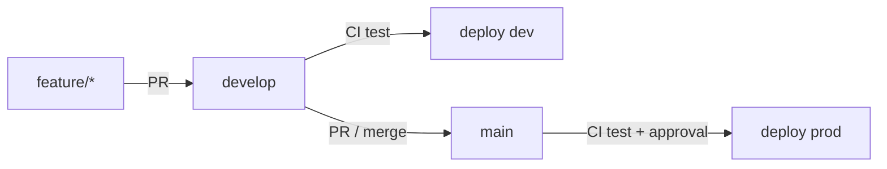
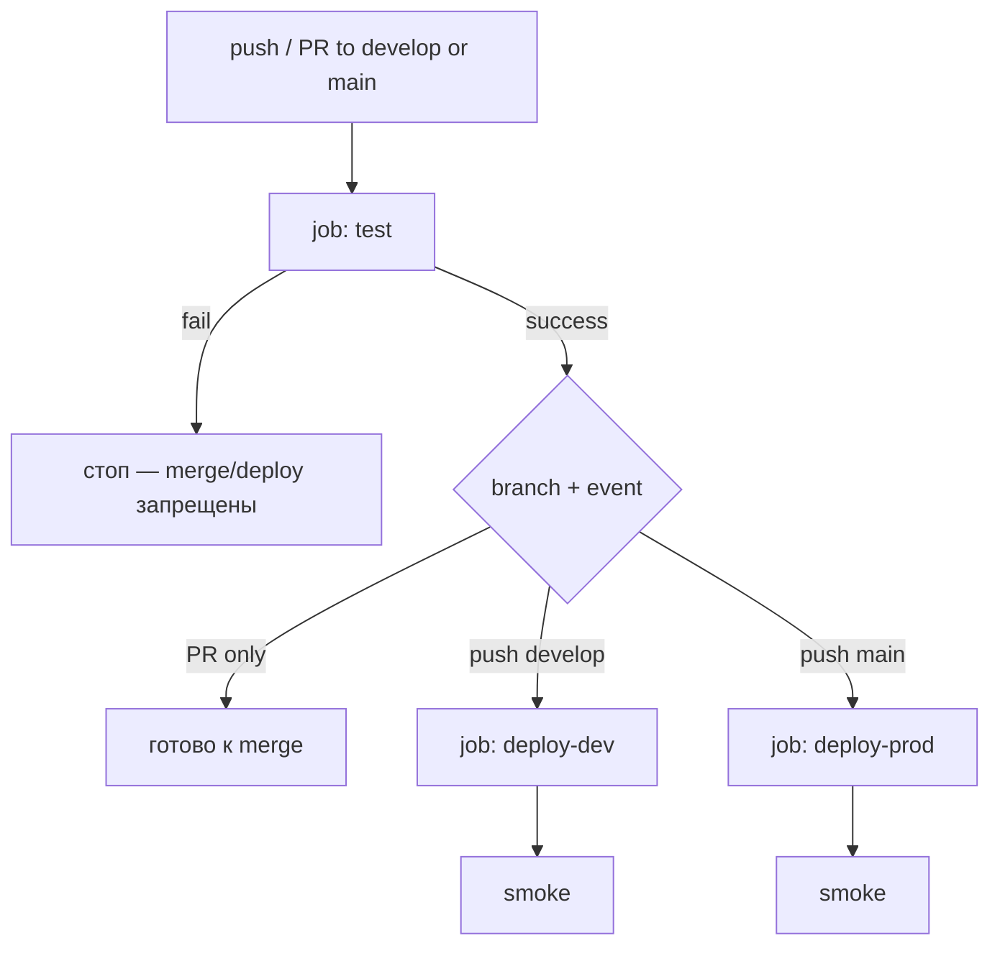
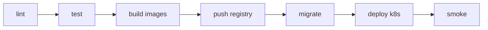
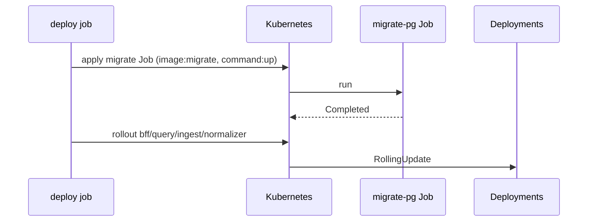

# 10. CI/CD

## Выбор

**GitHub Actions** как default (легко для учебного GitHub-репо).  
GitLab CI — эквивалентные стадии, если репозиторий на GitLab.

**Канон gate:** сначала тесты, потом деплой. Deploy-job всегда `needs: [test]` и не стартует при красных тестах.  
Реализация: [`.github/workflows/ci-cd.yml`](../../.github/workflows/ci-cd.yml) — один workflow, jobs `test` → `deploy-dev` / `deploy-prod`.

Полная матрица suites: [13-testing.md](./13-testing.md). Backend — [13a](./13a-testing-backend.md), UI/E2E — [13b](./13b-testing-frontend-e2e.md).  
Секреты CI / Environments: [17-secrets-management.md](./17-secrets-management.md) §6.

---

## Branch model (рекомендация)

Простая схема **develop → dev, main → prod** (удобно для «пушим → тесты → выкатываем»):

| Branch | Назначение | Env после зелёного CI |
|--------|------------|------------------------|
| `feature/*`, `fix/*` | работа → PR | нет деплоя |
| `develop` | интеграция | **dev** (auto) |
| `main` | production-ready | **prod** (auto после test + Environment protection) |
| tags `vX.Y.Z` / `release/*` | опц. stage / ручной promote | **stage** (позже) |



Правила:

- В `develop` и `main` — только через PR (branch protection).
- Merge в `develop` / `main` возможен только если required check **`test`** зелёный.
- Hotfix: PR в `main` (и при необходимости cherry-pick / merge обратно в `develop`).
- Долгоживущий `develop` оправдан именно связкой «dev env ≠ prod»; чистый GitHub Flow (`main` → только dev) — альтернатива, если prod ещё нет.

---

## Gate: сначала тесты, потом деплой



| Принцип | Как |
|---------|-----|
| Тесты всегда первыми | job `test` без `needs`; deploy с `needs: [test]` |
| Нет деплоя при fail | GitHub не запускает downstream при failure `test` |
| PR не деплоит | `deploy-*` только при `github.event_name == 'push'` |
| Fork без secrets | deploy не на `pull_request` из fork; Environment secrets недоступны fork PR; см. § Forks |
| Prod строже | suite на `main` шире; Environment `production` + required reviewers |

### Что гоняем на develop vs main (согласовано с [13](./13-testing.md))

| Suite | PR → `develop`/`main` | push `develop` (→ deploy dev) | push `main` (→ deploy prod) | Nightly |
|-------|----------------------|-------------------------------|-----------------------------|---------|
| lint + unit Go/TS + HH fixtures | ✅ required | ✅ | ✅ | ✅ |
| contract lite (OpenAPI, buf, BFF↔Query) | ✅ required | ✅ | ✅ | ✅ |
| migrate dry / SQL present | ✅ | ✅ | ✅ | ✅ |
| integration (PG/Redis, testcontainers) | ❌ / label | опц. warn | ✅ **required** (когда код есть) | ✅ |
| migrate up/down/up against PG | ❌ | опц. | ✅ before deploy | ✅ |
| build/push images + k8s deploy | ❌ | ✅ после test | ✅ после test | — |
| curl smoke post-deploy | — | ✅ | ✅ | — |
| Playwright E2E | ❌ | ❌ | опц. 1 smoke | ✅ required job |
| live HH | ❌ | ❌ | ❌ | manual + secrets |

Итого: **develop** = PR-набор + deploy в dev; **main** = PR-набор + integration + более строгий prod deploy.

---

## Pipeline stages (полный путь)



| Stage | Что | Когда |
|-------|-----|-------|
| lint | `golangci-lint`, `eslint`/`tsc`, proto lint (`buf lint`), OpenAPI lint | каждый PR / push |
| test (PR / develop) | Go unit + HH fixtures (без сети); Vitest; contract BFF↔Query; `buf breaking`; migrate dry | **required** check `test` |
| test (main) | то же + integration (testcontainers PG/Redis); migrate up/down/up | push `main` перед deploy |
| test (nightly) | Playwright E2E + опц. Schemathesis / load smoke | schedule, не PR-gate |
| build | Docker multi-stage per service | после зелёного `test` на push |
| push | GHCR / registry | push `develop` / `main`, tags |
| migrate | Job `migrate-pg` / `migrate-ch` (golang-migrate) | deploy job before app rollout |
| deploy | `kubectl`/`helm`/`kustomize` | `develop` → dev auto; `main` → prod + approval |
| smoke | curl health + summary; опц. 1 Playwright | после deploy |

---

## Workflow layout (канон)

**Рекомендуемый паттерн — один файл** (сложно сломать gate `needs: test`):

```text
.github/workflows/
  ci-cd.yml          # jobs: test → deploy-dev | deploy-prod
  docs-pages.yml     # OpenAPI HTML → GitHub Pages (не зависит от test/deploy)
  nightly.yml        # позже: Playwright E2E (schedule)
```

### `docs-pages.yml` — публикация OpenAPI

Отдельный workflow (не в gate `test` → deploy): статический сайт Redoc + Swagger UI из [`docs/api-site/`](../api-site/).

| | |
|--|--|
| Trigger | push `main` (paths: `api/openapi.yaml`, `docs/api-site/**`, сам workflow) + `workflow_dispatch` |
| Шаги | checkout → `cp api/openapi.yaml docs/api-site/openapi.yaml` → `upload-pages-artifact` → `deploy-pages` |
| Permissions | `pages: write`, `id-token: write`, `contents: read` |
| Source of truth | только `api/openapi.yaml`; копия в site — артефакт build, не коммитить |
| Включить Pages | Settings → Pages → Source = **GitHub Actions** |
| URL | https://chuchoss.github.io/it-labor-pulse/ (Redoc), https://chuchoss.github.io/it-labor-pulse/swagger.html (Swagger UI) |

Решение: [ADR 008](./adr/008-github-pages-openapi.md). Стиль/контракт: [22-documentation-style.md](./22-documentation-style.md).

Альтернатива (два/три файла): отдельный `ci.yml` + `deploy-*.yml` с `workflow_run` после success — больше точек рассинхрона; для LMA не нужен, пока нет жёсткого требования split permissions.

### `ci-cd.yml` — логика jobs

| Job | Trigger | Условие | Secrets |
|-----|---------|---------|---------|
| `test` | `pull_request` + `push` на `develop`/`main` | всегда | нет (только fixtures / public) |
| `deploy-dev` | push | `needs: [test]`, ref = `develop`, не fork | Environment **`development`** |
| `deploy-prod` | push | `needs: [test]`, ref = `main`, не fork | Environment **`production`** (+ reviewers) |

Шаги `test` (сейчас stubs с TODO — зелёные на пустом репо; по мере появления модулей раскомментировать):

1. Checkout  
2. OpenAPI present / lint stub  
3. TODO: Setup Go → `golangci-lint` → `go test ./...` (unit; **без** `-tags=integration`)  
4. TODO: Setup Node → `npm ci && npm test` (Vitest)  
5. TODO: `buf lint` + `buf breaking --against main`  
6. На `main` (push): TODO `go test -tags=integration ./...`  
7. Не запускать на PR: Playwright full, live HH, deploy secrets  

Шаги `deploy-*` (stubs, Phase 3+):

1. TODO: build & push images `{sha}` / `{env}`  
2. TODO: kube context (OIDC / Environment secret)  
3. TODO: migrate Job → wait → rollout → curl smoke  

**Не класть** `HH_APP_TOKEN` / kubeconfig в job `test`. Fixture/httptest only. См. [17](./17-secrets-management.md).

---

## Branch protection (включить на GitHub)

Settings → Branches → Branch protection rules для **`develop`** и **`main`**:

| Настройка | Значение |
|-----------|----------|
| Require a pull request before merging | ✅ |
| Require status checks to pass before merging | ✅ |
| Status checks that are required | **`test`** (имя job из `ci-cd.yml`) |
| Require branches to be up to date before merging | ✅ (желательно) |
| Do not allow bypassing the above settings | ✅ для `main` |
| Restrict who can push | опц.; без прямого push в `main` |

После первого успешного прогона Actions check `test` появится в списке — выбери его как required.

Environments (Settings → Environments):

| Environment | Protection | Secrets (примеры имён, не значения) |
|-------------|------------|-------------------------------------|
| `development` | без reviewers (или optional) | `KUBE_CONFIG` / cloud OIDC role, registry — **dev** |
| `production` | **Required reviewers** (1+) | отдельный kube/OIDC, registry — **prod**; не шарить с dev |

Подробнее про Environment secrets: [17 §6](./17-secrets-management.md#6-cicd-github-actions), кратко в [21](./21-external-services.md).

---

## Forks и секреты

| Событие | `test` | `deploy-*` | Secrets |
|---------|--------|------------|---------|
| PR из той же репы | ✅ | ❌ (`if: push` only) | нет в test |
| PR из **fork** | ✅ (public checks) | ❌ | Environment / repo secrets **не** доступны fork PR |
| push в `develop`/`main` на origin | ✅ | ✅ после test | только Environment |

Никогда не использовать `pull_request_target` для деплоя с checkout кода PR.  
Deploy jobs дополнительно: `github.event.repository.fork == false` и только trusted refs.

---

## Environments (runtime)

| Env | Trigger | Protection |
|-----|---------|------------|
| development (dev) | push `develop` после `test` | auto |
| stage | tag `v*` или manual (later) | reviewers optional |
| production (prod) | push `main` после `test` | required reviewers, отдельные secrets |

Secrets per environment: `KUBE_CONFIG` / cloud creds, `REGISTRY_TOKEN`. DB URLs лучше в cluster Secrets (CI не обязан знать пароли, если миграции — Job с SA).

---

## Docker images

Matrix services (по мере появления):

- `bff`, `query`, `ingest`, `normalizer`, `web`, `scheduler`, `ai-analyzer` (later)

Tags:

- `ghcr.io/org/lma-bff:sha-abc123`
- `ghcr.io/org/lma-bff:dev` / `:prod` (moving tag optional)

Multi-stage: build Go binary → distroless/alpine runtime.

---

## Migration jobs in pipeline



Правила:

- Миграции **обратно совместимы** с текущей версией app (expand/contract)
- Один Job, `backoffLimit: 1–3`, не parallel
- CH migrations отдельным Job
- Fail migrate → **стоп deploy**
- Local: `make migrate-up` / compose profile `migrate`

---

## Quality gates

| Gate | PR | develop (push) | main (push) | Nightly |
|------|----|----------------|-------------|---------|
| lint + unit + fixtures + contract | **required** (`test`) | required | required | required |
| coverage floor (normalize >80%) | optional warn | optional | optional | — |
| integration (PG/Redis) | label only | optional | **required** (когда есть) | required |
| image scan (trivy) | optional | recommended | recommended | — |
| curl smoke | — | after deploy-dev | after deploy-prod | yes |
| Playwright E2E | ❌ | ❌ | опц. 1 spec | **required job** |
| live HH | ❌ | ❌ | ❌ | manual only |

---

## Config promotion

- Один и тот же image digest продвигается dev → stage → prod
- Меняются только ConfigMap/Secret/env overlays (`deploy/k8s/overlays/{env}`)

```text
deploy/k8s/
  base/
  overlays/
    dev/
    stage/
    prod/
```

---

## Rollback

1. `kubectl rollout undo deploy/bff` (и др.)  
2. DB migrate down — только если есть безопасный down и app совместим; иначе forward-fix  
3. CD: redeploy previous sha  

---

## Make targets (ориентир)

```text
make lint test
make docker-build
make migrate-up
make compose-up
```
