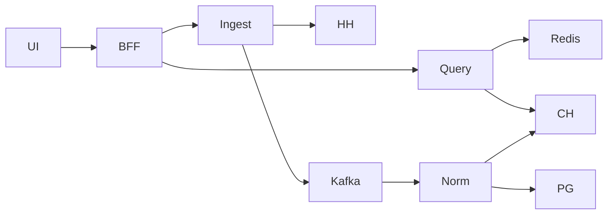

# 11. Observability & Security

## Observability pillars

| Pillar | MVP | Target |
|--------|-----|--------|
| Logging | structured JSON stdout | + centralized (Loki/ELK) |
| Metrics | Prometheus `/metrics` | Grafana dashboards + alerts |
| Tracing | request_id propagation | OpenTelemetry → Jaeger/Tempo |

## Logging

**Полный дизайн** (куда писать по фазам, Loki, поиск LogQL, playbook инцидентов, чеклист внедрения): **[18-logging-and-incidents.md](./18-logging-and-incidents.md)**.

Кратко здесь — контракт формата; детали и ops не дублируем.

**Формат:** JSON, одна строка = одно событие → **stdout** (Phase 1: `docker logs`; Phase 2/3: Loki + Grafana).

Обязательные поля:

| Field | Пример |
|-------|--------|
| `ts` | RFC3339 |
| `level` | info/warn/error |
| `msg` | short |
| `service` | bff/query/ingest/... |
| `trace_id` / `request_id` | ULID |
| `ingest_run_id` | когда релевантно |
| `source` / `external_id` | ingest/normalize; `external_id` — единственное имя для внешнего id вакансии |
| `error` | string + type |

Правила:

- Не логировать raw secrets, полные API keys (см. [17](./17-secrets-management.md))  
- Не логировать полные тексты вакансий на info (debug only, sampling)  
- HH responses: status + latency, не весь body на info  
- Инциденты: detect → correlate `request_id`/`ingest_run_id` → runbooks — см. [18 §7](./18-logging-and-incidents.md)

## Metrics (ключевые)

| Metric | Type | Labels |
|--------|------|--------|
| `http_requests_total` | counter | service, method, path, code |
| `http_request_duration_seconds` | histogram | service, path |
| `grpc_server_handled_total` | counter | method, code |
| `hh_requests_total` | counter | endpoint, code |
| `hh_429_total` | counter | | 
| `ingest_runs_total` | counter | source, status |
| `ingest_vacancies_fetched_total` | counter | source |
| `kafka_produce_total` / errors | counter | topic |
| `kafka_consumer_lag` | gauge | group, topic, partition |
| `normalize_errors_total` | counter | reason |
| `normalize_upserts_total` | counter | result=inserted/updated/noop |
| `cache_hit_total` / `cache_miss_total` | counter | cache_name |
| `ai_jobs_total` | counter | type, status |
| `ai_tokens_total` | counter | model, direction |
| `db_query_duration_seconds` | histogram | store=pg\|ch |

## Tracing



- W3C `traceparent` на HTTP; gRPC metadata propagation  
- Span names: `HH.GetVacancies`, `Redis.Get`, `CH.QuerySummary`  
- Sampling: 100% dev; 5–20% prod + always on errors  

## Health & alerting

| Alert | Условие |
|-------|---------|
| Ingest failed | `status=failed` за сутки для `hh` |
| High 429 | `hh_429_total` spike |
| Kafka lag | lag age > 30m |
| Query p95 | > 2s for 10m |
| Error rate | 5xx > 5% |
| Disk PG/CH | > 80% (если self-hosted) |

## Dashboards (минимум)

1. **Ingest:** runs, fetched, 429, duration  
2. **Pipeline:** kafka lag, normalize rate, DLQ  
3. **API:** RPS, latency, cache hit ratio  
4. **AI (Target):** jobs, tokens, cost proxy  

## SLO lite & cost cues

Связь с [00-overview.md](./00-overview.md):

| SLO / сигнал | Алерт (ориентир) |
|--------------|------------------|
| Daily ingest success | нет `success/partial` за 24h |
| Summary p95 | > 2s за 10m |
| HH 429 spike | резкий рост `hh_429_total` |
| DLQ depth | рост `vacancies.raw.dlq` |
| AI token spend (Target) | > дневного cap |

Cost: ограничить parallelism HH, TTL кэша, не держать raw JSONB вечно, AI — только async + max tokens.

Runbooks: [ingest-failed](../runbooks/ingest-failed.md), [dlq-replay](../runbooks/dlq-replay.md), [cache-and-locks](../runbooks/cache-and-locks.md).  
Общий процесс расследования: [18-logging-and-incidents.md](./18-logging-and-incidents.md).

---

## Security

### Secrets

Полный гайд (инвентарь, local/Compose/K8s/CI, ротация, фазы): **[17-secrets-management.md](./17-secrets-management.md)**.

Кратко:

| Secret | Где |
|--------|-----|
| DB/Redis/Kafka creds | K8s Secret / Compose `.env` (gitignored) |
| `HH_USER_AGENT` / tokens | Secret (UA — sensitive config) |
| `ADMIN_TOKEN` / JWT keys | Secret |
| `AI_API_KEY` | Secret |

Запрещено: secrets в git, в ConfigMap, в client-side React bundle. Day‑1 достаточно `.env` + gitignore; Vault/ESO — upgrade path (см. 17).

### Network

- Public: only Ingress 443  
- Internal gRPC/ClusterIP  
- NetworkPolicy Target  
- Redis/PG/CH без публичных LoadBalancer  

### HH User-Agent & API ToS compliance

HeadHunter требует идентифицирующий User-Agent с контактами.

Пример:

```text
LMAStudyProject/0.1 (+https://github.com/<user>/study_project; contact@example.com)
```

Практика:

| Правило | Как соблюдаем |
|---------|----------------|
| Корректный User-Agent | обязательный env, fail fast если пусто |
| Rate limits | backoff на 429, низкий parallelism, nightly schedule |
| Не DDoS | один lock на source, page delay |
| Хранение данных | для аналитики учебного проекта; не перепродавать как зеркало HH |
| Attribution | в UI/README: данные из HH (и др.) |
| Токены | если используются application token — только server-side |

Перед prod-публичным доступом — перечитать актуальные [условия API HH](https://dev.hh.ru/) и лимиты.

Аналогично для SuperJob/Remotive/Adzuna — отдельный checklist ToS в adapter docs.

### Authn/z roadmap

| Фаза | AuthN | AuthZ |
|------|-------|-------|
| MVP | нет / optional `X-Admin-Token` на admin routes | admin vs public split by path |
| Phase 3 | JWT (OIDC optional) для UI | roles: `viewer`, `admin` |
| Target | API keys для automation | scopes: `read:analytics`, `write:ingest`, `write:ai` |

Admin routes:

- `/api/v1/admin/**` → require admin  
- Read analytics → viewer/public (решение продукта)

gRPC: остаётся внутри кластера; service-to-service mTLS — later.

### App security basics

- Validate all query params (dates, enums, page_size max)  
- Timeouts на все outbound HTTP/gRPC  
- Body size limits на BFF  
- Dependency scanning в CI (Target)  
- Non-root containers  
- Read-only root FS where possible  

### Privacy & AI

- Не отправлять PII в LLM (см. [08](./08-integrations-and-extensibility.md))  
- Не кэшировать PII в Redis  
- Логи AI: без полного промпта с сырыми описаниями на info level  

### Threat model (кратко)

| Угроза | Митигация |
|--------|-----------|
| Злоупотребление admin ingest | token/JWT + rate limit + lock |
| Утечка API keys | Secrets, no client exposure |
| Scraping нашей API | rate limit, future auth |
| Poison Kafka messages | schema validation, DLQ |
| SSRF из адаптеров | fixed base URLs, no user-supplied URLs |

## Compliance checklist перед публичным демо

- [ ] HH User-Agent с контактом  
- [ ] Секреты не в репозитории  
- [ ] Admin endpoints закрыты  
- [ ] Rate limit на публичное API  
- [ ] README с дисклеймером источника данных  
- [ ] Нет хранения лишних персональных контактов из описаний  
