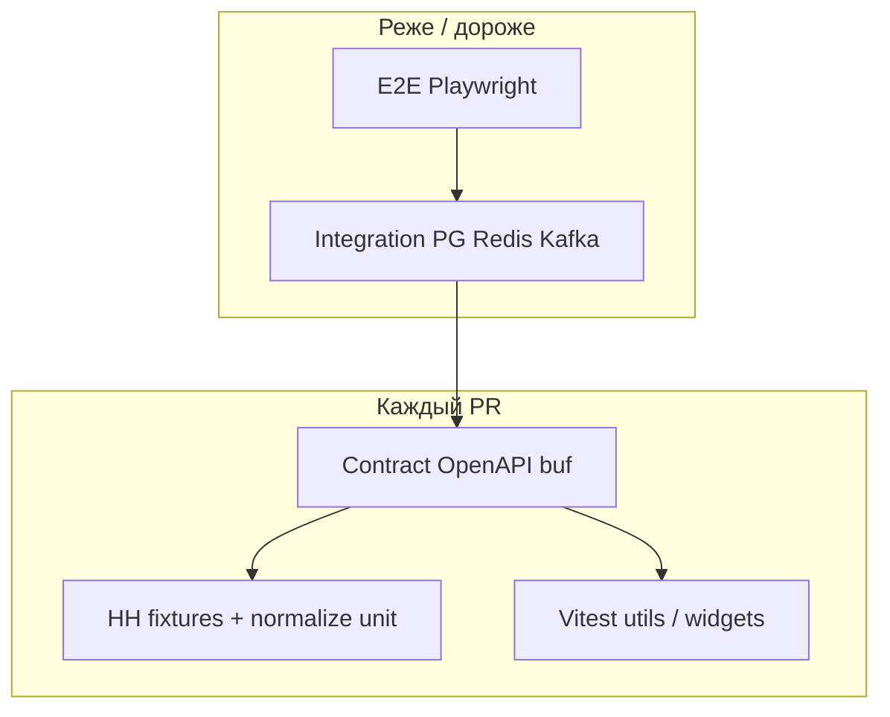
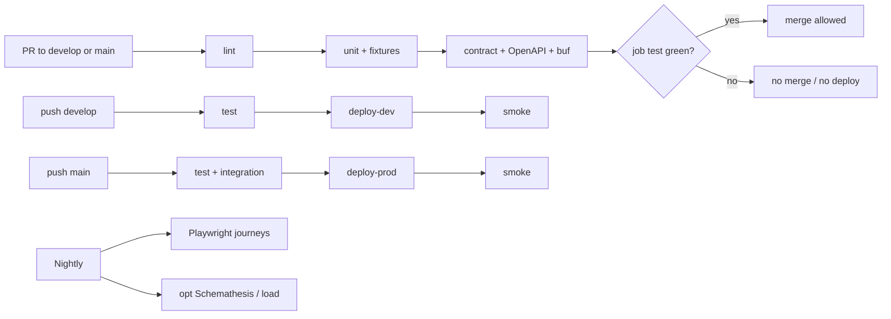

# 13. Testing Strategy

Подробная стратегия тестов LMA / IT Labor Pulse: **сначала тесты (или фикстуры + контракты), потом фича**. Документ — политика и матрица CI; детали слоёв:

| Документ | Содержание |
|----------|------------|
| **Этот файл** | Философия, пирамида, DoD, coverage, структура репо, CI-матрица, план по фазам, mermaid |
| [13a-testing-backend.md](./13a-testing-backend.md) | Go: unit, integration (PG/Redis/Kafka), contract (OpenAPI/gRPC) |
| [13b-testing-frontend-e2e.md](./13b-testing-frontend-e2e.md) | React (Vitest + Testing Library + MSW), Playwright E2E, seed |

Связано: [15-normalization-rules.md](./15-normalization-rules.md), [03-api.md](./03-api.md), [10-cicd.md](./10-cicd.md), [16-frontend.md](./16-frontend.md), [`testdata/hh/`](../../testdata/hh/), [00-overview.md](./00-overview.md).

---

## Содержание

1. [Философия](#1-философия)
2. [Пирамида для этого стека](#2-пирамида-для-этого-стека)
3. [Definition of Done (с тестами)](#3-definition-of-done-с-тестами)
4. [Цели покрытия](#4-цели-покрытия)
5. [Слоистые gates (без flaky E2E на каждый PR)](#5-слоистые-gates)
6. [Структура каталогов](#6-структура-каталогов)
7. [Матрица CI](#7-матрица-ci)
8. [План по фазам](#8-план-по-фазам)
9. [Нефункциональные проверки](#9-нефункциональные-проверки)
10. [Секреты и данные в тестах](#10-секреты-и-данные-в-тестах)
11. [Make / команды (ориентир)](#11-make--команды-ориентир)
12. [Диаграммы](#12-диаграммы)

---

## 1. Философия

LMA — production-like продукт. Тесты должны:

1. **Ловить регрессии нормализации зарплат и парсинга HH до merge** — это главный риск аналитики.
2. **Не зависеть от живого HH в CI** — только фикстуры / `httptest`.
3. **Быть дешёвыми на PR** — unit + lint + contract lite; тяжёлое — на push `main` (перед prod) / nightly; `develop` → dev deploy после того же PR-набора.
4. **Согласоваться с фазами** — не требовать Kafka/CH/Playwright в Phase 0.
5. **Test-first для критичной логики Phase 0–1** — перед кодом ingest/normalize: table-driven кейсы + golden по [`testdata/hh/`](../../testdata/hh/); см. [00-overview § Test-first](./00-overview.md#test-first--тесты-до-фичи-phase-01).

**Не делаем «ради галочки»:** 100% coverage всего репо, chaos в CI, полный UI E2E на каждый PR, live HH с реальным токеном в GitHub Actions.

### Стек инструментов (канон)

| Слой | Инструмент |
|------|------------|
| Go unit / table-driven | `testing` + [testify](https://github.com/stretchr/testify) |
| Go HTTP fake | `net/http/httptest` |
| Go integration | [testcontainers-go](https://github.com/testcontainers/testcontainers-go) (PG, Redis; Phase 2 — Redpanda) **или** compose `local-pg` / `local-redis` в job |
| Migrations smoke | [golang-migrate](https://github.com/golang-migrate/migrate) (`up` / `down` / `up` снова) |
| OpenAPI | lint (`spectral` / `redocly`) + опц. [Schemathesis](https://schemathesis.readthedocs.io/) / request validation в BFF-тестах |
| gRPC | `buf lint` + `buf breaking` (против `main`) |
| Frontend unit | Vitest + Testing Library + MSW |
| E2E | Playwright против Compose stack |
| CI | GitHub Actions — см. [10-cicd.md](./10-cicd.md) |

---

## 2. Пирамида для этого стека

```text
                    /\
                   /  \         E2E Playwright (Compose)
                  /----\        — nightly / main post-deploy
                 /      \
                /--------\      Integration (PG, Redis, Kafka TC)
               /          \     — push main (+ opt. PR labeled)
              /------------\
             /              \   Contract (OpenAPI, buf, BFF↔Query)
            /----------------\  — каждый PR (когда артефакты есть)
           /                  \
          /--------------------\ Adapter fixtures + normalize unit
         /                      \ — каждый PR (основа пирамиды)
```

| Слой | Что проверяем | Скорость | Стабильность | Gate |
|------|---------------|----------|--------------|------|
| **Unit Go** | salary mid, FX, outliers, gross/net, role/skill, `content_hash`, checkpoint cursor (pure) | секунды | высокая | PR required |
| **Unit TS** | formatters, API mappers, critical widgets | секунды | высокая | PR required |
| **Adapter fixtures** | HH JSON → draft (без сети) | секунды | высокая | PR required |
| **Contract** | OpenAPI lint/validate, buf, BFF↔Query semantics | десятки сек | высокая | PR required |
| **Integration** | repos + migrate, Redis hit/miss, HH httptest end-to-end page | 1–5 мин | средняя | **main** (не блокер каждого PR) |
| **E2E / Smoke** | dashboard + filter; admin ingest fixture-mode | 5–15 мин | ниже | **nightly** / post-deploy main |

Подробности: [13a](./13a-testing-backend.md), [13b](./13b-testing-frontend-e2e.md).

---

## 3. Definition of Done (с тестами)

Фича Phase 0–1 **не считается готовой**, пока не выполнены релевантные пункты.

### Общий DoD

- [ ] Есть тест(ы) на уровне, где живёт логика (unit > integration > e2e).
- [ ] Нет зависимости от сети к HH/CBR в unit/CI.
- [ ] Фикстуры анонимны; секреты не в тестах и не в логах assert.
- [ ] CI job для этого слоя зелёный локально (`make test` / `make test-unit`).
- [ ] Документ/комментарий не противоречит [15](./15-normalization-rules.md) / OpenAPI.

### DoD по типу изменения

| Изменение | Минимум тестов до/вместе с merge |
|-----------|----------------------------------|
| Правило normalize (salary/FX/role/…) | Table-driven unit + обновление golden при смене политики |
| HH adapter поле/схема | Фикстура в `testdata/hh/` + parse/map test; **без** live API |
| PG repository / SQL | Integration: migrate up + insert/select; idempotent upsert |
| Redis cache | Integration: miss → fill → hit; TTL/version bump если затронут |
| BFF handler / DTO | Contract: schema/error codes; unit handler с fake Query |
| Query aggregate | Unit SQL builder или integration на seeded PG |
| React util / mapper | Vitest |
| Critical UI widget (KPI, filters) | Testing Library + MSW |
| User journey (dashboard) | Playwright — можно land на main/nightly, не блокер первого PR виджета |
| Миграция PG | `migrate up/down/up` smoke в CI main |
| Proto / OpenAPI breaking | `buf breaking` / OpenAPI lint на PR |

### До кода Phase 1 ingest

**Сначала** (можно пустые `TestXxx` / skipped с TODO, но кейсы и фикстуры зафиксированы):

1. Table-driven скелет для mid / gross / FX / outliers / remote / role match / `content_hash`.
2. Фикстуры HH + README golden (уже в `testdata/hh/`).
3. OpenAPI stubs ключевых путей dashboard/admin (lint в CI).
4. Migrate dry / up-down smoke, когда появляются SQL-файлы.

**Потом** — реализация adapter → normalize → PG → Query → BFF → UI.

---

## 4. Цели покрытия

Реалистично для пета; не догма. Считать `go test -cover` / Vitest coverage по пакетам, не по монорепо целиком.

| Область | Target | Обязательность |
|---------|--------|----------------|
| `normalize` / salary helpers | **> 80%** веток политик из [15](./15-normalization-rules.md) | hard goal Phase 1 |
| HH adapter parse/map | все поля canonical draft на фикстурах | hard |
| Checkpoint / cursor pure logic | 100% веток «save only after page success» | hard |
| `content_hash` | happy + order-independent skills | hard |
| BFF handlers | happy + 400 + 502 | medium |
| Query repos | критичные summary/roles queries | medium |
| React utils / mappers | > 70% | medium |
| React components | critical widgets only | soft |
| E2E | 2–4 journey, не coverage % | soft |

**Не гнаться** за 100% UI и за покрытие generate-кода / main wiring.

---

## 5. Слоистые gates

| Gate | Когда | При flaky |
|------|-------|-----------|
| lint + unit + fixtures + contract | **каждый PR** (`develop`/`main`) — merge blocker; job `test` | чинить сразу |
| integration (testcontainers) | **push `main`** перед prod (+ опц. label `run-integration` на PR) | retry 1×; иначе quarantine issue |
| migrate up/down/up | PR (dry/SQL lint) + main (против реального PG в job) | блокер deploy |
| deploy | только после зелёного `test`; `develop`→dev, `main`→prod | см. [10](./10-cicd.md) |
| Playwright E2E | **nightly** + опц. после deploy `main` | **не** required check на каждый PR |
| Live HH dry-run | только manual / secret-protected workflow | никогда в PR |

Правило: если E2E красный, а unit/integration зелёные — сначала triage окружения Compose; не отключать unit-asserts.

---

## 6. Структура каталогов

Целевой layout (код suites появится при реализации; сейчас допустимы placeholder README):

```text
apps/
  bff/
  query/
  ingest/
  normalizer/          # Phase 2 process; Phase 1 — пакет/in-process
  web/
    src/
    src/**/*.test.ts(x)
libs/
  go-common/
    normalize/
    ...
  proto/lma/
api/
  openapi.yaml
testdata/
  hh/                  # HH JSON fixtures (канон)
  seeds/               # SQL/JSON для integration + E2E (без PII)
tests/
  integration/         # Go tests, tag integration; или *_test.go рядом с пакетом + build tag
  e2e/                 # Playwright project
    README.md
    playwright.config.ts
deploy/compose/
docs/architecture/
  13-testing.md
  13a-testing-backend.md
  13b-testing-frontend-e2e.md
```

**Где класть тесты:**

| Тип | Предпочтение |
|-----|--------------|
| Unit Go | рядом с пакетом: `foo_test.go` |
| Unit TS | рядом с модулем: `foo.test.ts` |
| Integration | `//go:build integration` рядом с repos **или** `tests/integration/...` |
| E2E | только `tests/e2e/` (не смешивать с Vitest) |
| Фикстуры | `testdata/` (Go convention: доступны как `testdata/...`) |

---

## 7. Матрица CI

Связь с [10-cicd.md](./10-cicd.md). Канон workflow: [`.github/workflows/ci-cd.yml`](../../.github/workflows/ci-cd.yml) — job **`test`** (required check) → `deploy-dev` / `deploy-prod` только при `needs: [test]` и push в `develop` / `main`.

| Проверка | PR → `develop`/`main` | push `develop` → deploy **dev** | push `main` → deploy **prod** | Nightly | После deploy |
|----------|----------------------|----------------------------------|---------------------------------|---------|--------------|
| `golangci-lint` / `eslint`+`tsc` | ✅ | ✅ | ✅ | ✅ | — |
| `go test` unit + HH fixtures (без TC) | ✅ | ✅ | ✅ | ✅ | — |
| Vitest (web) | ✅ | ✅ | ✅ | ✅ | — |
| OpenAPI lint | ✅ | ✅ | ✅ | ✅ | — |
| `buf lint` (+ `buf breaking` vs main) | ✅ | ✅ | ✅ | ✅ | — |
| migrate SQL present / `migrate up` dry | ✅ dry | ✅ dry | ✅ against PG | ✅ | ✅ job before apps |
| Integration PG/Redis (testcontainers) | ❌ / label | опц. | ✅ | ✅ | — |
| Contract BFF↔Query | ✅ если пакет есть | ✅ | ✅ | ✅ | — |
| Schemathesis / OpenAPI fuzz lite | ❌ | ❌ | опц. | ✅ | — |
| Playwright E2E | ❌ | ❌ | опц. smoke 1 test | ✅ | опц. subset |
| Compose / curl smoke health+summary | ❌ | ✅ после deploy-dev | ✅ после deploy-prod | ✅ | ✅ |
| Live HH | ❌ | ❌ | ❌ | manual only | — |
| Load (k6) | ❌ | ❌ | ❌ | опц. Phase 3+ | — |

**Gate:** красный `test` → merge blocked (branch protection) и deploy jobs не стартуют. Fork PR — только `test` без Environment secrets. Детали branch protection: [10-cicd.md § Branch protection](./10-cicd.md#branch-protection-включить-на-github).

### Бюджеты времени (ориентир)

| Job | Бюджет |
|-----|--------|
| PR / develop lint+unit+contract | < 5–8 мин |
| main + integration | < 15 мин |
| nightly E2E | < 25 мин |

---

## 8. План по фазам

### Phase 0 — Skeleton

| Есть до/вместе с кодом | Позже |
|------------------------|-------|
| CI: Go/TS lint, `go test` stub packages, Vitest smoke | — |
| Health handler unit (BFF) | — |
| migrate up/down когда появятся SQL | Playwright |
| OpenAPI lint на минимальный `/health` | gRPC/Kafka tests |

### Phase 1 — MVP analytics (HH → PG → Query → BFF → UI)

**До ingest-кода:** normalize table-driven + HH fixtures golden + checkpoint pure tests.

| Land with feature | Слой |
|-------------------|------|
| salary/FX/outlier/gross/role/skill/remote/hash | unit Go |
| HH search/detail parse | fixtures |
| page checkpoint «save only after success» | unit + opt. integration |
| vacancy upsert idempotent | integration PG |
| Redis summary cache | integration Redis |
| `GET /dashboard/summary`, roles, validation errors | contract + BFF unit |
| KPI format, filter → query params | Vitest |
| Dashboard render + filter role | Playwright (nightly) |
| Admin ingest trigger **fixture mode** | integration + E2E nightly |

### Phase 2 — Kafka + CH + gRPC

| Тесты | Примечание |
|-------|------------|
| Consumer contract: produce → consume draft envelope | testcontainers Redpanda |
| Idempotent normalize on redelivery | integration |
| `buf breaking` обязателен | PR |
| Query CH reads (если trends из CH) | integration CH или golden SQL |
| BFF ↔ Query gRPC bufconn/contract | PR |

### Phase 3 — Platform

| Тесты | Примечание |
|-------|------------|
| CI matrix как в §7 стабилизирована | required checks |
| Post-deploy smoke | curl + opt. 1 Playwright |
| Image scan (trivy) | recommended на main |
| Load smoke | optional, вне PR |

### Phase 4 — AI + multi-source job boards

| Тесты | Примечание |
|-------|------------|
| Новый source = новый adapter + `testdata/<source>/` | тот же паттерн, что HH |
| AI worker: mock provider, no real LLM в CI | unit + fake HTTP |
| Prompt version / no-PII redaction helpers | unit |
| Не тащить Perspectives scoring сюда | Phase 5 |

### Phase 5 — Perspectives («Тенденции»)

| Тесты | Примечание |
|-------|------------|
| Signal adapter fixtures (`edu`/`news`) | unit, без scrape |
| Composite score pure function + `score_version` golden | unit > 80% |
| Aggregator idempotent daily | integration |
| API `GET /trends/perspectives` contract | OpenAPI + BFF |
| UI `/perspectives` disclaimer + empty/error | Vitest + E2E nightly |
| Не смешивать с vacancy `/trends` asserts | отдельные suites |

---

## 9. Нефункциональные проверки

| Проверка | Когда | Как |
|----------|-------|-----|
| Migration smoke | main / deploy | golang-migrate up → down → up на чистой БД |
| Secrets hygiene | всегда | нет `HH_*` токенов в CI env для unit; fixture mode |
| Structured log fields (smoke) | opt. Phase 3 | не ассертить секреты/PII в log output tests |
| Load smoke | Phase 3+ optional | k6/vegeta на summary endpoint stage — **не** PR gate |
| Backup/restore | out of scope MVP | — |

---

## 10. Секреты и данные в тестах

| Можно | Нельзя |
|-------|--------|
| Фикстуры `testdata/hh/`, fake employers | Реальные ФИО, телефоны, названия компаний с HH |
| `ADMIN_TOKEN=test-admin` в compose test env | Коммит `.env` / kubeconfig / HH app token |
| Fixed FX stub / clock (`clock.Fake`) | Живой CBR/HH в unit |
| `INGEST_TRANSPORT=fixture` / recorded httptest | `HH_APP_TOKEN` в GitHub Actions для PR |
| Seed SQL с синтетическими UUID | Смешивать offered и survey в одном assert без дискриминатора |

Подробнее: [17-secrets-management.md](./17-secrets-management.md), [testdata/hh/README.md](../../testdata/hh/README.md).

---

## 11. Make / команды (ориентир)

```bash
make lint
make test              # unit Go + Vitest (PR-эквивалент)
make test-unit
make test-integration  # tags=integration, нужен Docker
make test-contract
make test-e2e          # Playwright; нужен compose up
make smoke             # curl health + summary
make migrate-up
make migrate-down
```

Точные target — в [12-local-dev.md](./12-local-dev.md) по мере появления Makefile.

---

## 12. Диаграммы

### Пирамида



### CI flow



---

## Краткие указатели

- Backend детали → [13a-testing-backend.md](./13a-testing-backend.md)
- Frontend + E2E → [13b-testing-frontend-e2e.md](./13b-testing-frontend-e2e.md)
- Правила агентов → `.cursor/rules/tests-testdata.mdc`
- HH skill → `.cursor/skills/lma-ingest-hh` (тесты без сети)
