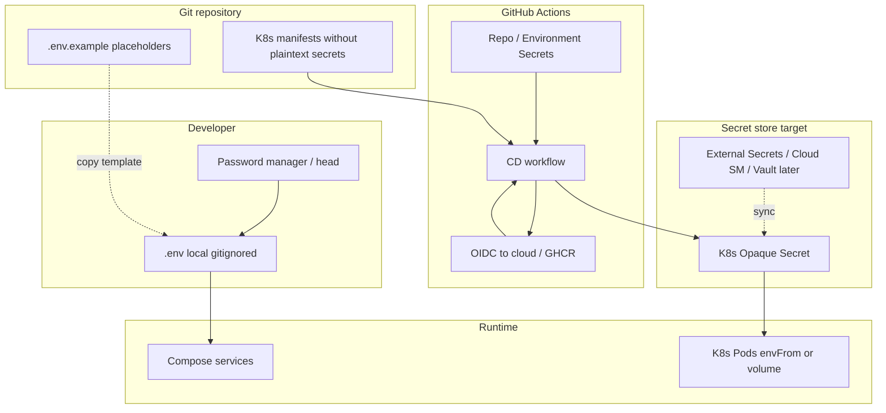

# 17. Управление секретами (Secrets Management)

Цель документа: для соло-учебного проекта **IT Labor Market Analytics (LMA)** описать, *где* и *как* хранить ключи, пароли и прочие секреты так, чтобы это выглядело профессионально, но без обязательного Vault в day‑1.

Связанные документы:

- [11-observability-security.md](./11-observability-security.md) — кратко про secrets + observability/ToS  
- [09-deployment.md](./09-deployment.md) — ConfigMap vs Secret, Compose/K8s  
- [10-cicd.md](./10-cicd.md) — GitHub Actions, environments  
- [12-local-dev.md](./12-local-dev.md) — локальный `.env`  
- Корневой [`.env.example`](../../.env.example) — канон имён переменных  

**Хороший минимум сейчас:** `.env` (gitignored) + placeholders в `.env.example` + K8s Opaque Secrets на Phase 3.  
**Путь апгрейда:** External Secrets / cloud Secret Manager / SOPS / OIDC в CI — когда появится реальный stage/prod или GitOps.

---

## 1. Инвентарь секретов и чувствительных данных

Классификация:

| Класс | Смысл | Примеры |
|-------|--------|---------|
| **public** | Можно в git / клиенте | `HH_BASE_URL`, имена топиков, публичный `VITE_API_BASE_URL` |
| **sensitive config** | Не секрет криптографии, но не для публичного скрапинга/спама | `HH_USER_AGENT` (email/контакт), cron-расписание admin, внутренние hostname |
| **secret** | Даёт доступ к системам | пароли БД, API tokens, `ADMIN_TOKEN` |
| **high-risk** | Компрометация = полный контроль infra/данных или дорогостоящий abuse | kubeconfig, cloud keys, JWT signing key, AI keys с биллингом, TLS private key, registry write token |

| Имя / артефакт | Фазы | Класс | Где сейчас / later | Примечание |
|----------------|------|-------|--------------------|------------|
| `HH_USER_AGENT` (email/URL контакта) | 0+ | sensitive config | `.env` / K8s Secret | Не «пароль», но PII-like; не светить в публичных issues |
| `HH_APP_TOKEN` | 1+ opt. | secret | `.env` / K8s Secret | Только server-side; не в React |
| SuperJob `X-Api-App-Id` / secret | later | secret | Secret | Аналогично адаптеру SJ |
| Adzuna / Remotive keys | later | secret | Secret | По мере подключения источников |
| `POSTGRES_PASSWORD` / `DATABASE_URL` | 0+ | secret | `.env` / K8s Secret | Local: слабый ok; **cloud/managed PG:** пароль и полный DSN — secret (не в git, не в issues); stage/prod: сильный, свой |
| `REDIS_PASSWORD` / `REDIS_URL` | 0+ | secret | `.env` / K8s Secret | Local часто без пароля / `redis://localhost…`; **cloud/managed Redis:** полный URL (`rediss://…`) — secret; не в git |
| `REDIS_TLS_CA_FILE` | 0+ | path (не secret) | `.env` (local path) | Опционально: PEM CA для TLS (Yandex Valkey). Путь к файлу, не сам сертификат в git |
| Kafka SASL user/pass (или TLS keystore) | 2–3+ | secret | позже | Local Redpanda обычно без auth |
| `CLICKHOUSE_PASSWORD` / DSN | 2+ | secret | `.env` / Secret | `default` без пароля — только local |
| `ADMIN_TOKEN` | 1+ | secret → high-risk в prod | `.env` / Secret | Закрывает `/api/v1/admin/**` |
| JWT signing key / OIDC client secret | 3+ | high-risk | Secret / IdP | Не хардкодить; ротация = logout всех |
| `AI_API_KEY` | 4 | high-risk | отдельный Secret | Бюджет/квоты; никогда в логах |
| Docker/GHCR push token | 3+ CI | high-risk | GitHub Actions secret / OIDC | Предпочесть OIDC → GHCR |
| Cloud credentials / `KUBE_CONFIG` | 3+ CI | high-risk | Actions Environment secret | Target: OIDC federated login, не long-lived key |
| TLS cert + private key | 3+ | high-risk | cert-manager (предпочтительно) | Не коммитить `.pem` / `.key` |
| GitHub Actions secrets (набор) | 3+ | high-risk | Settings → Secrets / Environments | Не дублировать runtime DB password в CI без нужды |
| SOPS age/pgp private key | opt. | high-risk | password manager / CI only | Нужен только если secrets-in-git encrypted |

Правило большого пальца: **если значение открывает доступ или стоит денег — это Secret; если только настраивает поведение без auth — ConfigMap/env non-secret.**

---

## 2. Принципы

1. **Never commit secrets** — ни в код, ни в `docker-compose.yml`, ни в манифесты plaintext, ни в скриншоты/issues. В git только `.env.example` с плейсхолдерами.
2. **Config ≠ secret** — TTL, feature flags, имена топиков, `LOG_LEVEL` → ConfigMap / обычный env. Пароли, токены, DSN с паролем → Secret / `.env`.
3. **Least privilege** — отдельный DB user на сервис (когда дойдёте); CI write-токен registry ≠ runtime read; admin token не класть в web.
4. **Разные значения на env** — `local` / `dev` / `stage` / `prod` никогда не шарят один `ADMIN_TOKEN` или пароль Postgres.
5. **Ротация** — уметь сменить секрет без переписывания архитектуры (env/Secret → restart/rollout).
6. **Short-lived где возможно** — OIDC в CI, временные cloud credentials, cert-manager сертификаты; long-lived ключи — исключение.
7. **Fail closed в prod** — отсутствие обязательного секрета = отказ старта, не «дефолтный пароль из кода».
8. **Не в образе** — `Dockerfile`/`COPY .env` запрещены; секреты только в runtime mount/env.

### ConfigMap vs Secret (Kubernetes)

| Можно в ConfigMap | Только Secret (или external store) |
|-------------------|--------------------------------------|
| `CACHE_SUMMARY_TTL_SEC`, `SOURCES_ENABLED`, topic names | `DATABASE_URL`, `POSTGRES_PASSWORD`, `REDIS_URL` |
| `LOG_LEVEL`, listen addresses (non-auth) | `ADMIN_TOKEN`, JWT keys |
| `HH_BASE_URL`, `REPORT_CURRENCY` | `HH_APP_TOKEN`, `AI_API_KEY` |
| публичные URL внутренних svc | Kafka SASL, Redis password, CH password |

| | TLS private keys, registry creds (если вообще в cluster) |

`HH_USER_AGENT` формально не крипто-секрет, но **рекомендуется Secret** (содержит контакт/email; единый канал с остальными HH-настройками).

---

## 3. Локальная разработка

### Обязательный минимум (Phase 0–1)

```bash
cp .env.example .env
# заполнить ADMIN_TOKEN;
# облачный PG: DATABASE_URL (sslmode=require) — секрет;
# облачный Redis: REDIS_URL (часто rediss://) — секрет;
# local PG/Redis: local DATABASE_URL / REDIS_URL + POSTGRES_PASSWORD;
# HH_USER_AGENT — для реального ingest
```

| Файл | В git? | Содержание |
|------|--------|------------|
| `.env.example` | да | имена + безопасные local placeholders (без реальных cloud URL) |
| `.env` | **нет** (`.gitignore`) | реальные локальные / cloud значения |
| `*.pem`, `kubeconfig`, `credentials.json` | **нет** | никогда |

**Cloud Postgres:** connection string из Neon/Supabase/Yandex/Timeweb и т.п. храни только в `.env` или password manager. Утечка DSN = полный доступ к учебной БД — ротация пароля в кабинете провайдера (см. §8). Hybrid DX: [12-local-dev.md — Облачный PostgreSQL](./12-local-dev.md#облачный-postgresql).

**Cloud Redis:** статус **кандидат**; preferred для РФ — [Yandex Managed Valkey](https://yandex.cloud/ru/docs/managed-valkey/) (`REDIS_URL` вида `rediss://…`, опц. `REDIS_TLS_CA_FILE`). Upstash **может быть недоступен из РФ** — не primary. Альтернативы: Selectel / Timeweb / VK Cloud / Redis Cloud (если доступен). Утечка = доступ к cache/locks. DX: [12-local-dev.md — Облачный Redis](./12-local-dev.md#облачный-redis), реестр: [21](./21-external-services.md).

Проверка: корневой [`.gitignore`](../../.gitignore) должен содержать как минимум `.env` / `.env.*` / `.env.local` (с исключением `!.env.example`), `*.pem` / `*.key`, `kubeconfig`, `credentials*`, `**/secrets/`; после `git init` — `git check-ignore -v .env`.

### Опционально (advanced, не day‑1)

| Подход | Когда имеет смысл |
|--------|-------------------|
| **direnv** (`direnv allow`) | авто-load `.env` в shell без ручного `export` |
| **1Password / Bitwarden** CLI | хранить prod-like токены; в `.env` подставлять ссылки/inject на сессию |
| **SOPS + age** | зашифрованный `.env.enc` в *private* repo; ключ age — только у вас и в CI |

### Чего не делать

- Не копировать **prod** пароли/AI keys на ноутбук «насовсем».
- Не использовать один и тот же `ADMIN_TOKEN`, что в публичном демо.
- Не коммитить «временно» настоящий ключ «потом уберём» — history останется.

---

## 4. Docker Compose

Правила:

- Сервисы читают секреты через `env_file: .env` или `environment: ${VAR}` из env хоста/`.env`.
- **Не** хардкодить пароли в `deploy/compose/docker-compose.yml`.
- Не монтировать `.env` в образ как layer; только runtime env.

Пример идеи (не полный compose):

```yaml
services:
  bff:
    env_file:
      - ../../.env
    environment:
      APP_ENV: local
  postgres:
    environment:
      POSTGRES_PASSWORD: ${POSTGRES_PASSWORD}
```

### Docker secrets (optional)

`docker secret` / Compose Swarm secrets — имеет смысл только если уже на Swarm. Для учебного Compose **достаточно `.env` + gitignore**. На Phase 2 можно держать `env_file` и не усложнять.

---

## 5. Kubernetes (целевой деплой, Phase 3)

### Good enough now (пет-проект)

**Native Opaque Secret** на namespace (`lma-dev` / `lma-stage` / `lma-prod`):

```yaml
apiVersion: v1
kind: Secret
metadata:
  name: lma-secrets
  namespace: lma-dev
type: Opaque
stringData:
  DATABASE_URL: "postgres://..."
  REDIS_URL: "rediss://..."
  ADMIN_TOKEN: "..."
  HH_USER_AGENT: "LMAStudyProject/0.1 (...)"
  # HH_APP_TOKEN, AI_API_KEY — по мере появления
```

Как создать без хранения plaintext в git:

```bash
kubectl -n lma-dev create secret generic lma-secrets \
  --from-literal=ADMIN_TOKEN='...' \
  --from-literal=DATABASE_URL='...' \
  --from-literal=REDIS_URL='...' \
  --dry-run=client -o yaml | kubectl apply -f -
```

Или CI подставляет значения из **GitHub Environment secrets** и делает `kubectl apply` (манифест с плейсхолдерами не коммитить с реальными значениями).

### Как поды потребляют

| Способ | Когда |
|--------|--------|
| `envFrom.secretRef` | удобно для многих строковых env (DSN, tokens) |
| `valueFrom.secretKeyRef` | точечно для 1–2 ключей |
| **volume mount** (`/var/run/secrets/...`) | предпочтительно для длинных ключей/файлов (JWT PEM, kube-style), меньше шансов утечки через `/proc/*/environ` |

Практика для LMA: DSN/токены через env — ok для MVP; PEM/файлы — mount.

### RBAC

- Обычные app ServiceAccount: **не** `get/list/watch` Secrets cluster-wide.
- Доступ к Secret — только у контроллеров/операторов, которые монтируют его в нужные Deployment.
- Не раздавать разработчикам `cluster-admin` на prod «для удобства».
- CI deploy SA: `apply` Deployments + нужный Secret в одном namespace; без чтения чужих ns.

### Never bake secrets into images

- Multi-stage build без `.env`.
- Не `ENV ADMIN_TOKEN=...` в Dockerfile.
- Скан образа (trivy) в CD — recommended (см. [10-cicd.md](./10-cicd.md)).

### Upgrade path (когда и зачем)

| Решение | Когда брать | Зачем |
|---------|-------------|-------|
| **External Secrets Operator** + AWS/GCP Secret Manager | есть облако и ≥2 env | единый source of truth, ротация, аудит |
| **HashiCorp Vault** | overkill для соло day‑1; later если много сервисов/динамические creds | dynamic DB creds, fine-grained policies |
| **Sealed Secrets** или **SOPS + KSOPS** | GitOps (Flux/Argo), хотите secrets-in-git *encrypted* | PR-review манифестов без plaintext |
| **cert-manager** | любой публичный Ingress | не хранить TLS key вручную |

Для Phase 3 учебного стенда: **K8s Secret из CI/ручного apply** — достаточно. ESO/SOPS — когда надоедает копировать секреты руками или появляется GitOps.

---

## 6. CI/CD (GitHub Actions)

См. также [10-cicd.md](./10-cicd.md). Workflow: [`.github/workflows/ci-cd.yml`](../../.github/workflows/ci-cd.yml) — job `test` **без** deploy-секретов; `deploy-dev` / `deploy-prod` читают только **Environment** secrets после зелёного `test`.

### GitHub Environments (для деплоя)

| Environment (Settings → Environments) | Branch / job | Protection | Что класть |
|---------------------------------------|--------------|------------|------------|
| `development` | push `developer` → `deploy-dev` | auto / optional reviewers | kube/OIDC **dev**, registry write для dev tags |
| `production` | push `production` → `deploy-prod` | **Required reviewers** (solo: self-approve или временно без reviewers) | kube/OIDC **prod**, отдельный registry/cloud; **не** копировать dev-значения |
| `stage` (later) | tags / manual | optional reviewers | свои secrets |

Создай Environments до первого реального деплоя. Имена должны совпадать с `environment:` в workflow (`development`, `production`).

### Где что лежит

| Секрет | GitHub Actions Secrets / Environments | Runtime K8s Secret |
|--------|----------------------------------------|--------------------|
| `KUBE_CONFIG` или cloud OIDC role | да (**Environment** deploy) | нет |
| Registry push (`GHCR`) | да, или OIDC | нет |
| `DATABASE_URL` для migrate Job | **лучше нет** — Job в кластере читает Secret | да |
| `ADMIN_TOKEN`, `AI_API_KEY` | только если CD создаёт/обновляет Secret | да (источник истины для app) |
| Slack webhook (notify) | да | нет |

**Environments:** `development` (auto), `stage` / `production` (protection + отдельные secrets). Prod secrets не видны workflow из fork PR; job `test` секретов деплоя не использует.

### OIDC вместо long-lived cloud keys (target)

Предпочтительная схема для Phase 3+:

```text
GitHub Actions → OIDC token → Cloud IAM / GHCR → short-lived creds → kubectl/helm
```

Так не храните вечный `AWS_SECRET_ACCESS_KEY` в репозитории.

### Опасные паттерны

| Антипаттерн | Почему плохо |
|-------------|--------------|
| `echo $ADMIN_TOKEN` / debug print env | утечка в логи Actions |
| Секреты в `pull_request` из **fork** | автор PR может попытаться эксфильтрировать |
| Один secret на все env | компрометация dev = prod |
| Коммит `kubeconfig` в `deploy/` | полный доступ к кластеру |
| Передача prod DB password в каждый PR job | не нужно для unit-тестов |

PR из fork: только lint/test без secrets; deploy — только из `developer`/`production`/tags в trusted environment.

---

## 7. Дизайн приложения (Go)

Документ не реализует код; контракт поведения:

1. **Читать секреты из env** (или файла по пути из env), 12-factor.
2. **Нет дефолтных prod-паролей в коде** — `dev-admin-token` допустим только при `APP_ENV=local|dev` явно; в `stage|prod` — пустой/отсутствующий `ADMIN_TOKEN` → fatal.
3. **Fail fast** при старте: обязательные `HH_USER_AGENT` (для ingest), `DATABASE_URL`/`POSTGRES_*`, `REDIS_URL`/`REDIS_ADDR`, в prod — `ADMIN_TOKEN`.
4. **Redaction в логах** — не логировать raw `Authorization`, `X-Admin-Token`, DSN/`REDIS_URL` с паролем, `AI_API_KEY`, тела ответов с токенами. Маскировать query string если туда попали secrets.
5. **Admin ingest** — заголовок `X-Admin-Token` сравнивать constant-time; не принимать токен из query string.
6. **Клиент (React)** — только `VITE_API_BASE_URL`; никаких server secrets в bundle.

Псевдо-правило:

```text
if APP_ENV in {stage, prod} && ADMIN_TOKEN == "" → os.Exit(1)
if APP_ENV in {stage, prod} && ADMIN_TOKEN == "dev-admin-token" → os.Exit(1)
```

---

## 8. Ротация и инцидент

### Как ротировать (типичный порядок)

| Секрет | Шаги |
|--------|------|
| `ADMIN_TOKEN` | сгенерировать новый → обновить K8s Secret / `.env` → rollout bff (и кто проверяет) → обновить секреты у оператора → старый перестаёт работать |
| Postgres password | создать новый пароль пользователя → обновить Secret/`DATABASE_URL` → rollout зависимых deploy → (managed: rotation API) → отозвать старый |
| Redis password / URL | перевыпустить пароль в кабинете → обновить Secret/`REDIS_URL` → rollout зависимых deploy → отозвать старый |

| `HH_APP_TOKEN` / SJ keys | перевыпустить в кабинете провайдера → Secret → rollout ingest → revoke old |
| `AI_API_KEY` | revoke в кабинете LLM → новый key в Secret → rollout ai-analyzer → проверить бюджетные лимиты |
| JWT signing key | выпустить новый → dual-key window если возможно → rollout →invalidate sessions |
| CI kubeconfig / cloud key | invalidate credentials в cloud → выпустить новые / перейти на OIDC → обновить Environment secret |

Ротация не должна требовать rebuild образа — только Secret + rollout.

### Чеклист: секрет утеёл (committed / залогирован / в чате)

1. **Считать скомпрометированным** — не «надеемся, что никто не видел».
2. **Revoke / rotate** у провайдера (HH, AI, DB, GitHub, cloud) — *сначала это*, потом разбор.
3. **Обновить** runtime Secret / `.env` / Actions secrets.
4. **Rollout** затронутых сервисов; проверить, что старый ключ не работает.
5. Если попало в git: удалить из tree + **scrub history** (`git filter-repo` / BFG) и force-push только если понимаете последствия; сменить все ключи всё равно обязательно (history могла быть склонирована).
6. Проверить логи Actions / Grafana на злоупотребление (ingest spam, AI spend).
7. Краткая запись: что утекло, когда, что сделано (для себя / преподавателя).

---

## 9. Рекомендуемая схема для LMA по фазам

| Фаза | Где секреты | Good enough | Upgrade path |
|------|-------------|-------------|--------------|
| **0–1** MVP local | `.env` + `.gitignore`; `.env.example` без реальных prod/cloud URL | Local passwords ok; cloud `DATABASE_URL` / `REDIS_URL` только в `.env`; отдельный `ADMIN_TOKEN` | Password manager для cloud DB/Redis + токенов |
| **2** Kafka/CH Compose | тот же `.env`; пароль CH/Redis если включите auth | `env_file`, без секретов в YAML | Compose secrets — только если очень захочется |
| **3** Kubernetes | Opaque Secret per namespace; CI Environment secrets для kube/registry | `kubectl create secret` / CD apply; cert-manager для TLS | ESO + cloud SM; SOPS/Sealed Secrets при GitOps; OIDC в CI |
| **4** AI | отдельный `AI_API_KEY` в Secret; не в `.env.example` с реальным значением | Budget/max tokens; ключ только у `ai-analyzer` | Отдельный billing project; vault/SM; никогда не логировать промпт вместе с key |

Дополнительно по фазам:

- **0–1:** не класть cloud kubeconfig на машину без нужды.
- **3:** prod Environment в GitHub с required reviewers.
- **4:** лимит дневного spend (см. SLO/cost в [11](./11-observability-security.md)); ключ не передавать в bff/web.

---

## 10. Поток секретов (обзор)



Кратко:

- **Local:** голова/password manager → `.env` → Compose.  
- **CI:** GitHub Secrets (+OIDC) → создаёт/обновляет cluster Secret или деплоит apps, которые уже ссылаются на Secret.  
- **Runtime:** приложение читает env/файлы; образы и git секретов не содержат.

---

## 11. Чеклист перед публичным демо

- [ ] `.env` в `.gitignore`, в remote нет реальных секретов (`git log -p` / secret scan)
- [ ] `.env.example` только с placeholders / local-only dummy
- [ ] `ADMIN_TOKEN` не равен `dev-admin-token` на публичном стенде
- [ ] HH/AI/DB секреты только server-side
- [ ] Ingress TLS через cert-manager (или эквивалент), ключи не в git
- [ ] Actions: prod environment protected; fork PR без secrets
- [ ] План ротации `ADMIN_TOKEN` и AI key известен (этот документ, §8)

---

## Итог одной строкой

**Сейчас:** gitignore + `.env` / `.env.example`.  
**Compose:** `env_file`.  
**K8s (Phase 3):** Opaque Secrets + отдельные GitHub Environment secrets для деплоя; OIDC когда появится облако.  
**Потом:** External Secrets / SOPS / Vault — по необходимости, не как входной билет.
