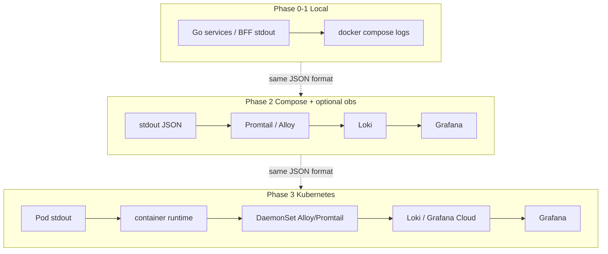
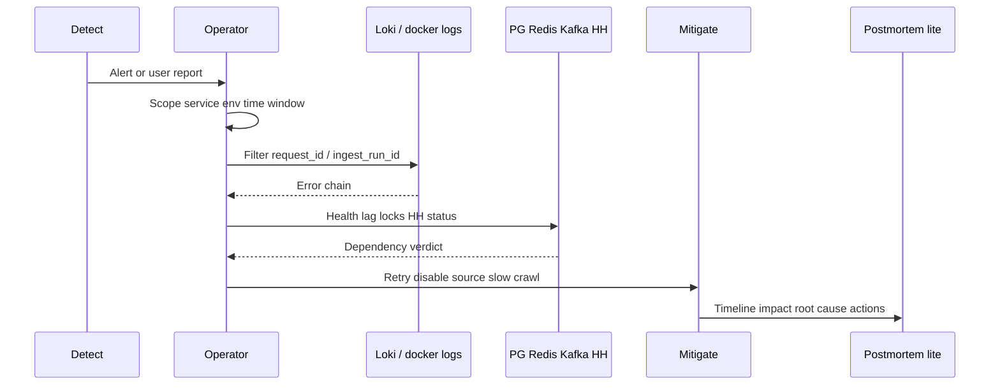
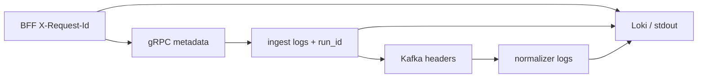

# 18. Логирование и расследование инцидентов

Цель документа: для соло-учебного проекта **IT Labor Market Analytics (LMA)** описать, *куда* писать логи, *как* искать нужные события и *как* разбирать инциденты — профессионально, но без обязательного APM/ELK в day‑1.

Связанные документы:

- [11-observability-security.md](./11-observability-security.md) — метрики, SLO lite, краткий обзор логов  
- [23-observability-tracing.md](./23-observability-tracing.md) — **канон tracing / поиска по `trace_id` в Grafana** (OTel, Loki↔Tempo, Compose `observability`)  
- [17-secrets-management.md](./17-secrets-management.md) — redaction секретов в логах  
- [09-deployment.md](./09-deployment.md) — Compose / K8s runtime  
- [10-cicd.md](./10-cicd.md) — не светить секреты в CI логах  
- [02-services.md](./02-services.md) — сервисы и failure modes  
- Runbooks: [ingest-failed](../runbooks/ingest-failed.md), [dlq-replay](../runbooks/dlq-replay.md), [cache-and-locks](../runbooks/cache-and-locks.md)

**Хороший минимум сейчас (Phase 0–1):** structured JSON → stdout → `docker logs` (поля `trace_id` + `request_id`).  
**Рекомендуемый путь Phase 2/3:** Grafana Loki + Alloy + Tempo + Grafana (+ Prometheus из [11](./11-observability-security.md)) — детали в [23](./23-observability-tracing.md), [ADR 009](./adr/009-otel-loki-tempo.md).  
**Не day‑1:** полный ELK/EFK, коммерческий APM, 100% sampling traces в prod.

---

## 1. Goals & non-goals

### Goals (нужно)

| Цель | Зачем |
|------|--------|
| Понять *что сломалось* за минуты | ingest failed, 5xx, DLQ, 429 |
| Корреляция одного запроса / одного run | `request_id` / `trace_id` / `ingest_run_id` |
| Единый формат логов во всех Go-сервисах + BFF | поиск и дашборды без сюрпризов |
| Безопасность логов | нет секретов, нет полного PII, нет сырых HH/AI payload на info |
| Лёгкий upgrade path | stdout → Loki в Compose → agent в K8s без смены формата |
| Минимум алертов | 4–6 сигналов, не «зоопарк» |

### Non-goals (откладываем)

| Не делаем day‑1 | Когда вернуться |
|-----------------|-----------------|
| Полный APM (Datadog/New Relic) | если появится реальный prod и бюджет |
| ELK/EFK как обязательный стек | только если Loki перестанет хватать (сложные full-text кейсы) |
| 100% distributed tracing в prod | OTel + Tempo — [23](./23-observability-tracing.md); sampling Phase 3+ |
| Долгое хранение всех debug-логов | retention короткий; debug локально |
| Логирование каждого тела вакансии | никогда на info; sampling + redaction на debug |
| Централизованные логи фронтенда (RUM) | позже; browser console ≠ backend pipeline |
| SIEM / compliance audit trail | не требуется для учебного пет-проекта |

**Разделение ответственности:** метрики (Prometheus) отвечают на «сколько / как часто»; логи — на «почему / для какого run_id»; трейсы (later) — на «где узкое место в цепочке вызовов».

---

## 2. Logging standards (Go + BFF)

### Формат

- Structured **JSON**, одна строка = одно событие.
- Библиотека: стандартный **`log/slog`** (предпочтительно для Go 1.21+) или **zap** — выбрать одну на весь монорепо и держать в `libs/go-common`.
- Писать в **stdout** (stderr допустим только для fatal bootstrap до инициализации логгера). Не писать в произвольные файлы внутри контейнера как основной канал (файлы — только optional local sidecar).

### Обязательные поля

| Поле | Тип / пример | Когда |
|------|--------------|--------|
| `ts` | RFC3339 / RFC3339Nano | всегда |
| `level` | `debug` / `info` / `warn` / `error` | всегда |
| `msg` | короткий стабильный текст | всегда |
| `service` | `bff` / `query` / `ingest` / `normalizer` / `scheduler` / `analytics` / `ai-analyzer` | всегда |
| `env` | `local` / `dev` / `stage` / `prod` | всегда (`APP_ENV`) |
| `trace_id` | 32 hex (W3C) | HTTP/gRPC/Kafka; из `traceparent`; **не** ULID — см. [23](./23-observability-tracing.md) |
| `request_id` | ULID/UUID | `X-Request-Id` для клиентов/error body; рядом с `trace_id`, не вместо |
| `ingest_run_id` | UUID | ingest / normalize / scheduler вокруг run |
| `source` | `hh` / … | ingest/normalize |
| `external_id` | string | когда событие про конкретную вакансию |
| `error` | string (+ опц. `error_type`) | на warn/error |
| `component` | `hh_client` / `kafka_producer` / … | опционально, помогает фильтру |

Согласование с [11](./11-observability-security.md): те же имена полей (`ts`, `level`, `msg`, `service`, `trace_id`/`request_id`, `ingest_run_id`, `source`, `external_id`). Альтернативные имена для внешнего id вакансии запрещены.

Пример (схематично):

```json
{
  "ts": "2026-08-11T22:15:01.234Z",
  "level": "info",
  "msg": "ingest_run_finished",
  "service": "ingest",
  "env": "local",
  "request_id": "01JABC...",
  "ingest_run_id": "7c9e...",
  "source": "hh",
  "status": "partial",
  "fetched": 1200,
  "published": 1180,
  "errors": 20
}
```

### Политика уровней

| Level | Когда | Где |
|-------|--------|-----|
| `debug` | тела ответов (redacted), детальный pagination step, cache key internals | **local/dev**; в prod выключен или sampling |
| `info` | старт/конец run, успешный produce batch summary, HTTP access (выборочно), scheduler tick | prod default |
| `warn` | retry, 429 + backoff, cache miss storm, degraded dependency (Redis down → fallback), partial run | prod |
| `error` | failed run, produce fail после retries, 5xx, unhandled, DLQ publish | prod; всегда с `error` |

`LOG_LEVEL` через env/ConfigMap (не Secret). Default: `debug` local, `info` stage/prod.

### Что NEVER логировать

См. также redaction в [17 §7](./17-secrets-management.md):

| Запрещено | Вместо этого |
|-----------|--------------|
| `ADMIN_TOKEN`, JWT, `Authorization`, `X-Admin-Token` | факт «auth failed» / status code |
| DSN с паролем, `POSTGRES_PASSWORD`, Redis password | host + db name без credentials |
| `AI_API_KEY`, raw provider keys | `model`, `job_id`, error code |
| Полный PII из описаний (телефон, email кандидата) | не писать; агрегаты ок |
| Весь HH JSON vacancy/list на `info` | `status`, `latency_ms`, `page`, `items_count` |
| Полный AI prompt / completion на `info` | `prompt_version`, `tokens_in/out`, error |
| Секреты CI (`echo $SECRET`) | маскирование в Actions |

Raw payload: только `debug` + redaction + sampling (например 1/N или только failed id). В prod raw HH body по умолчанию **выкл**.

### Correlation

Кратко здесь; полная модель (W3C, Kafka headers, Grafana LogQL по `trace_id`, mermaid) — **[23-observability-tracing.md](./23-observability-tracing.md)**.

```text
Client / UI
  → Gateway: принять или сгенерировать traceparent + X-Request-Id → BFF
  → gRPC metadata: traceparent / x-request-id → query, ingest
  → Workers (Kafka): headers traceparent, request_id, ingest_run_id, source, external_id
  → Логи: trace_id + request_id (+ ingest_run_id) в каждом JSON-событии
```

| Канал | Заголовки / metadata |
|-------|----------------------|
| HTTP (публичный) | `traceparent` + `X-Request-Id` (оба в ответе) |
| gRPC | metadata `traceparent`, `x-request-id` (otelgrpc) |
| Kafka | headers: `traceparent`, `request_id`, `ingest_run_id`, `source`, `external_id`, `content_hash` |
| Outbound HH | не слать наши секреты; correlation только во внутренних логах/spans |

Правило: **один `trace_id` + один `request_id` на синхронный user/admin запрос**; **один `ingest_run_id` на весь async pipeline** этого прогона (даже если `request_id` у scheduler-тика другой).

---

## 3. Куда идут логи по фазам

| Фаза | Куда пишем | Как смотрим | Централизация |
|------|------------|-------------|---------------|
| **0–1** local MVP | stdout | `docker compose logs -f bff ingest` | нет (optional: файл volume только для отладки) |
| **2** Kafka/CH Compose | stdout | docker logs + **опционально** Loki+Grafana в том же compose profile `obs` | Loki (рекомендуется) |
| **3** Kubernetes | stdout контейнера | Grafana/Loki; `kubectl logs` как fallback | agent (Promtail/Alloy/DaemonSet) → Loki |
| **4** AI | тот же pipeline | фильтр `service=ai-analyzer` | без отдельного «AI log store» |

### Рекомендуемый стек (pet-friendly)

| Вариант | Состав | Вердикт |
|---------|--------|---------|
| **Good enough (default)** | **Grafana Loki + Promtail или Grafana Alloy + Grafana** | Легко в Compose; LogQL достаточен; мало RAM vs ELK |
| Альтернатива | ELK/EFK (Elasticsearch + Fluent Bit/Fluentd + Kibana) | Тяжелее для соло; overkill day‑1 |
| Cloud | Grafana Cloud free tier / аналог | Когда лень держать Loki локально на VPS |
| Метрики | **Prometheus + Grafana** (см. [11](./11-observability-security.md)) | Рядом с Loki в той же Grafana |
| Трейсы | OpenTelemetry → **Tempo** (+ Loki link) | Design: [23](./23-observability-tracing.md); export Phase 2–3; не блокер MVP |

**Почему Loki, а не ELK для соло:** меньше ресурсов, проще compose-profile, индексирование по labels (`service`, `env`, `level`) совпадает с нашей JSON-схемой; полнотекст Elasticsearch нужен редко.

### Pipeline (mermaid)



---

## 4. Log taxonomy / события по сервисам

Чеклист: что эмитить (уровень — ориентир).

### Ingest

| Событие (`msg`) | Level | Поля |
|-----------------|-------|------|
| `ingest_run_started` | info | `ingest_run_id`, `source`, `mode`, `request_id` |
| `ingest_run_finished` | info | status, fetched, published, errors, duration_ms |
| `ingest_page_fetched` | info/debug | page, items_count, latency_ms |
| `hh_rate_limited` | warn | status=429, retry_after, backoff_ms |
| `hh_request_failed` | warn/error | status, endpoint, attempt |
| `kafka_produce_ok` | debug/info (batch summary) | topic, count |
| `kafka_produce_failed` | error | topic, error |
| `ingest_lock_acquired` / `ingest_lock_conflict` | info/warn | source, lock_value |

### Normalizer / worker

| Событие | Level | Поля |
|---------|-------|------|
| `normalize_batch_processed` | info | upserts inserted/updated/noop, duration |
| `normalize_message_failed` | warn/error | reason, external_id, attempt |
| `normalize_dlq_published` | error | topic, reason |
| `consumer_lag_high` | warn | group, topic, lag (если считаем в процессе; иначе метрика) |

### Query / BFF

| Событие | Level | Поля |
|---------|-------|------|
| `http_request` | info (или sample) | method, path, status, latency_ms, request_id |
| `grpc_call` | debug/info | method, code, latency_ms |
| `cache_hit` / `cache_miss` | debug (счётчики — в метриках) | cache_name |
| `dependency_error` | error | dep=pg\|ch\|redis\|grpc, error |

Не логировать query string с токенами; path templates предпочтительнее сырых URL с id-heavy cardinality в **метриках** (в логах id допустим умеренно).

### Scheduler

| Событие | Level | Поля |
|---------|-------|------|
| `scheduler_tick` | info | cron_id / schedule |
| `scheduler_trigger_ok` | info | ingest_run_id / http status |
| `scheduler_trigger_skipped` | info/warn | reason=lock|disabled |
| `scheduler_trigger_failed` | error | error |

### Market analytics worker

| Событие | Level | Поля |
|---------|-------|------|
| `analytics_run_finished` | info | analytics_run_id, run_type, source_cycle_id, rows, method_version |
| `analytics_run_skipped` | info | reason=lock\|no_complete_cycle\|no_daily_snapshots |
| `analytics_cycle_trigger_failed` | error | source_cycle_id, error_category без SQL/DSN |

### AI (later)

| Событие | Level | Поля |
|---------|-------|------|
| `ai_job_started` / `ai_job_finished` | info | job_id, type, status |
| `ai_inference` | info | model, tokens_in, tokens_out, latency_ms |
| `ai_inference_failed` | error | model, error_type (без prompt dump) |

---

## 5. Retention & volume

| Среда | Retention (ориентир) | Комментарий |
|-------|----------------------|-------------|
| Local docker logs | дни (default rotate) | не копить гигабайты HH debug |
| Loki (Compose / учебный k8s) | **7–14 дней** | для пет-проекта достаточно |
| Grafana Cloud free | по квоте тарифа | следить за ingest GB |
| Prod-like (если появится) | 14–30 дней logs; метрики дольше | raw debug не хранить |

**Контроль объёма:**

- Не логировать тело каждой вакансии на `info`.
- Access-логи BFF: в prod можно sample 10% success + 100% ≥400.
- Batch summary вместо per-message info в hot path Kafka.
- Labels Loki: низкая cardinality (`service`, `env`, `level`) — **не** класть `external_id` в label, только в JSON line.

---

## 6. Как искать

Предполагается Loki + LogQL. Локально без Loki: `docker compose logs ingest 2>&1 | jq -c 'select(.ingest_run_id=="...")'`.  
Поиск по **`trace_id`** и связка Loki↔Tempo — канон в [23 § Grafana UX](./23-observability-tracing.md).

### Рецепты LogQL

**Все логи по `trace_id` (главный ключ в Grafana):**

```logql
{service=~".+"} | json | trace_id="4bf92f3577b34da6a3ce929d0e0e4736"
```

**Все логи по `request_id`:**

```logql
{service=~".+"} | json | request_id="01JABC..."
```

**Ошибки конкретного `ingest_run_id`:**

```logql
{service=~"ingest|normalizer"} | json | ingest_run_id="7c9e..." | level="error"
```

**Шторм 429 от HH за последний час:**

```logql
sum(count_over_time({service="ingest"} | json | msg="hh_rate_limited" [1h]))
```

или поток:

```logql
{service="ingest"} | json | msg="hh_rate_limited" or hh_status="429"
```

**Ошибки за 1h по сервисам:**

```logql
sum by (service) (count_over_time({env="dev"} | json | level="error" [1h]))
```

**Failed ingest runs (по логам):**

```logql
{service="ingest"} | json | msg="ingest_run_finished" | status="failed"
```

### Панели Grafana (минимум)

| Panel | Источник | Идея |
|-------|----------|------|
| Error rate by service | Loki/Metrics | errors / time |
| Ingest run duration | logs `ingest_run_finished` или metric | p50/p95 duration_ms |
| HH 429 rate | metric `hh_429_total` + log samples | spike detection |
| Kafka consumer lag | metric | из [11](./11-observability-security.md) |
| DLQ publishes | logs `normalize_dlq_published` | count |

Дашборды метрик — канон в [11 § Dashboards](./11-observability-security.md); логи дополняют drill-down.

---

## 7. Incident investigation playbook

Общий процесс; детали mitigation — в runbooks.



### Шаги

1. **Detect** — алерт (см. §8), красный smoke после deploy, жалоба «дашборд пустой/вчерашний», admin API `status=failed|partial`.
2. **Scope** — `env`, сервисы (`ingest` vs `query`), окно времени (начало симптомов ±30m), последний deploy/migrate.
3. **Correlate** — взять `trace_id` / `request_id` из ответа API / `ingest_run_id` из admin; в Grafana — LogQL по `trace_id` ([23](./23-observability-tracing.md)); для async — Kafka headers / `external_id`; собрать цепочку BFF → ingest → Kafka → normalizer.
4. **Check dependencies**
   - PG: `readyz`, миграции, locks в `ingest_runs`
   - Redis: lock `lock:ingest:{source}` — [cache-and-locks](../runbooks/cache-and-locks.md)
   - Kafka/Redpanda: up, produce errors, consumer lag, DLQ — [dlq-replay](../runbooks/dlq-replay.md)
   - HH: 403/429/5xx — [ingest-failed](../runbooks/ingest-failed.md)
5. **Mitigate** — не усугублять: снизить crawl, не параллелить ingest, replay DLQ только после фикса, cache bust при необходимости, disable source через `SOURCES_ENABLED` если источник ядовит.
6. **Postmortem lite** (даже для себя / зачёта) — короткий шаблон:

```markdown
## Incident: <title>
- Timeline: detect → mitigate → resolve (UTC)
- Impact: runs missed / UI stale / errors
- Root cause:
- Detection gap: (why slow to notice)
- Action items: [ ] ...
- Related runbooks / PRs:
```

### Куда идти при известных классах

| Класс | Runbook / док |
|-------|----------------|
| Ingest failed/partial | [ingest-failed.md](../runbooks/ingest-failed.md) |
| DLQ / poison | [dlq-replay.md](../runbooks/dlq-replay.md) |
| Lock / 429 / cache | [cache-and-locks.md](../runbooks/cache-and-locks.md) |
| Утечка секрета в лог | [17 §8](./17-secrets-management.md) |
| Метрики/SLO | [11](./11-observability-security.md) |

---

## 8. Alerting (lite)

Не заводить 50 алертов. Минимум для пет-проекта:

| Alert | Условие (ориентир) | Канал |
|-------|-------------------|--------|
| Ingest не успешен 24h | нет `success`/`partial` приемлемого для `source=hh` | Telegram/email webhook |
| Error rate spike | 5xx > 5% / 10m (BFF/query) | то же |
| Kafka consumer lag high | lag age > 30m | Phase 2+ |
| Disk / Loki / Prometheus down | up == 0 или disk > 80% (self-hosted) | то же |
| (опц.) HH 429 storm | резкий рост `hh_429_total` | warn, не паниковать ночью |

Доставка: Grafana Alerting → Discord/Telegram bot / email; в CI можно только smoke fail notification ([10](./10-cicd.md)).  
Синхронизировать пороги с таблицей Health & alerting в [11](./11-observability-security.md).

---

## 9. Диаграммы (сводка)

Pipeline по фазам — §3.  
Incident flow — §7.

Дополнительно: связь логов и корреляции:



---

## 10. Implementation checklist

Порядок, когда начнётся кодирование (этот документ код не реализует):

1. [ ] Общий logger в `libs/go-common`: slog JSON, поля `service`, `env`, `ts`
2. [ ] `LOG_LEVEL` / `APP_ENV` из env
3. [ ] BFF middleware: extract/generate `traceparent` + `X-Request-Id`; JSON с `trace_id` + `request_id` — см. [23 § checklist](./23-observability-tracing.md)
4. [ ] gRPC interceptors: прокидывать `traceparent` / `x-request-id`
5. [ ] Kafka producer/consumer: headers correlation (+ `traceparent`) + логировать summary
6. [ ] Redaction helpers: никогда не логировать token/DSN/AI key (согласовано с [17](./17-secrets-management.md))
7. [ ] События taxonomy §4 для ingest (start/end/429/produce) — highest value first
8. [ ] `/metrics` Prometheus (параллельно, см. [11](./11-observability-security.md))
9. [ ] Compose profile `observability` / `obs`: Loki + Alloy + Tempo + Grafana (stub уже в `deploy/compose/`)
10. [ ] Grafana: derived field Loki→Tempo + dashboard errors / ingest duration
11. [ ] 4 lite alerts (§8)
12. [ ] K8s: не менять формат логов; добавить DaemonSet agent → Loki
13. [ ] OTel SDK + OTLP → Tempo (Phase 2–3; [23](./23-observability-tracing.md), [ADR 009](./adr/009-otel-loki-tempo.md))
14. [ ] AI service: логи job/model/tokens без prompt dump

---

## Итог одной строкой

**Phase 1:** JSON stdout + `docker logs` + `trace_id`/`request_id`/`ingest_run_id`.  
**Phase 2/3:** тот же формат → **Loki + Tempo + Grafana** (Alloy); метрики в Prometheus; поиск по `trace_id` — [23](./23-observability-tracing.md).  
**Инцидент:** detect → scope → correlate ids → deps → mitigate (runbook) → postmortem lite.
