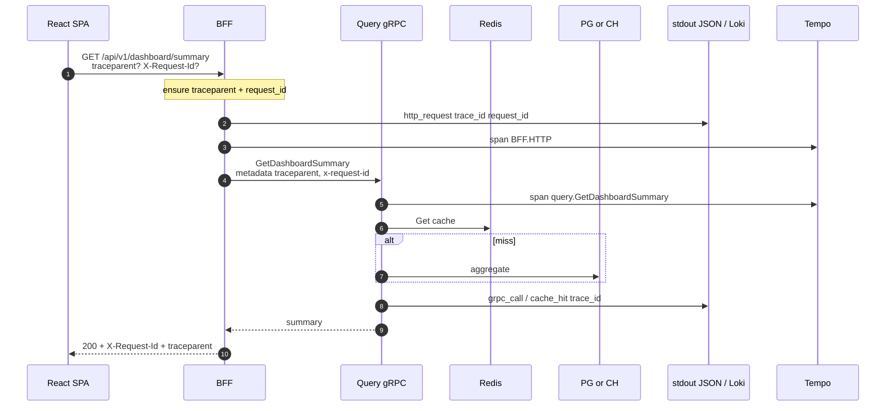
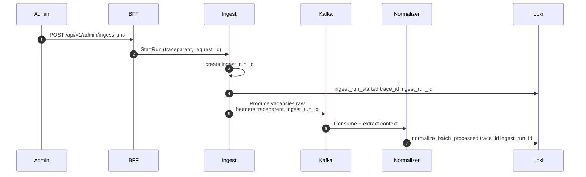

# 23. Observability: tracing и поиск по traceId

Цель: связать **structured logs** и **distributed tracing**, чтобы по одному `trace_id` (W3C `traceparent`) найти всю цепочку запроса/job в Grafana (Loki ↔ Tempo).

Связанные документы:

- [18-logging-and-incidents.md](./18-logging-and-incidents.md) — формат логов, taxonomy, инциденты, что не логировать  
- [11-observability-security.md](./11-observability-security.md) — метрики, SLO lite, краткий обзор pillars  
- [21-external-services.md](./21-external-services.md) — Grafana Cloud / self-host кандидаты  
- [12-local-dev.md](./12-local-dev.md) — Compose profile `observability` / `obs`  
- [ADR 009](./adr/009-otel-loki-tempo.md) — выбор OTel + Loki + Tempo  

**Канон полей логов** остаётся в [18](./18-logging-and-incidents.md). Этот документ — корреляция, стек, Grafana UX и rollout.

---

## 1. Goals & phase rollout

### Goals

| Цель | Результат |
|------|-----------|
| Structured JSON logs | единый stdout JSON во всех Go-сервисах (+ BFF) |
| Distributed tracing | OpenTelemetry; контекст W3C `traceparent` |
| Find-by-traceId | в Grafana: все логи и spans одного запроса/job |
| Upgrade path | Phase 0–1: `docker logs`; Phase 2–3: Loki + Tempo + Grafana без смены формата полей |

### Non-goals (не day‑1)

| Не делаем сразу | Когда |
|-----------------|-------|
| 100% sampling в prod | Phase 3+; prod 5–20% + always-on errors |
| Полный APM (Datadog/New Relic) | при реальном бюджете |
| Frontend RUM / browser tracing | later (React может слать `traceparent` / `X-Request-Id`) |
| Exemplars metrics↔traces | optional после стабильного Tempo |

### Фазы

| Фаза | Что обязательно | Как смотрим |
|------|-----------------|-------------|
| **0–1** | slog JSON + поля `trace_id`, `span_id` (если есть), `request_id`, `ingest_run_id`; middleware BFF | `docker compose logs` / `jq` по `trace_id` |
| **2** | тот же формат; Kafka headers с trace context; опц. Compose profile `observability` | Loki + Grafana (+ Tempo stub) |
| **3** | OTel SDK → OTLP; Prometheus; Grafana Explore logs↔traces | self-host или **Grafana Cloud** free tier |
| **4–5** | те же пайплайны для AI/workers/signals | фильтр `service=` |

---

## 2. Correlation model

### Идентификаторы (единые имена)

| Поле в логе | Источник | Назначение |
|-------------|----------|------------|
| `trace_id` | W3C `traceparent` (32 hex) | главный ключ поиска в Grafana / Tempo |
| `span_id` | текущий span (16 hex) | связь log line ↔ span |
| `request_id` | `X-Request-Id` (ULID/UUID) | стабильный id для клиентов/ошибок API; **не заменяет** `trace_id` |
| `ingest_run_id` | UUID run | async ingest/normalize pipeline |

Правила:

1. **Edge = BFF (публичный HTTP, MVP):** если нет валидного `traceparent` — создать; если нет `X-Request-Id` — сгенерировать; оба вернуть в response. Target: optional gateway делает то же и пробрасывает в BFF.
2. **`request_id` и `trace_id` живут вместе:** `request_id` — для людей/API error body; `trace_id` — для Grafana/Tempo. Не смешивать форматы (не класть ULID в `trace_id`).
3. **Один синхронный user/admin запрос** → один `trace_id` + один `request_id`.
4. **Один ingest run** → один `ingest_run_id` на весь async pipeline; `trace_id` scheduler-тика может отличаться — в логах workers всегда писать `ingest_run_id`, а trace context продолжать из Kafka headers когда есть.

### Propagation по каналам

| Канал | Что прокидываем |
|-------|-----------------|
| HTTP (UI → BFF, admin; Target: +gateway) | `traceparent`, `tracestate` (если есть), `X-Request-Id` |
| gRPC (BFF → query/ingest) | metadata: W3C via otelgrpc; плюс `x-request-id` |
| Kafka | headers: `traceparent` (или бинарный otel propagator), `request_id`, `ingest_run_id`, `source`, `external_id` |
| Outbound HH | **не** обязаны слать наш `traceparent` наружу; correlation только во внутренних логах/spans (`HH.GetVacancies`) |

### OpenTelemetry (Go)

Рекомендуемый набор (когда дойдём до кода, Phase 1 stub → Phase 2–3 полный export):

| Компонент | Пакет / роль |
|-----------|----------------|
| SDK + OTLP exporter | `go.opentelemetry.io/otel`, exporter OTLP HTTP/gRPC |
| HTTP server/client | `otelhttp` |
| gRPC | `otelgrpc` interceptors |
| Logs bridge | `go.opentelemetry.io/contrib/bridges/otelslog` — чтобы slog подмешивал `trace_id`/`span_id` из context |
| Kafka | вручную inject/extract `propagation.TraceContext{}` в headers |

Env (имена — в [`.env.example`](../../.env.example)):

| Env | Пример | Когда |
|-----|--------|--------|
| `OTEL_SERVICE_NAME` | `bff` | всегда при включённом SDK |
| `OTEL_EXPORTER_OTLP_ENDPOINT` | `http://localhost:4318` | Alloy/Tempo/Grafana Cloud gateway |
| `OTEL_TRACES_SAMPLER` | `always_on` local; `parentbased_traceidratio` prod | Phase 3 |
| `OTEL_TRACES_SAMPLER_ARG` | `0.1` | prod sampling |

Phase 0–1 без коллектора: можно не экспортировать spans, но **поля `trace_id`/`request_id` в JSON обязательны** (из middleware context).

---

## 3. Stack recommendation

```text
Apps (stdout JSON + OTLP traces)
        │                    │
        ▼                    ▼
   Alloy / Promtail      OTLP (4317/4318)
        │                    │
        ▼                    ▼
      Loki                 Tempo
        │                    │
        └──────── Grafana ───┘
                 ▲
                 │
            Prometheus (metrics, см. 11)
```

| Pillar | Backend | Agent / ingest | UI |
|--------|---------|----------------|-----|
| Logs | **Loki** | Grafana Alloy (предпочтительно) или Promtail | Grafana Explore |
| Traces | **Tempo** (или Grafana Cloud Traces) | OTLP → Alloy → Tempo | Grafana Explore / Trace view |
| Metrics | **Prometheus** | `/metrics` scrape | Grafana dashboards |

**Почему этот стек для соло LMA:** одна Grafana, дешёвый Compose-профиль, LogQL + TraceQL, free tier Grafana Cloud как альтернатива self-host на VPS/Yandex later. ELK/Jaeger-отдельно — не default (Jaeger допустим только если Tempo неудобен; канон — Tempo).

### Grafana: связка Loki ↔ Tempo

1. Datasource Loki: derived field / traceID link → Tempo (regex по `trace_id` в JSON).  
2. Datasource Tempo: trace-to-logs → Loki query `{service="$service"} \|= "$traceId"` или `| json | trace_id=…`.  
3. Labels Loki: низкая cardinality — `service`, `env`, `level`. **`trace_id` только в JSON line**, не в label.

---

## 4. Grafana UX: поиск по traceId

### Известен trace_id (из ответа API / лога / error `request_id`→lookup)

**Explore → Loki:**

```logql
{service=~".+"} |= "4bf92f3577b34da6a3ce929d0e0e4736"
```

Точнее после парсинга JSON:

```logql
{service=~".+"} | json | trace_id="4bf92f3577b34da6a3ce929d0e0e4736"
```

По сервису:

```logql
{service="bff"} | json | trace_id="4bf92f3577b34da6a3ce929d0e0e4736"
```

**Explore → Tempo (TraceQL):**

```traceql
{ trace:id = "4bf92f3577b34da6a3ce929d0e0e4736" }
```

или UI: вставить Trace ID в поле TraceQL / Search.

### Известен только request_id

```logql
{service=~".+"} | json | request_id="01JABC..."
```

Из найденной строки взять `trace_id` → открыть Tempo (derived field) или вставить вручную.

### Ingest / async job

```logql
{service=~"ingest|normalizer"} | json | ingest_run_id="7c9e..."
```

При наличии Kafka propagation — дополнительно фильтр по `trace_id` родительского admin/scheduler span.

### Прыжки trace → logs → trace

| Откуда | Куда | Как |
|--------|------|-----|
| Tempo Trace view | Loki | Trace to logs (кнопка / configured query) |
| Loki log line | Tempo | derived field на `trace_id` |
| Dashboard panel | Explore | «Explore» / data link с `${__value.raw}` |

### Dashboard panels (минимум + obs)

| Panel | Источник | Зачем |
|-------|----------|--------|
| Errors by service | Loki / Prometheus | spike |
| Ingest run duration | logs / metric | [18 §6](./18-logging-and-incidents.md) |
| Request rate / latency | Prometheus | [11](./11-observability-security.md) |
| Exemplars (later) | Prometheus ↔ Tempo | клик с latency spike в trace |

Метрические дашборды канонически в [11](./11-observability-security.md); здесь — только связка с traces.

---

## 5. Local vs cloud

### Local Compose — profile `observability` (alias `obs`)

Сервисы (stub в `deploy/compose`):

| Service | Порт (host) | Роль |
|---------|-------------|------|
| `loki` | 3100 | log store |
| `tempo` | 3200 (UI/API), OTLP через Alloy | traces |
| `alloy` | 4317/4318 (OTLP), scrapes docker/stdout | agent |
| `grafana` | 3001→3000 | UI (3001 чтобы не конфликтовать с `web:3000`) |
| `prometheus` (опц.) | 9090 | metrics |

```bash
docker compose --env-file .env \
  -f deploy/compose/docker-compose.yml \
  --profile observability up -d
# alias: --profile obs
```

Конфиги: `deploy/compose/observability/`. Не входит в `make up-mvp` / cloud path — только opt-in.

### Prod / учебный VPS

| Вариант | Когда |
|---------|--------|
| **Grafana Cloud free tier** (Logs + Traces + Prometheus) | меньше ops; OTLP/Alloy remote write |
| Self-host Loki+Tempo+Grafana на VPS / Yandex Cloud | контроль данных; сами патчи/диски |
| Hybrid | метрики/трейсы в Cloud, локальный Loki — обычно не нужно |

Секреты Cloud stack (`GRAFANA_CLOUD_*`, OTLP tokens) — только env/K8s Secret, см. [17](./17-secrets-management.md). Реестр провайдеров — [21](./21-external-services.md).

---

## 6. Implementation checklist (Phase 1 Go)

Порядок для BFF / ingest / query (код позже; этот doc не реализует сервисы):

1. [ ] `libs/go-common` logger: `slog` JSON handler; поля `ts`, `level`, `msg`, `service`, `env`
2. [ ] Context helpers: `WithRequestID`, `WithTrace` (или сразу otelslog bridge)
3. [ ] BFF HTTP middleware: parse/generate `traceparent` + `X-Request-Id`; положить в context; echo headers
4. [ ] Логировать access/`dependency_error` с `trace_id` + `request_id`
5. [ ] gRPC: unary interceptor metadata propagate (`otelgrpc` когда появится gRPC)
6. [ ] Ingest: каждый run пишет `ingest_run_id`; admin trigger наследует incoming trace
7. [ ] **Не логировать:** токены, DSN, raw HH/AI body на info — [18 § Never](./18-logging-and-incidents.md), [17](./17-secrets-management.md)
8. [ ] Phase 2: Kafka inject/extract `traceparent`; Alloy→Loki
9. [ ] Phase 2–3: OTLP export → Tempo; Grafana datasources + derived fields
10. [ ] React later: прокидывать `X-Request-Id` / `traceparent` на `/api/v1/*` (optional)

---

## 7. Mermaid: request path + trace context

### Синхронный read (UI → BFF → Query)



### Admin ingest → Kafka → normalizer (Phase 2)



Поиск при инциденте: взять `trace_id` или `ingest_run_id` → LogQL → (опц.) Tempo → зависимости — playbook [18 §7](./18-logging-and-incidents.md).

---

## Итог одной строкой

**Phase 0–1:** JSON stdout с `trace_id` + `request_id` (+ `ingest_run_id` для runs).  
**Phase 2–3:** Loki + Tempo + Grafana (Compose `observability` или Grafana Cloud); прыжки logs↔traces по `trace_id`.  
**Метрики** — Prometheus ([11](./11-observability-security.md)); **инциденты** — [18](./18-logging-and-incidents.md).
